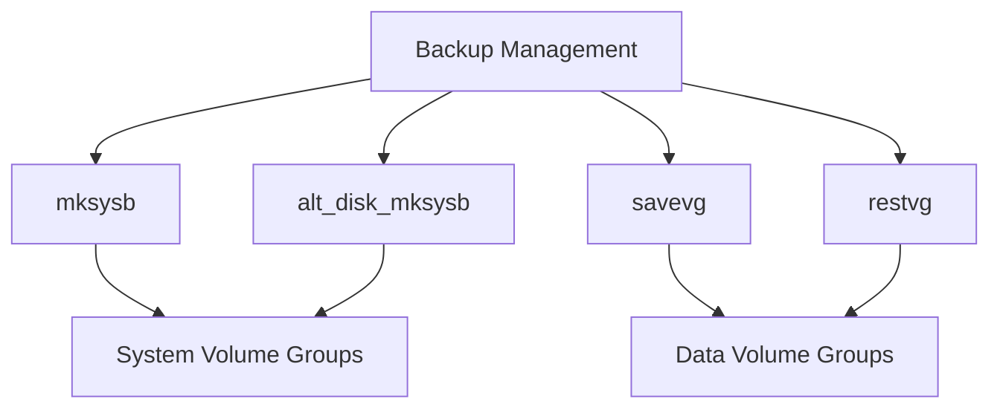

# Backup Overview

Backup refers to the management of backup images for data or system volume groups on a logical partition (LPAR). It uses the <SwmToken path="plugins/modules/backup.py" pos="227:13:13" line-data="- name: backup the rootvg with mksysb">`mksysb`</SwmToken> or <SwmToken path="plugins/modules/backup.py" pos="24:10:10" line-data="- It uses mksysb or savevg commands to create backup image of a volume group either in a file or">`savevg`</SwmToken> commands to create backup images of a volume group either in a file or onto a device. The module also uses <SwmToken path="plugins/modules/backup.py" pos="26:6:6" line-data="- It uses restvg or alt_disk_mksysb to restore a backup image to disk(s).">`restvg`</SwmToken> or <SwmToken path="plugins/modules/backup.py" pos="26:10:10" line-data="- It uses restvg or alt_disk_mksysb to restore a backup image to disk(s).">`alt_disk_mksysb`</SwmToken> to restore a backup image to <SwmToken path="plugins/modules/backup.py" pos="26:24:26" line-data="- It uses restvg or alt_disk_mksysb to restore a backup image to disk(s).">`disk(s`</SwmToken>).

# Backup Management

The <SwmToken path="plugins/modules/backup.py" pos="227:5:5" line-data="- name: backup the rootvg with mksysb">`backup`</SwmToken> module manages backup images of data or system volume groups on a logical partition (LPAR). It uses the <SwmToken path="plugins/modules/backup.py" pos="227:13:13" line-data="- name: backup the rootvg with mksysb">`mksysb`</SwmToken> or <SwmToken path="plugins/modules/backup.py" pos="24:10:10" line-data="- It uses mksysb or savevg commands to create backup image of a volume group either in a file or">`savevg`</SwmToken> commands to create backup images of a volume group either in a file or onto a device. The module also uses <SwmToken path="plugins/modules/backup.py" pos="26:6:6" line-data="- It uses restvg or alt_disk_mksysb to restore a backup image to disk(s).">`restvg`</SwmToken> or <SwmToken path="plugins/modules/backup.py" pos="26:10:10" line-data="- It uses restvg or alt_disk_mksysb to restore a backup image to disk(s).">`alt_disk_mksysb`</SwmToken> to restore a backup image to <SwmToken path="plugins/modules/backup.py" pos="26:24:26" line-data="- It uses restvg or alt_disk_mksysb to restore a backup image to disk(s).">`disk(s`</SwmToken>).

# System Volume Groups

<SwmToken path="plugins/modules/backup.py" pos="227:13:13" line-data="- name: backup the rootvg with mksysb">`mksysb`</SwmToken> and <SwmToken path="plugins/modules/backup.py" pos="26:10:10" line-data="- It uses restvg or alt_disk_mksysb to restore a backup image to disk(s).">`alt_disk_mksysb`</SwmToken> operate on system volume groups, creating and restoring installable backup images.

# Data Volume Groups

<SwmToken path="plugins/modules/backup.py" pos="24:10:10" line-data="- It uses mksysb or savevg commands to create backup image of a volume group either in a file or">`savevg`</SwmToken> and <SwmToken path="plugins/modules/backup.py" pos="26:6:6" line-data="- It uses restvg or alt_disk_mksysb to restore a backup image to disk(s).">`restvg`</SwmToken> operate on data volume groups, managing the backup and restoration of these groups.

# Example: Creating a Backup

This example demonstrates how to create a backup of the root volume group (rootvg) using the <SwmToken path="plugins/modules/backup.py" pos="227:13:13" line-data="- name: backup the rootvg with mksysb">`mksysb`</SwmToken> command.

<SwmSnippet path="/plugins/modules/backup.py" line="227">

---

The following code snippet shows how to use the <SwmToken path="plugins/modules/backup.py" pos="227:5:5" line-data="- name: backup the rootvg with mksysb">`backup`</SwmToken> module to create a backup of the root volume group (rootvg) with the <SwmToken path="plugins/modules/backup.py" pos="227:13:13" line-data="- name: backup the rootvg with mksysb">`mksysb`</SwmToken> command. The backup is stored at <SwmToken path="plugins/modules/backup.py" pos="231:4:7" line-data="    location: /tmp/backup_rootvg">`/tmp/backup_rootvg`</SwmToken>.

```python
- name: backup the rootvg with mksysb
  backup:
    action: create
    type: mksysb
    location: /tmp/backup_rootvg
    exclude_files: false
    extend_fs: true
```

---

</SwmSnippet>



&nbsp;

*This is an auto-generated document by Swimm 🌊 and has not yet been verified by a human*

<SwmMeta version="3.0.0" repo-id="Z2l0aHViJTNBJTNBYW5zaWJsZS1wb3dlci1haXglM0ElM0Fzd2ltbWlv" repo-name="ansible-power-aix"><sup>Powered by [Swimm](/)</sup></SwmMeta>
