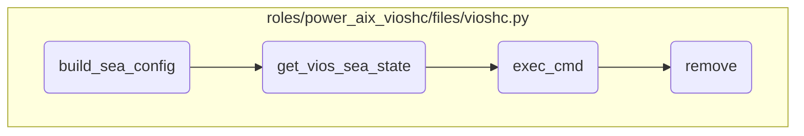

In this document, we will explain the process of building the SEA configuration. The process involves initializing the SEA configuration, retrieving the SEA state, executing the necessary command, and finally removing any temporary files created during the process.

The flow starts with initializing the SEA configuration by extracting network details from an XML file. Next, the state of the SEA device is retrieved to understand its current status. Then, a command is executed to get the SEA state, and any errors are logged. Finally, temporary files created during the process are removed to ensure no unnecessary files are left on the system.

# Flow drill down



<SwmSnippet path="/roles/power_aix_vioshc/files/vioshc.py" line="1099">

---

## Building SEA Configuration

First, the <SwmToken path="roles/power_aix_vioshc/files/vioshc.py" pos="1099:2:2" line-data="def build_sea_config(vios_name, vios_uuid, sea_config):">`build_sea_config`</SwmToken> function initializes the SEA configuration dictionary for a given VIOS. It retrieves the network configuration from an XML file and parses it to extract relevant details such as Backing Device Name, SEA Device Name, and High Availability Mode. This step is crucial for setting up the initial configuration needed for further operations.

```python
def build_sea_config(vios_name, vios_uuid, sea_config):
    """
    Build sea_config dictionnary
    from an XML file: <vios_name>_network.xml

    sea_config[vios_name] = {}
              [vios_name][VLAN_IDs] = {}
              [vios_name][VLAN_IDs]["BackingDeviceName"] = "entx"
              [vios_name][VLAN_IDs]["BackingDeviceState"] = "Inactive/Disconnected/...."
              [vios_name][VLAN_IDs]["SEADeviceName"] = "entx"
              [vios_name][VLAN_IDs]["SEADeviceState"] = ""
              [vios_name][VLAN_IDs]["HighAvailabilityMode"] = "auto/sharing"
              [vios_name][VLAN_IDs]["Priority"] = priority

    Input:  (str) vios name
    Input:  (str) vios UUID
    Input: (dict) SEA config to fill
    Output: none
    """

    write("\nRecovering SEA configuration for {0}:".format(vios_name), 2)
```

---

</SwmSnippet>

<SwmSnippet path="/roles/power_aix_vioshc/files/vioshc.py" line="816">

---

## Retrieving SEA State

Next, the <SwmToken path="roles/power_aix_vioshc/files/vioshc.py" pos="816:2:2" line-data="def get_vios_sea_state(vios_name, sea_device):">`get_vios_sea_state`</SwmToken> function is called to retrieve the state of the SEA device. This function executes a command on the VIOS to get the SEA adapter's state and parses the output to determine if the adapter is in a PRIMARY, BACKUP, or STANDBY state. This information is essential for understanding the current status of the SEA configuration.

```python
def get_vios_sea_state(vios_name, sea_device):
    """
    Parse an XML file to get the SEA device state

    Input:(dict) LPAR info to fill
    Input: (str) VIOS name
    Input: (str) SEA device name
    Output:(int) 0 if success
    Output:(str) SEA device state,
           prints error message and exits upon error
    """

    state = ""

    # file to get all SEA info (debug)
    filename = "{0}/{1}_{2}.txt".format(xml_dir, vios_name, sea_device)
    try:
        f = open(filename, 'w+')
    except IOError as e:
        write("ERROR: Failed to create file {0}: {1}.".format(filename, e.strerror), lvl=0)
        f = None
```

---

</SwmSnippet>

<SwmSnippet path="/roles/power_aix_vioshc/files/vioshc.py" line="171">

---

## Executing Command

Then, the <SwmToken path="roles/power_aix_vioshc/files/vioshc.py" pos="171:2:2" line-data="def exec_cmd(cmd):">`exec_cmd`</SwmToken> function is used to execute the command that retrieves the SEA state. It handles the execution of the command, captures the output, and checks for any errors. This step ensures that the command is executed correctly and any issues are logged for troubleshooting.

```python
def exec_cmd(cmd):
    """
    Execute the given command

    Input: (str) return code of command
    Output:(int) stdout of the command
    Output:(str) stderr of the command
    """
    rc = 0
    output = ''
    errout = ''
    th_id = threading.current_thread().ident
    stderr_file = os.path.join(log_dir, 'cmd_stderr_{0}'.format(th_id))
    try:
        with open(stderr_file, 'w') as myfile:
            output = subprocess.check_output(cmd, stderr=myfile)
            output = output.decode('UTF-8')
            s = re.search(r'rc=([-\d]+)$', output)
            if s:
                rc = int(s.group(1))
                output = re.sub(r'rc=[-\d]+\n$', '', output)  # remove the rc of c_rsh with echo $?
```

---

</SwmSnippet>

<SwmSnippet path="/roles/power_aix_vioshc/files/vioshc.py" line="132">

---

## Removing Temporary Files

Finally, the <SwmToken path="roles/power_aix_vioshc/files/vioshc.py" pos="132:2:2" line-data="def remove(path):">`remove`</SwmToken> function is called to delete any temporary files created during the process. This cleanup step is important to ensure that no unnecessary files are left on the system, which could consume disk space and potentially cause conflicts in future operations.

```python
def remove(path):
    """
    Remove file

    Input: (str) file path
    Output: none
    """
    try:
        if os.path.exists(path):
            os.remove(path)
        else:
            log('file {0} does not exists.\n'.format(path))
    except OSError as e:
        write('ERROR: Failed to remove file {0}: {1}.'.format(path, e.strerror), lvl=0)
```

---

</SwmSnippet>

&nbsp;

*This is an auto-generated document by Swimm 🌊 and has not yet been verified by a human*

<SwmMeta version="3.0.0" repo-id="Z2l0aHViJTNBJTNBYW5zaWJsZS1wb3dlci1haXglM0ElM0Fzd2ltbWlv" repo-name="ansible-power-aix"><sup>Powered by [Swimm](/)</sup></SwmMeta>
