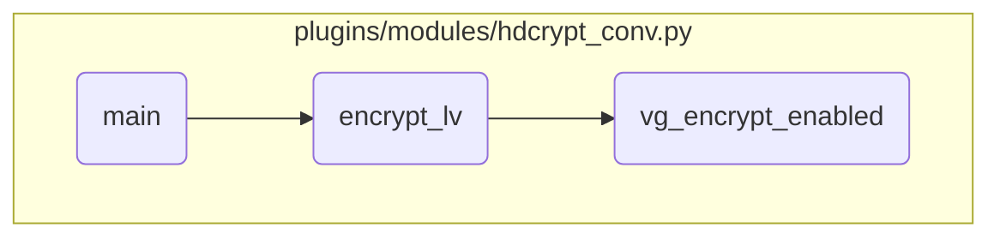

This document explains the process of encrypting logical volumes in an AIX system using Ansible modules. The process involves initializing the Ansible module, setting up parameters, processing logical volumes and volume groups, and calling appropriate functions to handle encryption.

The flow starts with initializing the Ansible module and setting up the necessary parameters for the action (encrypt or decrypt) and the devices (logical volumes, volume groups, and physical volumes). It then processes the logical volumes and volume groups, ensuring they exist and are not in the exception list. Based on the action parameter, it calls the appropriate function to either encrypt or decrypt the logical volumes. The encryption process involves checking if the volume group has encryption enabled and, if not, enabling it before proceeding with the encryption of the logical volume.

# Flow drill down



<SwmSnippet path="/plugins/modules/hdcrypt_conv.py" line="655" repo-id="Z2l0aHViJTNBJTNBYW5zaWJsZS1wb3dlci1haXglM0ElM0Fzd2ltbWlv">

---

## Main Function

First, the <SwmToken path="/plugins/modules/hdcrypt_conv.py" pos="655:2:2" line-data="def main():" repo-id="Z2l0aHViJTNBJTNBYW5zaWJsZS1wb3dlci1haXglM0ElM0Fzd2ltbWlv" repo-name="ansible-power-aix">`main`</SwmToken> function initializes the Ansible module and sets up the parameters for the action (encrypt or decrypt) and the devices (logical volumes, volume groups, and physical volumes). It then processes the logical volumes and volume groups, checking if they exist and are not in the exception list. Based on the action parameter, it calls the appropriate function to either encrypt or decrypt the logical volumes.

```python
def main():
    global result

    device_spec = dict(
        lv=dict(type='list', elements='str'),
        vg=dict(type='list', elements='str'),
        pv=dict(type='list', elements='str'),
        except_lv=dict(type='list', elements='str'),
    )

    module = AnsibleModule(
        supports_check_mode=False,
        argument_spec=dict(
            action=dict(type='str', choices=['encrypt', 'decrypt'], required=True),
            device=dict(type='dict', required=True, options=device_spec),
            password=dict(type='str', required=True, no_log=True),
        ),
    )

    result = dict(
        changed=False,
```

---

</SwmSnippet>

<SwmSnippet path="/plugins/modules/hdcrypt_conv.py" line="271" repo-id="Z2l0aHViJTNBJTNBYW5zaWJsZS1wb3dlci1haXglM0ElM0Fzd2ltbWlv">

---

## Encrypt Logical Volume

Next, the <SwmToken path="/plugins/modules/hdcrypt_conv.py" pos="271:2:2" line-data="def encrypt_lv(module, name):" repo-id="Z2l0aHViJTNBJTNBYW5zaWJsZS1wb3dlci1haXglM0ElM0Fzd2ltbWlv" repo-name="ansible-power-aix">`encrypt_lv`</SwmToken> function is called to handle the encryption of a specific logical volume. It first ensures that the volume group containing the logical volume has encryption enabled by calling <SwmToken path="/plugins/modules/hdcrypt_conv.py" pos="571:2:2" line-data="def vg_encrypt_enabled(module, name):" repo-id="Z2l0aHViJTNBJTNBYW5zaWJsZS1wb3dlci1haXglM0ElM0Fzd2ltbWlv" repo-name="ansible-power-aix">`vg_encrypt_enabled`</SwmToken>. It then constructs the appropriate command to encrypt the logical volume based on the password strength and executes it. The function updates the result with the command output and handles any errors that occur during the encryption process.

```python
def encrypt_lv(module, name):
    """
    Encrypts the Logical Volume it is passed
    arguments:
        module: Ansible module argument spec.
        name: Name of the logical volume to encrypt
    note:
        If the volume group that the logical volume belongs to is not encryption enabled, it is first encryption enabled.
    return:
        None
    """
    password = module.params['password']
    vg_name = get_vg_name(module, name)

    # Enable Encryption if not already enabled on the VG
    vg_encrypt_enabled(module, vg_name)

    if crypto_status == "uninitialized":
        if not check_password_strength(password):
            cmd = expectPrompts['authinit_weak_pwd'] % (name, password, password)
        else:
```

---

</SwmSnippet>

<SwmSnippet path="/plugins/modules/hdcrypt_conv.py" line="571" repo-id="Z2l0aHViJTNBJTNBYW5zaWJsZS1wb3dlci1haXglM0ElM0Fzd2ltbWlv">

---

## Enable Volume Group Encryption

Then, the <SwmToken path="/plugins/modules/hdcrypt_conv.py" pos="571:2:2" line-data="def vg_encrypt_enabled(module, name):" repo-id="Z2l0aHViJTNBJTNBYW5zaWJsZS1wb3dlci1haXglM0ElM0Fzd2ltbWlv" repo-name="ansible-power-aix">`vg_encrypt_enabled`</SwmToken> function checks if encryption is enabled on a volume group. If encryption is not enabled, it constructs and executes the command to enable encryption on the volume group. The function updates the result with the command output and handles any errors that occur during the process.

```python
def vg_encrypt_enabled(module, name):
    """
    Checks if encryption is enabled on a Volume Group, and enables it if it is not
    arguments:
        module: Ansible module argument spec.
        name: Name of the volume group to enable encryption on
    return:
        None
    """
    vg_props = get_vg_props(module, name)
    pattern = r"^ENCRYPTION:\s+(\w+)"
    encrypt_status = re.search(pattern, vg_props, re.MULTILINE).group(1)

    if encrypt_status == 'no':
        # enable encryption on that vg
        cmd = f"/usr/sbin/chvg -k y {name}"
        fail_msg = f"Failed to enable encryption on the volume group {name}. \
            Command '{cmd}' failed."
        rc, stdout, stderr = module.run_command(cmd)
        result['cmd'] = cmd
        result['rc'] = rc
```

---

</SwmSnippet>

&nbsp;

*This is an auto-generated document by Swimm 🌊 and has not yet been verified by a human*

<SwmMeta version="3.0.0"><sup>Powered by [Swimm](https://app.swimm.io/)</sup></SwmMeta>
