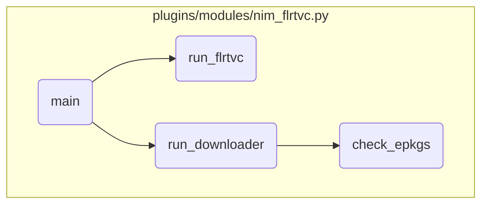

This document explains the flow of the <SwmToken path="/plugins/modules/nim_flrtvc.py" pos="1507:2:2" line-data="def main():" repo-id="Z2l0aHViJTNBJTNBYW5zaWJsZS1wb3dlci1haXglM0ElM0Fzd2ltbWlv" repo-name="ansible-power-aix">`main`</SwmToken> function, which is responsible for initializing the Ansible module, setting up the working directory, computing targets, checking connectivity, installing the FLRTVC script, running the script, parsing the report, downloading and checking fixes, installing fixes, and finally cleaning up.

The flow starts with initializing the module and setting up the working directory. It then computes the list of target machines and checks their connectivity. After that, it installs the FLRTVC script and runs it on each target machine to generate vulnerability reports. The function then parses these reports, downloads and checks the necessary fixes, and installs them on each target machine. Finally, it cleans up the working directory and logs the final status message.

# Flow drill down



<SwmSnippet path="/plugins/modules/nim_flrtvc.py" line="1507" repo-id="Z2l0aHViJTNBJTNBYW5zaWJsZS1wb3dlci1haXglM0ElM0Fzd2ltbWlv">

---

## Initializing the Module

First, the <SwmToken path="/plugins/modules/nim_flrtvc.py" pos="1507:2:2" line-data="def main():" repo-id="Z2l0aHViJTNBJTNBYW5zaWJsZS1wb3dlci1haXglM0ElM0Fzd2ltbWlv" repo-name="ansible-power-aix">`main`</SwmToken> function initializes the Ansible module with the required parameters and sets up the initial results dictionary. This sets the stage for the subsequent operations by defining the necessary inputs and outputs.

```python
def main():
    global module
    global results
    global workdir

    module = AnsibleModule(
        argument_spec=dict(
            targets=dict(required=True, type='list', elements='str'),
            apar=dict(required=False, type='str', choices=['sec', 'hiper', 'all', None], default=None),
            filesets=dict(required=False, type='str'),
            csv=dict(required=False, type='str'),
            path=dict(required=False, type='str', default='/var/adm/ansible'),
            save_report=dict(required=False, type='bool', default=False),
            verbose=dict(required=False, type='bool', default=False),
            force=dict(required=False, type='bool', default=False),
            clean=dict(required=False, type='bool', default=False),
            check_only=dict(required=False, type='bool', default=False),
            download_only=dict(required=False, type='bool', default=False),
            extend_fs=dict(required=False, type='bool', default=True),
        ),
        supports_check_mode=True
```

---

</SwmSnippet>

<SwmSnippet path="/plugins/modules/nim_flrtvc.py" line="1575" repo-id="Z2l0aHViJTNBJTNBYW5zaWJsZS1wb3dlci1haXglM0ElM0Fzd2ltbWlv">

---

## Setting Up Working Directory

Next, the function sets up the working directory where temporary files will be stored. This ensures that all operations have a designated space for file handling.

```python
    workdir = os.path.abspath(os.path.join(flrtvc_params['dst_path'], 'work'))
    if not os.path.exists(workdir):
        os.makedirs(workdir, mode=0o744)
```

---

</SwmSnippet>

<SwmSnippet path="/plugins/modules/nim_flrtvc.py" line="1582" repo-id="Z2l0aHViJTNBJTNBYW5zaWJsZS1wb3dlci1haXglM0ElM0Fzd2ltbWlv">

---

## Computing Targets

Then, the function computes the list of target machines by expanding the provided targets and filtering them based on the available NIM clients. This step ensures that only valid targets are processed.

```python
    # Get client list and keep targets that are part of it
    module.debug('*** OHAI ***')
    module.debug(f'requested targets are: "{targets}"')
    nim_clients = get_nim_clients_info(module)
    module.debug(f'Nim clients are: {nim_clients}')
    targets = expand_targets(module, targets, list(nim_clients.keys()))
    module.debug(f'Nim client targets are:{targets}')
```

---

</SwmSnippet>

<SwmSnippet path="/plugins/modules/nim_flrtvc.py" line="1596" repo-id="Z2l0aHViJTNBJTNBYW5zaWJsZS1wb3dlci1haXglM0ElM0Fzd2ltbWlv">

---

## Checking Connectivity

Moving to the connectivity check, the function verifies that all target machines are reachable. If no targets are available, it logs an appropriate message and exits.

```python
    # Check connectivity
    targets = check_targets(module, results['meta'], targets, nim_clients)
    module.debug(f'Available target machines are:{targets}')
    if not targets:
        msg = 'Empty target list'
        results['meta']['messages'].append(msg)
        module.log(msg)
    results['targets'] = list(targets)

```

---

</SwmSnippet>

<SwmSnippet path="/plugins/modules/nim_flrtvc.py" line="1608" repo-id="Z2l0aHViJTNBJTNBYW5zaWJsZS1wb3dlci1haXglM0ElM0Fzd2ltbWlv">

---

## Installing FLRTVC Script

The function then installs the FLRTVC script by downloading and unzipping it to the appropriate directory. This step ensures that the latest version of the script is available for vulnerability checking.

```python
    module.debug('*** INSTALL ***')
    flrtvc_dir = os.path.abspath(os.path.join(os.sep, 'usr', 'bin'))
    flrtvc_path = os.path.abspath(os.path.join(flrtvc_dir, 'flrtvc.ksh'))

    # remove previous version if any
    if os.path.exists(flrtvc_path):
        try:
            os.remove(flrtvc_path)
        except OSError as exc:
            msg = f'Cannot remove {flrtvc_path}, exception:{exc}'
            module.log('[WARNING] ' + msg)
            results['meta']['messages'].append(msg)

    flrtvc_dst = os.path.abspath(os.path.join(workdir, 'FLRTVC-latest.zip'))
    if not download(module, results['meta'],
                    'https://esupport.ibm.com/customercare/sas/f/flrt3/FLRTVC-latest.zip',
                    flrtvc_dst, resize_fs):
        if clean and os.path.exists(workdir):
            shutil.rmtree(workdir, ignore_errors=True)
        results['msg'] = 'Failed to download FLRTVC-latest.zip'
        module.fail_json(**results)
```

---

</SwmSnippet>

<SwmSnippet path="/plugins/modules/nim_flrtvc.py" line="1644" repo-id="Z2l0aHViJTNBJTNBYW5zaWJsZS1wb3dlci1haXglM0ElM0Fzd2ltbWlv">

---

## Running FLRTVC Script

Next, the function runs the FLRTVC script on each target machine to generate vulnerability reports. If any machine fails to generate a report, it is removed from the list of targets.

```python
    module.debug('*** REPORT ***')
    wrong_targets = []
    for machine in targets:
        if not run_flrtvc(module, results['meta'][machine], machine, flrtvc_path, flrtvc_params, force):
            wrong_targets.append(machine)
    for machine in wrong_targets:
        msg = f'Failed to get vulnerabilities report, {machine} will not be updated'
        module.log('[WARNING] ' + msg)
        results['meta'][machine]['messages'].append(msg)
        results['status'][machine] = 'FAILURE'
        targets.remove(machine)
    if check_only:
        if clean and os.path.exists(workdir):
            shutil.rmtree(workdir, ignore_errors=True)
        results['msg'] = 'exit on check only'
        for machine in targets:
            results['status'][machine] = 'SUCCESS'
        module.exit_json(**results)
```

---

</SwmSnippet>

<SwmSnippet path="/plugins/modules/nim_flrtvc.py" line="1667" repo-id="Z2l0aHViJTNBJTNBYW5zaWJsZS1wb3dlci1haXglM0ElM0Fzd2ltbWlv">

---

## Parsing FLRTVC Report

The function then parses the FLRTVC report to extract relevant information. This parsed data is used in subsequent steps for downloading and checking fixes.

```python
    for machine in targets:
        run_parser(module, machine, results['meta'][machine], results['meta'][machine]['0.report'])
    wait_all()

```

---

</SwmSnippet>

<SwmSnippet path="/plugins/modules/nim_flrtvc.py" line="1675" repo-id="Z2l0aHViJTNBJTNBYW5zaWJsZS1wb3dlci1haXglM0ElM0Fzd2ltbWlv">

---

## Downloading and Checking Fixes

The function proceeds to download and check the necessary fixes for each target machine. If any errors occur during this process, the affected machine is marked as failed.

```python
    for machine in targets:
        run_downloader(module, machine, results['meta'][machine], results['meta'][machine]['1.parse'], resize_fs)
        if '4.2.check' not in results['meta'][machine]:
            msg = f'Error downloading some fixes, {machine} will not be updated'
            results['meta'][machine]['messages'].append(msg)
            results['status'][machine] = 'FAILURE'
    wait_all()
```

---

</SwmSnippet>

<SwmSnippet path="/plugins/modules/nim_flrtvc.py" line="1693" repo-id="Z2l0aHViJTNBJTNBYW5zaWJsZS1wb3dlci1haXglM0ElM0Fzd2ltbWlv">

---

## Installing Fixes

Finally, the function installs the downloaded fixes on each target machine. This step ensures that all identified vulnerabilities are addressed.

```python
    for machine in targets:
        if '4.2.check' in results['meta'][machine]:
            run_installer(module, machine, results['meta'][machine], results['meta'][machine]['4.2.check'], resize_fs)
    wait_all()
```

---

</SwmSnippet>

<SwmSnippet path="/plugins/modules/nim_flrtvc.py" line="1698" repo-id="Z2l0aHViJTNBJTNBYW5zaWJsZS1wb3dlci1haXglM0ElM0Fzd2ltbWlv">

---

## Cleaning Up

After all operations are complete, the function cleans up the working directory and logs the final status message. This ensures that no temporary files are left behind and provides a summary of the operation.

```python
    if clean and os.path.exists(workdir):
        shutil.rmtree(workdir, ignore_errors=True)

    results['msg'] = 'FLRTVC completed, see status for details.'
    module.log(results['msg'])
    module.exit_json(**results)
```

---

</SwmSnippet>

&nbsp;

*This is an auto-generated document by Swimm 🌊 and has not yet been verified by a human*

<SwmMeta version="3.0.0"><sup>Powered by [Swimm](https://app.swimm.io/)</sup></SwmMeta>
