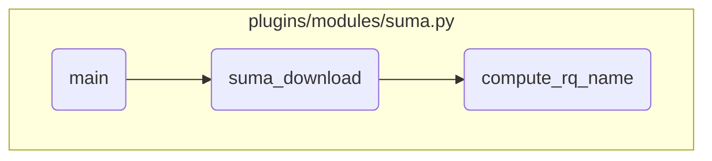

This document explains the flow of handling various actions and managing software updates and configurations for AIX systems. It covers the steps involved in validating and formatting parameters, computing request types and names, performing preview and download actions, and installing updates.

The flow starts with the <SwmToken path="/plugins/modules/suma.py" pos="828:2:2" line-data="def main():" repo-id="Z2l0aHViJTNBJTNBYW5zaWJsZS1wb3dlci1haXglM0ElM0Fzd2ltbWlv" repo-name="ansible-power-aix">`main`</SwmToken> function handling different actions like listing, editing, unscheduling, deleting, running, configuring, downloading, and previewing. Each action corresponds to a specific function call. The <SwmToken path="/plugins/modules/suma.py" pos="650:2:2" line-data="def suma_download():" repo-id="Z2l0aHViJTNBJTNBYW5zaWJsZS1wb3dlci1haXglM0ElM0Fzd2ltbWlv" repo-name="ansible-power-aix">`suma_download`</SwmToken> function then validates and formats the <SwmToken path="/plugins/modules/suma.py" pos="276:7:7" line-data="def compute_rq_name(rq_type, oslevel, last_sp):" repo-id="Z2l0aHViJTNBJTNBYW5zaWJsZS1wb3dlci1haXglM0ElM0Fzd2ltbWlv" repo-name="ansible-power-aix">`oslevel`</SwmToken> parameter, computes the request type and name, performs preview and download actions, and finally installs the updates if required.

# Flow drill down



<SwmSnippet path="/plugins/modules/suma.py" line="875" repo-id="Z2l0aHViJTNBJTNBYW5zaWJsZS1wb3dlci1haXglM0ElM0Fzd2ltbWlv">

---

## Handling Different Actions

First, the <SwmToken path="/plugins/modules/suma.py" pos="828:2:2" line-data="def main():" repo-id="Z2l0aHViJTNBJTNBYW5zaWJsZS1wb3dlci1haXglM0ElM0Fzd2ltbWlv" repo-name="ansible-power-aix">`main`</SwmToken> function handles different actions such as 'list', 'edit', 'unschedule', 'delete', 'run', 'config', 'default', 'download', and 'preview'. Each action corresponds to a specific function call that manages software updates and configurations for AIX systems.

```python
    if action == 'list':
        suma_params['task_id'] = module.params['task_id']
        suma_list()

    elif action == 'edit':
        suma_params['task_id'] = module.params['task_id']
        suma_params['sched_time'] = module.params['sched_time']
        suma_edit()

    elif action == 'unschedule':
        suma_params['task_id'] = module.params['task_id']
        suma_unschedule()

    elif action == 'delete':
        suma_params['task_id'] = module.params['task_id']
        suma_delete()

    elif action == 'run':
        suma_params['task_id'] = module.params['task_id']
        suma_run()

```

---

</SwmSnippet>

<SwmSnippet path="/plugins/modules/suma.py" line="665" repo-id="Z2l0aHViJTNBJTNBYW5zaWJsZS1wb3dlci1haXglM0ElM0Fzd2ltbWlv">

---

## Validating and Formatting oslevel

Next, the <SwmToken path="/plugins/modules/suma.py" pos="650:2:2" line-data="def suma_download():" repo-id="Z2l0aHViJTNBJTNBYW5zaWJsZS1wb3dlci1haXglM0ElM0Fzd2ltbWlv" repo-name="ansible-power-aix">`suma_download`</SwmToken> function validates and formats the <SwmToken path="/plugins/modules/suma.py" pos="688:10:10" line-data="    rq_type = compute_rq_type(suma_params[&#39;oslevel&#39;], suma_params[&#39;last_sp&#39;])" repo-id="Z2l0aHViJTNBJTNBYW5zaWJsZS1wb3dlci1haXglM0ElM0Fzd2ltbWlv" repo-name="ansible-power-aix">`oslevel`</SwmToken> parameter. This ensures that the oslevel is in the correct format before proceeding with the download or preview actions.

```python
    # Check oslevel format
    if not suma_params['oslevel'].strip() or suma_params['oslevel'].upper() == 'LATEST':
        suma_params['oslevel'] = 'Latest'
    else:
        if re.match(r"^[0-9]{4}(|-00|-00-00|-00-00-0000)$", suma_params['oslevel']):
            msg_oslevel = suma_params['oslevel']
            msg = f"Bad parameter: oslevel is '{msg_oslevel}', \
                specify a non 0 value for the Technical Level or the Service Pack"
            module.log(msg)
            results['msg'] = msg
            module.fail_json(**results)
        elif not re.match(r"^[0-9]{4}-[0-9]{2}(|-[0-9]{2}|-[0-9]{2}-[0-9]{4})$",
                          suma_params['oslevel']):
            msg_oslevel = suma_params['oslevel']
            msg = f"Bad parameter: oslevel is '{msg_oslevel}', \
                should repect the format: xxxx-xx or xxxx-xx-xx or xxxx-xx-xx-xxxx"
            module.log(msg)
            results['msg'] = msg
            module.fail_json(**results)
```

---

</SwmSnippet>

<SwmSnippet path="/plugins/modules/suma.py" line="688" repo-id="Z2l0aHViJTNBJTNBYW5zaWJsZS1wb3dlci1haXglM0ElM0Fzd2ltbWlv">

---

## Computing Request Type

Then, the <SwmToken path="/plugins/modules/suma.py" pos="650:2:2" line-data="def suma_download():" repo-id="Z2l0aHViJTNBJTNBYW5zaWJsZS1wb3dlci1haXglM0ElM0Fzd2ltbWlv" repo-name="ansible-power-aix">`suma_download`</SwmToken> function computes the SUMA request type based on the <SwmToken path="/plugins/modules/suma.py" pos="688:10:10" line-data="    rq_type = compute_rq_type(suma_params[&#39;oslevel&#39;], suma_params[&#39;last_sp&#39;])" repo-id="Z2l0aHViJTNBJTNBYW5zaWJsZS1wb3dlci1haXglM0ElM0Fzd2ltbWlv" repo-name="ansible-power-aix">`oslevel`</SwmToken> property. This step is crucial for determining the type of software update or configuration request.

```python
    rq_type = compute_rq_type(suma_params['oslevel'], suma_params['last_sp'])
    if rq_type == 'ERROR':
        msg_oslevel = suma_params['oslevel']
        msg = f"Bad parameter: oslevel is '{msg_oslevel}', parsing error"
        module.log(msg)
        results['msg'] = msg
        module.fail_json(**results)

    suma_params['RqType'] = rq_type
    module.debug(f"SUMA req Type: {rq_type}")

```

---

</SwmSnippet>

<SwmSnippet path="/plugins/modules/suma.py" line="702" repo-id="Z2l0aHViJTNBJTNBYW5zaWJsZS1wb3dlci1haXglM0ElM0Fzd2ltbWlv">

---

## Computing Request Name

Moving on, the <SwmToken path="/plugins/modules/suma.py" pos="650:2:2" line-data="def suma_download():" repo-id="Z2l0aHViJTNBJTNBYW5zaWJsZS1wb3dlci1haXglM0ElM0Fzd2ltbWlv" repo-name="ansible-power-aix">`suma_download`</SwmToken> function computes the SUMA request name based on metadata information. This name is used to identify the specific request for software updates or configurations.

```python
    suma_params['RqName'] = compute_rq_name(rq_type, suma_params['oslevel'], suma_params['last_sp'])
    debug_rqname = suma_params['RqName']
    module.debug(f"Suma req Name: {debug_rqname}")

```

---

</SwmSnippet>

<SwmSnippet path="/plugins/modules/suma.py" line="727" repo-id="Z2l0aHViJTNBJTNBYW5zaWJsZS1wb3dlci1haXglM0ElM0Fzd2ltbWlv">

---

## Preview and Download Actions

Next, the <SwmToken path="/plugins/modules/suma.py" pos="650:2:2" line-data="def suma_download():" repo-id="Z2l0aHViJTNBJTNBYW5zaWJsZS1wb3dlci1haXglM0ElM0Fzd2ltbWlv" repo-name="ansible-power-aix">`suma_download`</SwmToken> function performs the preview and download actions. It first runs a preview to check if there are any updates to download. If there are updates, it proceeds with the download action.

```python
    stdout = suma_command('Preview')
    module.debug(f"SUMA preview stdout:{stdout}")

    # parse output to see if there is something to download
    downloaded = 0
    failed = 0
    skipped = 0
    for line in stdout.rstrip().splitlines():
        line = line.rstrip()
        matched = re.match(r"^\s+(\d+)\s+downloaded$", line)
        if matched:
            downloaded = int(matched.group(1))
            continue
        matched = re.match(r"^\s+(\d+)\s+failed$", line)
        if matched:
            failed = int(matched.group(1))
            continue
        matched = re.match(r"^\s+(\d+)\s+skipped$", line)
        if matched:
            skipped = int(matched.group(1))

```

---

</SwmSnippet>

<SwmSnippet path="/plugins/modules/suma.py" line="803" repo-id="Z2l0aHViJTNBJTNBYW5zaWJsZS1wb3dlci1haXglM0ElM0Fzd2ltbWlv">

---

## Installing Updates

Finally, if the <SwmToken path="/plugins/modules/suma.py" pos="803:8:8" line-data="    if not suma_params[&#39;download_only&#39;]:" repo-id="Z2l0aHViJTNBJTNBYW5zaWJsZS1wb3dlci1haXglM0ElM0Fzd2ltbWlv" repo-name="ansible-power-aix">`download_only`</SwmToken> parameter is not set, the <SwmToken path="/plugins/modules/suma.py" pos="650:2:2" line-data="def suma_download():" repo-id="Z2l0aHViJTNBJTNBYW5zaWJsZS1wb3dlci1haXglM0ElM0Fzd2ltbWlv" repo-name="ansible-power-aix">`suma_download`</SwmToken> function installs the downloaded updates using the <SwmToken path="/plugins/modules/suma.py" pos="805:12:12" line-data="        cmd = f&quot;/usr/sbin/install_all_updates -Yd {cmd_DLTarget}&quot;" repo-id="Z2l0aHViJTNBJTNBYW5zaWJsZS1wb3dlci1haXglM0ElM0Fzd2ltbWlv" repo-name="ansible-power-aix">`install_all_updates`</SwmToken> command. This step ensures that the updates are applied to the AIX system.

```python
    if not suma_params['download_only']:
        cmd_DLTarget = suma_params['DLTarget']
        cmd = f"/usr/sbin/install_all_updates -Yd {cmd_DLTarget}"

        module.debug(f"SUMA command:{cmd}")
        results['meta']['messages'].append(msg)

        rc, stdout, stderr = module.run_command(cmd)

        results['cmd'] = cmd
        results['stdout'] = stdout
        results['stderr'] = stderr
        results['changed'] = True

        if rc != 0:
            msg = f"Suma install command '{cmd}' failed with return code {rc}."
            module.log(msg + f", stderr:{stderr}, stdout:{stdout}")
            results['msg'] = msg
            module.fail_json(**results)

        module.log(f"Suma install command output: {stdout}")
```

---

</SwmSnippet>

<SwmSnippet path="/plugins/modules/suma.py" line="276" repo-id="Z2l0aHViJTNBJTNBYW5zaWJsZS1wb3dlci1haXglM0ElM0Fzd2ltbWlv">

---

## Computing Request Name Details

Diving into, the <SwmToken path="/plugins/modules/suma.py" pos="276:2:2" line-data="def compute_rq_name(rq_type, oslevel, last_sp):" repo-id="Z2l0aHViJTNBJTNBYW5zaWJsZS1wb3dlci1haXglM0ElM0Fzd2ltbWlv" repo-name="ansible-power-aix">`compute_rq_name`</SwmToken> function computes the request name based on the request type and oslevel. It handles different formats of oslevel and ensures that the correct request name is generated for the SUMA request.

```python
def compute_rq_name(rq_type, oslevel, last_sp):
    """
    Compute rq_name.
        if oslevel is a TL then return the SP extratced from it
        if oslevel is a complete SP (12 digits) then return RqName = oslevel
        if oslevel is an incomplete SP (8 digits) or equal Latest then execute
        a metadata suma request to find the complete SP level (12 digits).
    The return format depends on rq_type value,
        - for Latest: return None
        - for TL: return the TL value in the form xxxx-xx
        - for SP: return the SP value in the form xxxx-xx-xx-xxxx

    arguments:
        rq_type     type of request, can be Latest, SP or TL
        oslevel     requested oslevel
        last_sp     if set get the latest SP level for specified oslevel
    note:
        Exits with fail_json in case of error
    return:
       rq_name value
    """
```

---

</SwmSnippet>

&nbsp;

*This is an auto-generated document by Swimm 🌊 and has not yet been verified by a human*

<SwmMeta version="3.0.0"><sup>Powered by [Swimm](https://app.swimm.io/)</sup></SwmMeta>
