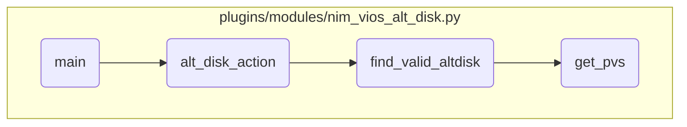

In this document, we will explain the process of handling alternate disk operations. The process involves initializing the environment, performing the specified alternate disk action, finding valid alternate disks, and retrieving physical volumes.

The flow starts with initializing the environment and setting up necessary parameters. Then, it performs the specified alternate disk action, such as copying or cleaning the disk. Next, it finds a valid alternate disk that meets the criteria. Finally, it retrieves the list of physical volumes to identify available disks and their statuses.

# Flow drill down



<SwmSnippet path="/plugins/modules/nim_vios_alt_disk.py" line="1279">

---

## Handling the main logic for alternate disk operations

First, the <SwmToken path="plugins/modules/nim_vios_alt_disk.py" pos="1279:2:2" line-data="def main():">`main`</SwmToken> function initializes the Ansible module and sets up the parameters and results dictionary. It then retrieves the module parameters and builds the NIM node information. This step is crucial for setting up the environment and ensuring that all necessary parameters are available for the subsequent operations.

```python
def main():

    global results

    module = AnsibleModule(
        argument_spec=dict(
            targets=dict(required=True, type='list', elements='dict'),
            action=dict(required=True, type='str',
                        choices=['alt_disk_copy', 'alt_disk_clean']),
            time_limit=dict(type='str'),
            vios_status=dict(type='dict'),
            nim_node=dict(type='dict'),
            disk_size_policy=dict(type='str',
                                  choices=['minimize', 'upper', 'lower', 'nearest'],
                                  default='nearest'),
            force=dict(type='bool', default=False),
        )
    )

    results = dict(
        changed=False,
```

---

</SwmSnippet>

<SwmSnippet path="/plugins/modules/nim_vios_alt_disk.py" line="1043">

---

## Performing alternate disk actions

Next, the <SwmToken path="plugins/modules/nim_vios_alt_disk.py" pos="1043:2:2" line-data="def alt_disk_action(module, params, action, targets, vios_status, time_limit):">`alt_disk_action`</SwmToken> function is called to perform the specified alternate disk action (either copy or clean). This function handles the core logic of the operation, including checking the root volume group (rootvg), validating the alternate disks, and performing the necessary operations such as unmirroring and mirroring the rootvg. This step ensures that the alternate disk operations are executed correctly and any issues are logged and handled appropriately.

```python
def alt_disk_action(module, params, action, targets, vios_status, time_limit):
    """
    alt_disk_copy / alt_disk_clean operation

    For each VIOS tuple,
    - retrieve the previous status if any (looking for SUCCESS-HC and SUCCESS-UPDT)
    - for each VIOS of the tuple, check the rootvg, find and valid the hdisk for the operation
    - unmirror rootvg if necessary
    - perform the alt disk copy or cleanup operation
    - wait for the copy to finish
    - mirror rootvg if necessary

    arguments:
        module      (dict): The Ansible module
        params      (dict): The parameters for the provided action
        action       (str): The action to perform
        targets     (list): The list of VIOS dictionary to perform the action on
        vios_status (dict): The previous operation status for each vios (if any)
        time_limit   (str): The limit of time to perform the operation

    return: dictionary containing the altdisk status for each vios tuple
```

---

</SwmSnippet>

<SwmSnippet path="/plugins/modules/nim_vios_alt_disk.py" line="473">

---

## Finding valid alternate disks

Then, the <SwmToken path="plugins/modules/nim_vios_alt_disk.py" pos="473:2:2" line-data="def find_valid_altdisk(module, params, action, vios_dict, vios_key, rootvg_info, altdisk_op_tab):">`find_valid_altdisk`</SwmToken> function is used to find a valid alternate disk that meets the specified criteria. This function checks if the disk exists, is not part of a volume group, and has the correct size. It sets the operation status accordingly and ensures that only valid disks are used for the alternate disk operations.

```python
def find_valid_altdisk(module, params, action, vios_dict, vios_key, rootvg_info, altdisk_op_tab):
    """
    Find a valid alternate disk that:
    - exists,
    - is not part of a VG
    - with a correct size
    and so can be used.

    Sets the altdisk_op_tab accordingly:
        altdisk_op_tab[vios_key] = "FAILURE-ALTDC <error message>"
        altdisk_op_tab[vios_key] = "SUCCESS-ALTDC"

    arguments:
        module          (dict): The Ansible module
        params          (dict): The parameters for the provided action
        action           (str): The action to perform
        vios_dict       (dict): The list of VIOS dictionary with associated list of hdisks
        vios_key         (str): The key for altdisk_op_tab status dicionary
        rootvg_info     (dict): The rootvg information gathered with check_rootvg
        altdisk_op_tab  (dict): The operation status

```

---

</SwmSnippet>

<SwmSnippet path="/plugins/modules/nim_vios_alt_disk.py" line="397">

---

## Retrieving physical volumes

Finally, the <SwmToken path="plugins/modules/nim_vios_alt_disk.py" pos="397:2:2" line-data="def get_pvs(module, vios):">`get_pvs`</SwmToken> function retrieves the list of physical volumes (<SwmToken path="plugins/modules/nim_vios_alt_disk.py" pos="399:9:9" line-data="    Get the list of PVs on the VIOS.">`PVs`</SwmToken>) on the VIOS. This function executes a command to list the <SwmToken path="plugins/modules/nim_vios_alt_disk.py" pos="399:9:9" line-data="    Get the list of PVs on the VIOS.">`PVs`</SwmToken> and parses the output to build a dictionary of PV information. This step is essential for identifying the available disks and their statuses, which is used in the validation and selection of alternate disks.

```python
def get_pvs(module, vios):
    """
    Get the list of PVs on the VIOS.

    arguments:
        module  (dict): The Ansible module
        vios     (str): The VIOS name
    return: dictionary with PVs information
    """
    module.debug(f'get_pvs vios: {vios}')

    cmd = ['/usr/ios/cli/ioscli', 'lspv']
    ret, stdout, stderr = nim_exec(module, vios, cmd)
    if ret != 0:
        msg = f'Failed to get the PV list on {vios}, lspv returned: {ret} {stderr}'
        results['meta'][vios]['messages'].append(msg)
        module.log(msg)
        return None

    # NAME             PVID                                 VG               STATUS
    # hdisk0           000018fa3b12f5cb                     rootvg           active
```

---

</SwmSnippet>

&nbsp;

*This is an auto-generated document by Swimm 🌊 and has not yet been verified by a human*

<SwmMeta version="3.0.0" repo-id="Z2l0aHViJTNBJTNBYW5zaWJsZS1wb3dlci1haXglM0ElM0Fzd2ltbWlv" repo-name="ansible-power-aix"><sup>Powered by [Swimm](/)</sup></SwmMeta>
