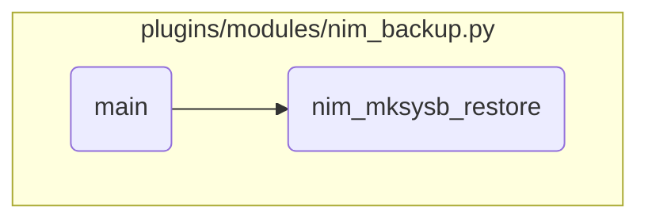

This document explains the flow of handling different actions such as listing, viewing, creating, and restoring backups in the nim_backup module. It covers the steps involved in each action, including the creation of SPOT resources, performing restore operations, and removing NIM resources.

The flow starts by determining the action to be performed, such as listing or restoring backups. For listing, it simply calls a function to list available backups. For restoring, it checks the type of target and object, sets necessary parameters, and calls a function to perform the restore operation. This involves creating SPOT resources if they don't exist, executing the restore command, and optionally removing the resources after the operation.

# Flow drill down



<SwmSnippet path="/plugins/modules/nim_backup.py" line="1337" repo-id="Z2l0aHViJTNBJTNBYW5zaWJsZS1wb3dlci1haXglM0ElM0Fzd2ltbWlv">

---

## Handling Different Actions

First, the code handles different actions such as listing, viewing, creating, and restoring backups. For example, if the action is 'list', it calls the `nim_list_backup` function to list available backups.

```python
    # perform the operation
    if action == 'list':
        params['oslevel'] = module.params['oslevel']
        nim_list_backup(module, targets, objtype, params)

    elif action == 'view':
        nim_view_backup(module, params)

```

---

</SwmSnippet>

<SwmSnippet path="/plugins/modules/nim_backup.py" line="1371" repo-id="Z2l0aHViJTNBJTNBYW5zaWJsZS1wb3dlci1haXglM0ElM0Fzd2ltbWlv">

---

## Restoring mksysb Backups

Next, when the action is 'restore', the code checks if the target is a standalone machine or a VIOS and whether the object type is supported. If the object type is 'mksysb', it sets various parameters and calls the `nim_mksysb_restore` function to perform the restore operation.

```python
    elif action == 'restore':
        for target in targets:

            if target in results['nim_node']['standalone'] and objtype != 'mksysb' and objtype != 'savevg':
                meta_msg2 = f'Operation {action} {objtype} not supported on a standalone machine. You may want to select mksysb.'
                results['meta'][target]['messages'] = meta_msg2
                results['status'][target] = 'FAILURE'
                continue
            if target in results['nim_node']['vios'] and (objtype == 'mksysb' or objtype == 'savevg'):
                results['meta'][target]['messages'].append(f'Operation {action} {objtype} not supported on a VIOS. You may want to select ios_mksysb.')
                results['status'][target] = 'FAILURE'
                continue

            if 'mksysb' in objtype:
                params['group'] = module.params['group']
                params['bosinst_data'] = module.params['bosinst_data']
                params['spot_name'] = module.params['spot_name']
                if not params['spot_name']:
                    params['spot_prefix'] = module.params['spot_prefix']
                    params['spot_postfix'] = module.params['spot_postfix']
                else:
```

---

</SwmSnippet>

<SwmSnippet path="/plugins/modules/nim_backup.py" line="772" repo-id="Z2l0aHViJTNBJTNBYW5zaWJsZS1wb3dlci1haXglM0ElM0Fzd2ltbWlv">

---

### Creating SPOT Resource

Diving into the `nim_mksysb_restore` function, it first checks if the SPOT resource exists. If not, it creates the SPOT resource from the mksysb backup for the restore operation.

```python
    # build sysb and spot resource names
    name = build_name(target, params['name'], params['name_prefix'], params['name_postfix'])
    spot_name = build_name(target, params['spot_name'], params['spot_prefix'], params['spot_postfix'])

    cmd = ['lsnim', spot_name]
    rc, stdout, stderr = module.run_command(cmd)
    if rc == 0:
        msg = f'SPOT {spot_name} exists, using it to restore {name}'
        module.log(msg)
        results['meta'][target]['messages'].append(msg)
    else:
        # Create the SPOT from the mksysb for restore operation
        # nim -o define -t spot -a server=master -a source=mksysb_name -a location=/export/spot spot1
        spot_loc = params['spot_location']
        cmd = ['nim', '-Fo', 'define', '-t', 'spot', '-a', 'server=master']
        cmd += ['-a', f'source={name}']
        cmd += ['-a', f'location={spot_loc}', spot_name]
        cmd = ' '.join(cmd)

        if not module.check_mode:
            rc, stdout, stderr = module.run_command(cmd)
```

---

</SwmSnippet>

<SwmSnippet path="/plugins/modules/nim_backup.py" line="807" repo-id="Z2l0aHViJTNBJTNBYW5zaWJsZS1wb3dlci1haXglM0ElM0Fzd2ltbWlv">

---

### Performing Restore Operation

Then, the function constructs the NIM command to perform the restore operation, including setting parameters like `bosinst_data` and `boot_client`. It executes the command and updates the results based on the command's success or failure.

```python
    cmd = ['nim', '-o', 'bos_inst', '-a', 'source=mksysb']
    param_group = params['group']
    bosinst_data = params['bosinst_data']
    if param_group:
        cmd += ['-a', f'group={param_group}']
    else:
        cmd += ['-a', f'mksysb={name}']
        cmd += ['-a', f'spot={spot_name}']

    if bosinst_data:
        cmd += ['-a', f'bosinst_data={bosinst_data}']
    else:
        results['meta'][target]['messages'].append('Warning: No bosinst_data specified, you will be prompted for additional settings on the console.')

    cmd += ['-a', 'accept_licenses=yes' if module.params['accept_licenses'] else 'accept_licenses=no']
    cmd += ['-a', 'boot_client=yes' if module.params['boot_target'] else 'boot_client=no']
    if params['other_attributes']:
        cmd += params['other_attributes'].split(' ')
    cmd += [target]
    cmd = ' '.join(cmd)

```

---

</SwmSnippet>

<SwmSnippet path="/plugins/modules/nim_backup.py" line="844" repo-id="Z2l0aHViJTNBJTNBYW5zaWJsZS1wb3dlci1haXglM0ElM0Fzd2ltbWlv">

---

### Removing NIM Resources

Finally, the function checks if the SPOT and backup resources should be removed after the restore operation. If so, it constructs and executes the commands to remove these resources, updating the results accordingly.

```python
    if params['remove_spot']:
        cmd = ['nim', '-o', 'remove', spot_name]
        cmd = ' '.join(cmd)
        if not module.check_mode:
            rc, stdout, stderr = module.run_command(cmd)
            if rc != 0:
                results['meta'][target]['stdout'] = stdout
                results['meta'][target]['stderr'] = stderr
                results['meta'][target]['messages'].append(f'Command \'{cmd}\' failed with return code {rc}.')
                results['status'][target] = 'FAILURE'
                return False

            results['meta'][target]['messages'].append(f'SPOT resource {spot_name} has been removed.')
        else:
            results['meta'][target]['messages'].append(f'Command \'{cmd}\' has no preview mode, execution skipped.')

    if params['remove_backup']:
        cmd = ['nim', '-o', 'remove', name]
        cmd = ' '.join(cmd)
        if not module.check_mode:
            rc, stdout, stderr = module.run_command(cmd)
```

---

</SwmSnippet>

&nbsp;

*This is an auto-generated document by Swimm 🌊 and has not yet been verified by a human*

<SwmMeta version="3.0.0"><sup>Powered by [Swimm](https://staging.swimm.cloud/)</sup></SwmMeta>
