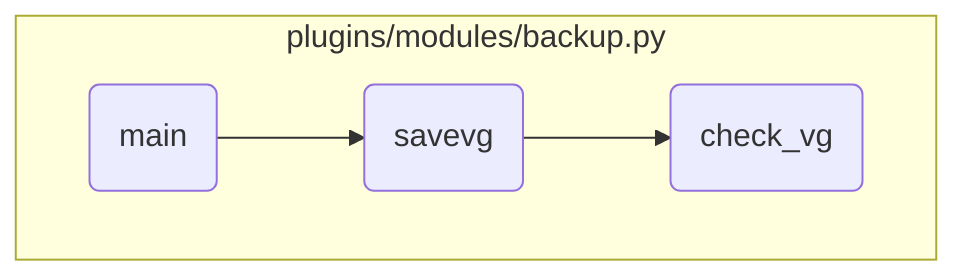

In this document, we will explain the process of handling different actions in the backup module. The process involves retrieving parameters, setting configurations based on the action, and managing volume group backups.

The flow starts with retrieving the action and type parameters, which determine what operation will be performed. If the action is 'create', additional parameters are set to configure the backup creation. If the type is 'savevg', parameters for the volume group backup are set. The process then checks if the volume group is active and finally constructs and runs the backup command.

# Flow drill down



<SwmSnippet path="/plugins/modules/backup.py" line="815">

---

## Handling Different Actions

First, the <SwmToken path="plugins/modules/backup.py" pos="762:2:2" line-data="def main():">`main`</SwmToken> function retrieves the action and type parameters from the module. These parameters determine what operation will be performed, such as creating, restoring, or viewing a backup.

```python
    action = module.params['action']
    params['objtype'] = module.params['type']
    params['flags'] = module.params['flags']
    params['location'] = module.params['location']

```

---

</SwmSnippet>

<SwmSnippet path="/plugins/modules/backup.py" line="820">

---

### Creating a Backup

Next, if the action is 'create', additional parameters like verbosity, data file creation, and exclusion settings are set. These parameters configure how the backup will be created, including whether to exclude certain files or extend file systems.

```python
    if action == 'create':
        params['verbose'] = module.params['verbose']
        params['create_data_file'] = module.params['create_data_file']
        params['exclude_fs'] = module.params['exclude_fs']
        params['exclude_files'] = module.params['exclude_files']
        params['extend_fs'] = module.params['extend_fs']
        params['force'] = module.params['force']

```

---

</SwmSnippet>

<SwmSnippet path="/plugins/modules/backup.py" line="833">

---

### Managing Volume Group Backups

Then, if the type is 'savevg', the function sets the name and exclusion data parameters. These parameters specify the volume group to be backed up and whether to exclude certain data from the backup.

```python
        elif params['objtype'] == 'savevg':
            params['name'] = module.params['name']
            params['exclude_data'] = module.params['exclude_data']

```

---

</SwmSnippet>

<SwmSnippet path="/plugins/modules/backup.py" line="620">

---

## Checking Volume Group

Moving to the <SwmToken path="plugins/modules/backup.py" pos="641:10:10" line-data="    cmd = [&#39;/bin/savevg&#39;]">`savevg`</SwmToken> function, it first checks if the volume group is active by calling the <SwmToken path="plugins/modules/backup.py" pos="620:5:5" line-data="    if not check_vg(module, vg):">`check_vg`</SwmToken> function. This ensures that the volume group is available for backup.

```python
    if not check_vg(module, vg):
        return 1
```

---

</SwmSnippet>

<SwmSnippet path="/plugins/modules/backup.py" line="641">

---

### Running the Backup Command

Finally, the <SwmToken path="plugins/modules/backup.py" pos="641:10:10" line-data="    cmd = [&#39;/bin/savevg&#39;]">`savevg`</SwmToken> function constructs and runs the <SwmToken path="plugins/modules/backup.py" pos="641:10:10" line-data="    cmd = [&#39;/bin/savevg&#39;]">`savevg`</SwmToken> command with the specified parameters. This command performs the actual backup of the volume group, storing the backup image at the specified location.

```python
    cmd = ['/bin/savevg']
    if params['exclude_files']:
        cmd += ['-e']
    if params['location']:
        cmd += ['-f', params['location']]
    if params['create_data_file'].lower() == 'mapfile':
        cmd += ['-m']
    elif params['create_data_file'].lower() == 'yes':
        cmd += ['-i']
    if params['exclude_data']:
        cmd += ['-r']
    if params['verbose']:
        cmd += ['-v']
    if params['exclude_fs']:
        cmd += ['-x', params['exclude_fs']]
    if params['extend_fs']:
        cmd += ['-X']
    if params['flags']:
        for f in params['flags'].split(' '):
            cmd += [f]
    cmd += [vg]
```

---

</SwmSnippet>

&nbsp;

*This is an auto-generated document by Swimm 🌊 and has not yet been verified by a human*

<SwmMeta version="3.0.0" repo-id="Z2l0aHViJTNBJTNBYW5zaWJsZS1wb3dlci1haXglM0ElM0Fzd2ltbWlv" repo-name="ansible-power-aix"><sup>Powered by [Swimm](/)</sup></SwmMeta>
