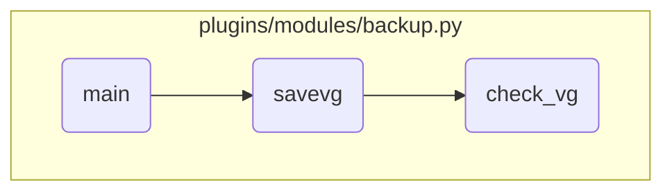

In this document, we will explain the process of handling different actions in the backup module. The process involves retrieving parameters, creating backups, and managing volume group backups.

The flow starts with retrieving the action and type parameters to determine the operation and backup type. If the action is 'create', additional parameters are retrieved to customize the backup creation. For 'savevg' type, it checks for necessary parameters and sets error messages if conditions are not met. The <SwmToken path="plugins/modules/backup.py" pos="582:2:2" line-data="def savevg(module, params, vg):">`savevg`</SwmToken> function checks for existing backups and creates a new one if needed. The <SwmToken path="plugins/modules/backup.py" pos="338:2:2" line-data="def check_vg(module, vg):">`check_vg`</SwmToken> function ensures the volume group is active before proceeding with the backup.

# Flow drill down



<SwmSnippet path="/plugins/modules/backup.py" line="815">

---

## Handling Different Actions

First, the <SwmToken path="plugins/modules/backup.py" pos="762:2:2" line-data="def main():">`main`</SwmToken> function retrieves the action and type parameters from the module. These parameters determine what kind of operation (create, restore, view) and what type of backup (mksysb, savevg) will be performed.

```python
    action = module.params['action']
    params['objtype'] = module.params['type']
    params['flags'] = module.params['flags']
    params['location'] = module.params['location']

```

---

</SwmSnippet>

<SwmSnippet path="/plugins/modules/backup.py" line="820">

---

### Creating a Backup

Next, if the action is 'create', additional parameters like verbose, <SwmToken path="plugins/modules/backup.py" pos="822:4:4" line-data="        params[&#39;create_data_file&#39;] = module.params[&#39;create_data_file&#39;]">`create_data_file`</SwmToken>, <SwmToken path="plugins/modules/backup.py" pos="823:4:4" line-data="        params[&#39;exclude_fs&#39;] = module.params[&#39;exclude_fs&#39;]">`exclude_fs`</SwmToken>, <SwmToken path="plugins/modules/backup.py" pos="824:4:4" line-data="        params[&#39;exclude_files&#39;] = module.params[&#39;exclude_files&#39;]">`exclude_files`</SwmToken>, <SwmToken path="plugins/modules/backup.py" pos="825:4:4" line-data="        params[&#39;extend_fs&#39;] = module.params[&#39;extend_fs&#39;]">`extend_fs`</SwmToken>, and force are retrieved. These parameters are used to customize the backup creation process.

```python
    if action == 'create':
        params['verbose'] = module.params['verbose']
        params['create_data_file'] = module.params['create_data_file']
        params['exclude_fs'] = module.params['exclude_fs']
        params['exclude_files'] = module.params['exclude_files']
        params['extend_fs'] = module.params['extend_fs']
        params['force'] = module.params['force']

```

---

</SwmSnippet>

<SwmSnippet path="/plugins/modules/backup.py" line="833">

---

### Handling 'savevg' Type

Then, if the type is 'savevg', the function checks if the 'name' parameter is provided and if <SwmToken path="plugins/modules/backup.py" pos="835:4:4" line-data="            params[&#39;exclude_data&#39;] = module.params[&#39;exclude_data&#39;]">`exclude_data`</SwmToken> is set when the name is 'rootvg'. If these conditions are not met, appropriate error messages are set, and the function fails.

```python
        elif params['objtype'] == 'savevg':
            params['name'] = module.params['name']
            params['exclude_data'] = module.params['exclude_data']

            if not params['name']:
                results['msg'] = 'argument \'name\' is missing.'
                module.fail_json(**results)
            if params['exclude_data'] and params['name'] == 'rootvg':
                results['msg'] = 'name cannot be \'rootvg\'.'
                module.fail_json(**results)
```

---

</SwmSnippet>

<SwmSnippet path="/plugins/modules/backup.py" line="582">

---

## Managing Volume Group Backups

Moving to the <SwmToken path="plugins/modules/backup.py" pos="582:2:2" line-data="def savevg(module, params, vg):">`savevg`</SwmToken> function, it first checks if a backup image already exists at the specified location. If a backup exists and the 'force' parameter is not set, it logs a message and returns without creating a new backup.

```python
def savevg(module, params, vg):
    """
    Run the savevg command to back up files of a volume group.
    But first, checks the volume group is varied-on.

    arguments:
        module  (dict): the module variable
        params  (dict): the command parameters
        vg       (str): the volume group to back up
    return:
        rc       (int): the return code of the command
    """

    module.log(f'Creating VG backup of { vg } with savevg.')

    # Check if the backup image already exists
    if not params['force']:
        rc = restvg_view(module, params)
        # check if there is an existing backup specified by 'location' parameter
        # if there is not existing backup at 'location' then proceed to creation of backup
        # 0512-054 listvgbackup: File /tmp/testvg_backup does not exist or is empty.
```

---

</SwmSnippet>

<SwmSnippet path="/plugins/modules/backup.py" line="338">

---

### Checking Volume Group Status

Diving into the <SwmToken path="plugins/modules/backup.py" pos="338:2:2" line-data="def check_vg(module, vg):">`check_vg`</SwmToken> function, it checks if the specified volume group is active. If the volume group is not active, it logs an appropriate message and returns False, preventing the backup from proceeding.

```python
def check_vg(module, vg):
    """
    Check if the volume group is active (i.e. varied-on).

    arguments:
        module  (dict): The Ansible module
        vg       (str): the volume group to back up
    return:
        True if the vg can be used
        False otherwise
    """

    module.log(f'Checking { vg } is active.')

    # list active volume groups
    cmd = ['/usr/sbin/lsvg', '-o']
    rc, stdout, stderr = module.run_command(cmd)
    if rc != 0:
        results['msg'] = f'Cannot get active volume group. Command \'{ cmd }\' failed.'
        results['stdout'] = stdout
        results['stderr'] = stderr
```

---

</SwmSnippet>

&nbsp;

*This is an auto-generated document by Swimm 🌊 and has not yet been verified by a human*

<SwmMeta version="3.0.0" repo-id="Z2l0aHViJTNBJTNBYW5zaWJsZS1wb3dlci1haXglM0ElM0Fzd2ltbWlv" repo-name="ansible-power-aix"><sup>Powered by [Swimm](/)</sup></SwmMeta>
