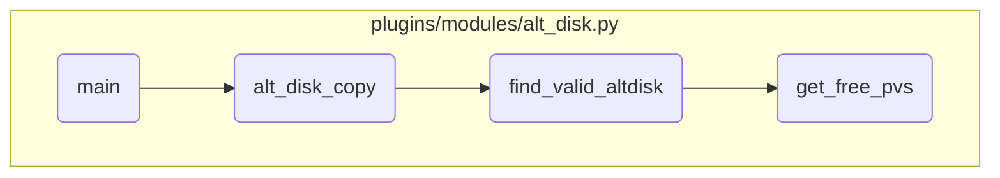

In this document, we will explain the process of handling the main action in the <SwmToken path="plugins/modules/alt_disk.py" pos="23:3:3" line-data="module: alt_disk">`alt_disk`</SwmToken> module. The process involves initializing the Ansible module, validating parameters, finding a valid alternate disk, and retrieving free physical volumes.

The flow starts with initializing the Ansible module and checking if the script is running on a VIOS system. It then determines the action to perform and calls the appropriate function. The <SwmToken path="plugins/modules/alt_disk.py" pos="538:2:2" line-data="def alt_disk_copy(module, params, hdisks, allow_old_rootvg):">`alt_disk_copy`</SwmToken> function validates the parameters and performs the alt disk copy operation. The <SwmToken path="plugins/modules/alt_disk.py" pos="267:2:2" line-data="def find_valid_altdisk(module, hdisks, rootvg_info, disk_size_policy, force, allow_old_rootvg):">`find_valid_altdisk`</SwmToken> function checks the root volume group status and selects a suitable alternate disk. Finally, the <SwmToken path="plugins/modules/alt_disk.py" pos="218:2:2" line-data="def get_free_pvs(module):">`get_free_pvs`</SwmToken> function retrieves the list of free physical volumes for the alt disk operations.

# Flow drill down



<SwmSnippet path="/plugins/modules/alt_disk.py" line="725">

---

## Handling the main action

First, the <SwmToken path="plugins/modules/alt_disk.py" pos="725:2:2" line-data="def main():">`main`</SwmToken> function initializes the Ansible module with the required parameters and checks if the script is running on a VIOS system, which is not allowed. It then determines the action to perform (copy, clean, or install) and calls the appropriate function to handle the action.

```python
def main():
    global results

    module = AnsibleModule(
        argument_spec=dict(
            action=dict(type='str',
                        choices=['copy', 'clean', 'install'], default='copy'),
            targets=dict(type='list', elements='str'),
            disk_size_policy=dict(type='str',
                                  choices=['minimize', 'upper', 'lower', 'nearest']),
            existing_altinst_rootvg=dict(type='str'),
            bundle_name=dict(type='str'),
            apar_fixes=dict(type='str'),
            filesets=dict(type='str'),
            installp_flags=dict(type='str'),
            image_location=dict(type='str'),
            force=dict(type='bool', default=False),
            bootlist=dict(type='bool', default=False),
            remain_nim_client=dict(type='bool', default=False),
            device_reset=dict(type='bool', default=False),
            first_boot_script=dict(type='str'),
```

---

</SwmSnippet>

<SwmSnippet path="/plugins/modules/alt_disk.py" line="538">

---

## Validating parameters and performing alt disk copy

Next, the <SwmToken path="plugins/modules/alt_disk.py" pos="538:2:2" line-data="def alt_disk_copy(module, params, hdisks, allow_old_rootvg):">`alt_disk_copy`</SwmToken> function validates the parameters to ensure either targets or <SwmToken path="plugins/modules/alt_disk.py" pos="547:17:17" line-data="    # Either hdisks must be non-empty or disk_size_policy must be">`disk_size_policy`</SwmToken> is specified. It then checks the root volume group (rootvg) and mirrors, and calls <SwmToken path="plugins/modules/alt_disk.py" pos="267:2:2" line-data="def find_valid_altdisk(module, hdisks, rootvg_info, disk_size_policy, force, allow_old_rootvg):">`find_valid_altdisk`</SwmToken> to find a suitable alternate disk. Finally, it performs the alt disk copy operation and logs the results.

```python
def alt_disk_copy(module, params, hdisks, allow_old_rootvg):
    """
    alt_disk_copy operation

    - check the rootvg, find and validate the hdisks for the operation
    - perform the alt disk copy operation
    """
    global mirrors

    # Either hdisks must be non-empty or disk_size_policy must be
    # explicitly set. This ensures the user knows what he is doing.
    if not hdisks and not params['disk_size_policy']:
        results['msg'] = 'Either targets or disk_size_policy must be specified'
        module.fail_json(**results)

    rootvg_info = check_rootvg(module)
    if rootvg_info is None:
        module.fail_json(**results)

    if hdisks is None:
        hdisks = []
```

---

</SwmSnippet>

<SwmSnippet path="/plugins/modules/alt_disk.py" line="267">

---

## Finding a valid alternate disk

Then, the <SwmToken path="plugins/modules/alt_disk.py" pos="267:2:2" line-data="def find_valid_altdisk(module, hdisks, rootvg_info, disk_size_policy, force, allow_old_rootvg):">`find_valid_altdisk`</SwmToken> function checks the rootvg status and retrieves the list of physical volumes (<SwmToken path="plugins/modules/alt_disk.py" pos="220:11:11" line-data="    Get the list of free PVs.">`PVs`</SwmToken>). It ensures no alternate or old rootvg disks already exist unless forced. It then selects a suitable alternate disk based on the disk size policy and validates the selected disks.

```python
def find_valid_altdisk(module, hdisks, rootvg_info, disk_size_policy, force, allow_old_rootvg):
    """
    Find a valid alternate disk that:
    - exists,
    - is not part of a VG
    - with a correct size
    and so can be used.
    """

    # check rootvg
    if rootvg_info['status'] != 0:
        results['msg'] = 'Wrong rootvg state'
        module.fail_json(**results)

    # get pv list
    pvs = get_pvs(module)
    if pvs is None:
        module.fail_json(**results)
    # check an alternate disk does not already exist
    found_altdisk = ''
    found_oldrootvg = ''
```

---

</SwmSnippet>

<SwmSnippet path="/plugins/modules/alt_disk.py" line="218">

---

## Getting free physical volumes

Finally, the <SwmToken path="plugins/modules/alt_disk.py" pos="218:2:2" line-data="def get_free_pvs(module):">`get_free_pvs`</SwmToken> function retrieves the list of free <SwmToken path="plugins/modules/alt_disk.py" pos="220:11:11" line-data="    Get the list of free PVs.">`PVs`</SwmToken> by running system commands to check for disks with no volume groups and retrieves their sizes. This information is used to find suitable disks for the alt disk operations.

```python
def get_free_pvs(module):
    """
    Get the list of free PVs.

    return: dictionary with free PVs information
    """

    cmd = ['lspv']
    ret, stdout, stderr = module.run_command(cmd)
    if ret != 0:
        results['stdout'] = stdout
        results['stderr'] = stderr
        results['msg'] = f'Command \'{ cmd }\' failed with return code { ret }.'
        return None

    # hdisk0           000018fa3b12f5cb                     rootvg           active
    free_pvs = {}
    for line in stdout.split('\n'):
        line = line.rstrip()
        match_key = re.match(r"^(hdisk\S+)\s+(\S+)\s+(\S+)\s*(\S*)", line)
        # Only match disks that have no volume groups
```

---

</SwmSnippet>

&nbsp;

*This is an auto-generated document by Swimm 🌊 and has not yet been verified by a human*

<SwmMeta version="3.0.0" repo-id="Z2l0aHViJTNBJTNBYW5zaWJsZS1wb3dlci1haXglM0ElM0Fzd2ltbWlv" repo-name="ansible-power-aix"><sup>Powered by [Swimm](/)</sup></SwmMeta>
