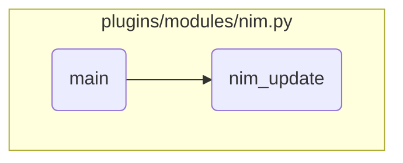

In this document, we will explain the process of handling different NIM actions. The process involves initializing the Ansible module, defining parameters, retrieving these parameters, and calling the appropriate function based on the specified action.

The flow starts with initializing the Ansible module and defining the necessary parameters for various NIM actions. It then retrieves these parameters and logs the start of the NIM operation. Depending on the action specified by the user, it calls the appropriate function to handle that action, ensuring the correct NIM operation is performed.

# Flow drill down



<SwmSnippet path="/plugins/modules/nim.py" line="2006">

---

## Handling Different NIM Actions

First, the <SwmToken path="plugins/modules/nim.py" pos="2006:2:2" line-data="def main():">`main`</SwmToken> function initializes the Ansible module and defines the parameters required for various NIM actions. It then retrieves these parameters and logs the start of the NIM operation. Depending on the action specified, it calls the appropriate function to handle that action, such as <SwmToken path="plugins/modules/nim.py" pos="982:2:2" line-data="def nim_update(module, params):">`nim_update`</SwmToken>, <SwmToken path="plugins/modules/nim.py" pos="1167:2:2" line-data="def nim_maintenance(module, params):">`nim_maintenance`</SwmToken>, <SwmToken path="plugins/modules/nim.py" pos="128:19:19" line-data="    U(https://www.ibm.com/support/knowledgecenter/ssw_aix_72/n_commands/nim_master_setup.html).">`nim_master_setup`</SwmToken>, etc. This ensures that the correct NIM operation is performed based on the user's input.

```python
def main():
    global results

    module = AnsibleModule(
        argument_spec=dict(
            action=dict(type='str', required=True,
                        choices=['update', 'master_setup', 'check', 'compare',
                                 'script', 'allocate', 'deallocate',
                                 'bos_inst', 'define_script', 'remove',
                                 'reset', 'reboot', 'maintenance', 'show', 'register_client']),
            lpp_source=dict(type='str'),
            targets=dict(type='list', elements='str'),
            new_targets=dict(type='list', elements='str'),  # The elements format is <machine name>-<login id>-<password>
            asynchronous=dict(type='bool', default=False),
            device=dict(type='str'),
            script=dict(type='str'),
            resource=dict(type='str'),
            location=dict(type='str'),
            group=dict(type='str'),
            force=dict(type='bool', default=False),
            boot_client=dict(type='bool', default=True),
```

---

</SwmSnippet>

<SwmSnippet path="/plugins/modules/nim.py" line="982">

---

## Updating NIM Clients

Next, the <SwmToken path="plugins/modules/nim.py" pos="982:2:2" line-data="def nim_update(module, params):">`nim_update`</SwmToken> function is called when the action is 'update'. This function updates NIM clients with a specified <SwmToken path="plugins/modules/nim.py" pos="984:17:17" line-data="    Update nim clients (targets) with a specified lpp_source.">`lpp_source`</SwmToken>. It handles both synchronous and asynchronous updates, checks for interim fixes that could block the install, and ensures that the correct <SwmToken path="plugins/modules/nim.py" pos="984:17:17" line-data="    Update nim clients (targets) with a specified lpp_source.">`lpp_source`</SwmToken> is used for the update. It also logs detailed messages and updates the results dictionary with the status of the operation for each target.

```python
def nim_update(module, params):
    """
    Update nim clients (targets) with a specified lpp_source.

    In case of updating to the latest TL or SP, the synchronous mode is forced.
    Interim fixes that could block the install are removed.

    arguments:
        module  (dict): The Ansible module
        params  (dict): The module parameters for the command.
    note:
        Exits with fail_json in case of error
    """

    lpp_source = params['lpp_source']
    alt_disk_update_name = params['alt_disk_update_name']
    targets = params['targets']

    async_update = 'no'
    if params['asynchronous']:
        async_update = 'yes'
```

---

</SwmSnippet>

&nbsp;

*This is an auto-generated document by Swimm 🌊 and has not yet been verified by a human*

<SwmMeta version="3.0.0" repo-id="Z2l0aHViJTNBJTNBYW5zaWJsZS1wb3dlci1haXglM0ElM0Fzd2ltbWlv" repo-name="ansible-power-aix"><sup>Powered by [Swimm](/)</sup></SwmMeta>
