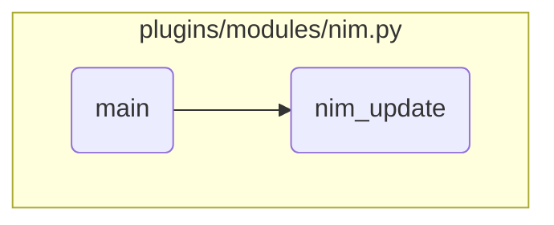

This document explains the flow of handling different NIM operations. The <SwmToken path="plugins/modules/nim.py" pos="2006:2:2" line-data="def main():">`main`</SwmToken> function is responsible for determining the action to be performed and calling the appropriate function to handle that action. It includes building NIM node information, registering new clients, and updating NIM clients.

The flow starts with the <SwmToken path="plugins/modules/nim.py" pos="2006:2:2" line-data="def main():">`main`</SwmToken> function checking the action to be performed. If the action is 'update', it sets the necessary parameters and calls the <SwmToken path="plugins/modules/nim.py" pos="982:2:2" line-data="def nim_update(module, params):">`nim_update`</SwmToken> function to handle the update operation. If the action is <SwmToken path="plugins/modules/nim.py" pos="2097:28:28" line-data="    if action != &#39;master_setup&#39; and action != &#39;show&#39; and action != &#39;register_client&#39;:">`register_client`</SwmToken>, it sets the targets to the new targets and calls the <SwmToken path="plugins/modules/nim.py" pos="2097:28:28" line-data="    if action != &#39;master_setup&#39; and action != &#39;show&#39; and action != &#39;register_client&#39;:">`register_client`</SwmToken> function to register a new client. For other actions, it calls <SwmToken path="plugins/modules/nim.py" pos="2099:1:1" line-data="        build_nim_node(module)">`build_nim_node`</SwmToken> to build the NIM node information.

# Flow drill down



<SwmSnippet path="/plugins/modules/nim.py" line="2096">

---

## Handling different NIM operations

First, the <SwmToken path="plugins/modules/nim.py" pos="2006:2:2" line-data="def main():">`main`</SwmToken> function checks if the action is 'update'. If it is, it sets the necessary parameters and calls the <SwmToken path="plugins/modules/nim.py" pos="2111:1:1" line-data="        nim_update(module, params)">`nim_update`</SwmToken> function to handle the update operation for NIM clients.

```python
    # skip build nim node for actions: master_setup or show
    if action != 'master_setup' and action != 'show' and action != 'register_client':
        # Build nim node info
        build_nim_node(module)

    if action == 'register_client':
        targets = module.params['new_targets']
        register_client(module, targets)

    if action == 'update':
        params['targets'] = targets
        params['lpp_source'] = lpp_source
        params['asynchronous'] = asynchronous
        params['force'] = force
        params['alt_disk_update_name'] = alt_disk_update_name
        nim_update(module, params)
```

---

</SwmSnippet>

<SwmSnippet path="/plugins/modules/nim.py" line="2101">

---

## Registering a new client

Next, if the action is <SwmToken path="plugins/modules/nim.py" pos="2101:8:8" line-data="    if action == &#39;register_client&#39;:">`register_client`</SwmToken>, the <SwmToken path="plugins/modules/nim.py" pos="2006:2:2" line-data="def main():">`main`</SwmToken> function sets the targets to the new targets and calls the <SwmToken path="plugins/modules/nim.py" pos="2101:8:8" line-data="    if action == &#39;register_client&#39;:">`register_client`</SwmToken> function to register a new client.

```python
    if action == 'register_client':
        targets = module.params['new_targets']
        register_client(module, targets)
```

---

</SwmSnippet>

<SwmSnippet path="/plugins/modules/nim.py" line="2097">

---

## Building NIM node information

Then, for actions other than <SwmToken path="plugins/modules/nim.py" pos="2097:8:8" line-data="    if action != &#39;master_setup&#39; and action != &#39;show&#39; and action != &#39;register_client&#39;:">`master_setup`</SwmToken>, 'show', and <SwmToken path="plugins/modules/nim.py" pos="2097:28:28" line-data="    if action != &#39;master_setup&#39; and action != &#39;show&#39; and action != &#39;register_client&#39;:">`register_client`</SwmToken>, the <SwmToken path="plugins/modules/nim.py" pos="2006:2:2" line-data="def main():">`main`</SwmToken> function calls <SwmToken path="plugins/modules/nim.py" pos="2099:1:1" line-data="        build_nim_node(module)">`build_nim_node`</SwmToken> to build the NIM node information.

```python
    if action != 'master_setup' and action != 'show' and action != 'register_client':
        # Build nim node info
        build_nim_node(module)
```

---

</SwmSnippet>

<SwmSnippet path="/plugins/modules/nim.py" line="982">

---

## Performing NIM update

Diving into the <SwmToken path="plugins/modules/nim.py" pos="982:2:2" line-data="def nim_update(module, params):">`nim_update`</SwmToken> function, it first logs the update operation and checks if the update should be asynchronous or synchronous. This decision affects how the update process will be handled.

```python
def nim_update(module, params):
    """
    Update nim clients (targets) with a specified lpp_source.

    In case of updating to the latest TL or SP, the synchronous mode is forced.
    Interim fixes that could block the install are removed.

    arguments:
        module  (dict): The Ansible module
        params  (dict): The module parameters for the command.
    note:
        Exits with fail_json in case of error
    """

    lpp_source = params['lpp_source']
    alt_disk_update_name = params['alt_disk_update_name']
    targets = params['targets']

    async_update = 'no'
    if params['asynchronous']:
        async_update = 'yes'
```

---

</SwmSnippet>

<SwmSnippet path="/plugins/modules/nim.py" line="1063">

---

## Handling asynchronous updates

Next, if the update is asynchronous, the function checks if the specified <SwmToken path="plugins/modules/nim.py" pos="1064:3:3" line-data="        if lpp_source not in results[&#39;nim_node&#39;][&#39;lpp_source&#39;]:">`lpp_source`</SwmToken> exists and performs the customization asynchronously. If the operation fails, it logs an error and exits.

```python
    if async_update == 'yes':   # async update
        if lpp_source not in results['nim_node']['lpp_source']:
            debug_lpp_src = results['nim_node']['lpp_source']
            results['msg'] = f'Cannot find lpp_source \'{ debug_lpp_src }\'.'
            module.log('NIM - Error: ' + results['msg'])
            module.fail_json(**results)

        msg_target_list = ','.join(target_list)
        msg = f'Asynchronous software customization for client(s) { msg_target_list } with resource { lpp_source }.'
        results['meta']['messages'].append(msg)
        module.log('NIM - ' + msg)

        rc = perform_customization(module, lpp_source, target_list, True)
        if rc:
            results['msg'] = 'Asynchronous software customization operation failed. See status and meta for details.'
            module.log('NIM - Error: ' + results['msg'])
            module.fail_json(**results)

```

---

</SwmSnippet>

<SwmSnippet path="/plugins/modules/nim.py" line="1081">

---

## Handling synchronous updates

Then, if the update is synchronous, the function retrieves the current oslevel of the targets, determines the new <SwmToken path="plugins/modules/nim.py" pos="984:17:17" line-data="    Update nim clients (targets) with a specified lpp_source.">`lpp_source`</SwmToken>, and performs the customization synchronously. It logs the results and updates the status accordingly.

```python
    else:    # synchronous update
        # Get the oslevels of the specified targets only
        oslevels = get_oslevels(module, target_list)
        for (k, val) in oslevels.items():
            if k != 'master':
                results['nim_node']['standalone'][k]['oslevel'] = val
            else:
                results['nim_node']['master']['oslevel'] = val

        for target in target_list:
            # get current oslevel
            cur_oslevel = ''
            if target == 'master':
                cur_oslevel = results['nim_node']['master']['oslevel']
            else:
                cur_oslevel = results['nim_node']['standalone'][target]['oslevel']
            if (cur_oslevel is None) or (not cur_oslevel.strip()) or cur_oslevel == 'timedout':
                msg = f'Invalid oslevel got: \'{ cur_oslevel }\'.'
                results['meta'][target]['messages'].append(msg)
                module.log(f'NIM - WARNING: On { target } with msg: { msg } ')
                results['msg'] += f"{target} - {results['meta'][target]['messages']}"
```

---

</SwmSnippet>

&nbsp;

*This is an auto-generated document by Swimm 🌊 and has not yet been verified by a human*

<SwmMeta version="3.0.0" repo-id="Z2l0aHViJTNBJTNBYW5zaWJsZS1wb3dlci1haXglM0ElM0Fzd2ltbWlv" repo-name="ansible-power-aix"><sup>Powered by [Swimm](/)</sup></SwmMeta>
