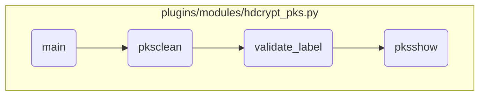

This document explains the flow of handling various PKS-related actions in the <SwmPath>[plugins/modules/hdcrypt_pks.py](plugins/modules/hdcrypt_pks.py)</SwmPath> module. The process starts with initializing the Ansible module and retrieving the action parameter. Depending on the user-specified action, the appropriate function is called to handle operations such as adding, showing, cleaning, importing, or exporting PKS keys.

The flow begins by initializing the Ansible module and getting the action parameter from the user. If PKS is not enabled or activated, an error message is returned. If PKS is enabled, the flow proceeds based on the action specified by the user. For example, if the action is 'clean', the <SwmToken path="plugins/modules/hdcrypt_pks.py" pos="549:2:2" line-data="def pksclean(module):">`pksclean`</SwmToken> function is called to clean invalid PKS keys. This function checks if a PKS label is provided and validates it. If valid, it cleans the invalid keys and returns a success message. If the label is invalid, an error message is returned. Similarly, other actions like 'show' involve calling the <SwmToken path="plugins/modules/hdcrypt_pks.py" pos="468:10:10" line-data="    results[&#39;msg&#39;] = pksshow(module)">`pksshow`</SwmToken> function to display PKS labels and their status.

# Flow drill down



<SwmSnippet path="/plugins/modules/hdcrypt_pks.py" line="687">

---

## Handling different actions based on user input

First, the <SwmToken path="plugins/modules/hdcrypt_pks.py" pos="687:2:2" line-data="def main():">`main`</SwmToken> function initializes the Ansible module and retrieves the action parameter. It then checks if PKS is enabled and activated. Depending on the action specified by the user, it calls the appropriate function to handle the requested operation, such as adding, showing, cleaning, importing, or exporting PKS keys.

```python
def main():

    module = AnsibleModule(
        supports_check_mode=True,
        argument_spec=dict(
            action=dict(type='str', choices=['addpks', 'show', 'clean', 'import', 'export'], required=True),
            device=dict(type='str', default=""),
            method_name=dict(type='str', default="initpks"),
            pks_label=dict(type='str'),
            location=dict(type='str'),
            passphrase=dict(type='str', default=""),
        ),
    )

    action = module.params['action']

    if not is_pks_enabled(module):
        results['msg'] = "PKS is not supported or PKS is not activated."
        module.fail_json(**results)

    version = find_version(module)
```

---

</SwmSnippet>

<SwmSnippet path="/plugins/modules/hdcrypt_pks.py" line="549">

---

## Cleaning invalid PKS keys

Next, the <SwmToken path="plugins/modules/hdcrypt_pks.py" pos="549:2:2" line-data="def pksclean(module):">`pksclean`</SwmToken> function is called when the user action is 'clean'. It ensures that a PKS label is provided and validates it. If the label is valid, it runs the command to clean the invalid PKS keys and returns a success message. If the label is not valid, it fails with an appropriate error message.

```python
def pksclean(module):
    """
    Cleans invalid PKS keys
    arguments:
        module - The generic ansible module
    returns:
        success_msg (str) - In case of success
        fail_msg (str) - In case of failure
    """
    success_msg = "Successfully cleaned invalid PKS keys"
    fail_msg = "Could not clean invalid PKS keys"

    pks_label = module.params['pks_label']

    if not pks_label:
        results['msg'] = "You must specify the PKS label that is associated with the invalid key that you want to remove."
        module.fail_json(**results)

    validate_label(module, pks_label)

    cmd = "hdcryptmgr pksclean " + pks_label
```

---

</SwmSnippet>

<SwmSnippet path="/plugins/modules/hdcrypt_pks.py" line="454">

---

## Validating PKS label

Then, the <SwmToken path="plugins/modules/hdcrypt_pks.py" pos="454:2:2" line-data="def validate_label(module, id):">`validate_label`</SwmToken> function checks if the provided PKS label is present in the PKS storage and if it is a valid key. If the label is not present or is a valid key, it fails with an appropriate error message.

```python
def validate_label(module, id):
    """
    Utility function to check if the provided id is valid or not

    arguments:
        module (dict) - The Ansible module
        id (str) - id that needs to be validated

    returns:
        Nothing

    Note:
        Fails if the key is not present in PKS storage or is a valid key
    """
    results['msg'] = pksshow(module)

    pksshow_res = results['pksshow_results']

    if id not in pksshow_res["PKS_Label (LVid)"].keys():
        results['msg'] = "The provided id is not present in PKS Storage."
        module.fail_json(**results)
```

---

</SwmSnippet>

<SwmSnippet path="/plugins/modules/hdcrypt_pks.py" line="524">

---

## Displaying PKS labels and status

Finally, the <SwmToken path="plugins/modules/hdcrypt_pks.py" pos="524:2:2" line-data="def pksshow(module):">`pksshow`</SwmToken> function displays the PKS labels and their status. It runs the command to fetch the PKS keys, labels, and their status, and returns the results. If the command fails, it returns an error message.

```python
def pksshow(module):
    """
    Displays the PKS label of volume that is associated with the PKS keys and the status of the PKS keys.
    arguements:
        module - The generic ansible module
    returns:
        success_msg: If the command runs successfully, success message is returned.
    """
    cmd = "hdcryptmgr pksshow"
    success_msg = "Successfully fetched PKS keys, labels and their status, check pksshow_results"
    fail_msg = "Could not fetch pksshow's output"

    rc, stdout, stderr = module.run_command(cmd)

    if not rc:
        results['stdout'] = stdout
        results['msg'] = success_msg
    else:
        results['stderr'] = stderr
        results['msg'] = fail_msg

```

---

</SwmSnippet>

&nbsp;

*This is an auto-generated document by Swimm 🌊 and has not yet been verified by a human*

<SwmMeta version="3.0.0" repo-id="Z2l0aHViJTNBJTNBYW5zaWJsZS1wb3dlci1haXglM0ElM0Fzd2ltbWlv" repo-name="ansible-power-aix"><sup>Powered by [Swimm](/)</sup></SwmMeta>
