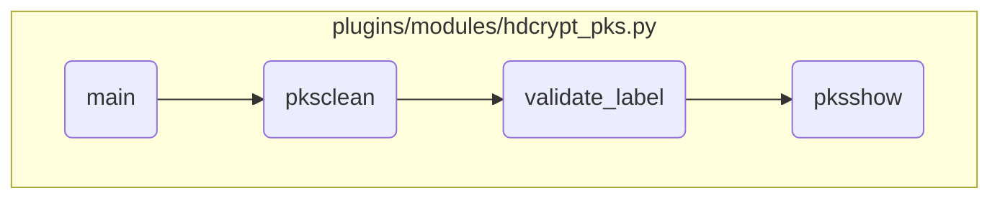

In this document, we will explain the process of handling different PKS key operations based on user input. The process involves initializing the Ansible module, retrieving the action parameter, and calling the appropriate function to handle the specified action.

The flow starts by initializing the Ansible module and retrieving the action parameter specified by the user. Depending on the action, such as 'clean', 'show', or 'validate', the corresponding function is called to perform the PKS key operation. For example, if the action is 'clean', the <SwmToken path="plugins/modules/hdcrypt_pks.py" pos="549:2:2" line-data="def pksclean(module):">`pksclean`</SwmToken> function is called to clean invalid PKS keys. This function checks if the PKS label is provided, validates the label, and then runs the command to clean the PKS keys. Similarly, the <SwmToken path="plugins/modules/hdcrypt_pks.py" pos="454:2:2" line-data="def validate_label(module, id):">`validate_label`</SwmToken> function checks if the provided PKS label is valid, and the <SwmToken path="plugins/modules/hdcrypt_pks.py" pos="468:10:10" line-data="    results[&#39;msg&#39;] = pksshow(module)">`pksshow`</SwmToken> function displays the PKS labels and key status.

# Flow drill down



<SwmSnippet path="/plugins/modules/hdcrypt_pks.py" line="687">

---

## Handling different actions based on user input

First, the <SwmToken path="plugins/modules/hdcrypt_pks.py" pos="687:2:2" line-data="def main():">`main`</SwmToken> function initializes the Ansible module and retrieves the action parameter. Depending on the action specified by the user, it calls the appropriate function to handle the PKS key operations. For example, if the action is 'clean', it calls the <SwmToken path="plugins/modules/hdcrypt_pks.py" pos="549:2:2" line-data="def pksclean(module):">`pksclean`</SwmToken> function to clean invalid PKS keys.

```python
def main():

    module = AnsibleModule(
        supports_check_mode=True,
        argument_spec=dict(
            action=dict(type='str', choices=['addpks', 'show', 'clean', 'import', 'export'], required=True),
            device=dict(type='str', default=""),
            method_name=dict(type='str', default="initpks"),
            pks_label=dict(type='str'),
            location=dict(type='str'),
            passphrase=dict(type='str', default=""),
        ),
    )

    action = module.params['action']

    if not is_pks_enabled(module):
        results['msg'] = "PKS is not supported or PKS is not activated."
        module.fail_json(**results)

    version = find_version(module)
```

---

</SwmSnippet>

<SwmSnippet path="/plugins/modules/hdcrypt_pks.py" line="549">

---

## Cleaning invalid PKS keys

Next, the <SwmToken path="plugins/modules/hdcrypt_pks.py" pos="549:2:2" line-data="def pksclean(module):">`pksclean`</SwmToken> function is responsible for cleaning invalid PKS keys. It first checks if the PKS label is provided. If not, it fails with an appropriate message. Then, it validates the label using the <SwmToken path="plugins/modules/hdcrypt_pks.py" pos="567:1:1" line-data="    validate_label(module, pks_label)">`validate_label`</SwmToken> function and runs the command to clean the PKS keys.

```python
def pksclean(module):
    """
    Cleans invalid PKS keys
    arguments:
        module - The generic ansible module
    returns:
        success_msg (str) - In case of success
        fail_msg (str) - In case of failure
    """
    success_msg = "Successfully cleaned invalid PKS keys"
    fail_msg = "Could not clean invalid PKS keys"

    pks_label = module.params['pks_label']

    if not pks_label:
        results['msg'] = "You must specify the PKS label that is associated with the invalid key that you want to remove."
        module.fail_json(**results)

    validate_label(module, pks_label)

    cmd = "hdcryptmgr pksclean " + pks_label
```

---

</SwmSnippet>

<SwmSnippet path="/plugins/modules/hdcrypt_pks.py" line="454">

---

## Validating the PKS label

Then, the <SwmToken path="plugins/modules/hdcrypt_pks.py" pos="454:2:2" line-data="def validate_label(module, id):">`validate_label`</SwmToken> function checks if the provided PKS label is valid. It retrieves the PKS show results and verifies if the label exists and if the key status is not 'VALID KEY'. If the label is invalid or the key is valid, it fails with an appropriate message.

```python
def validate_label(module, id):
    """
    Utility function to check if the provided id is valid or not

    arguments:
        module (dict) - The Ansible module
        id (str) - id that needs to be validated

    returns:
        Nothing

    Note:
        Fails if the key is not present in PKS storage or is a valid key
    """
    results['msg'] = pksshow(module)

    pksshow_res = results['pksshow_results']

    if id not in pksshow_res["PKS_Label (LVid)"].keys():
        results['msg'] = "The provided id is not present in PKS Storage."
        module.fail_json(**results)
```

---

</SwmSnippet>

<SwmSnippet path="/plugins/modules/hdcrypt_pks.py" line="524">

---

## Displaying PKS labels and key status

Finally, the <SwmToken path="plugins/modules/hdcrypt_pks.py" pos="524:2:2" line-data="def pksshow(module):">`pksshow`</SwmToken> function displays the PKS labels and the status of the PKS keys. It runs the command to fetch the PKS show output and parses the results. If successful, it returns a success message along with the parsed results.

```python
def pksshow(module):
    """
    Displays the PKS label of volume that is associated with the PKS keys and the status of the PKS keys.
    arguements:
        module - The generic ansible module
    returns:
        success_msg: If the command runs successfully, success message is returned.
    """
    cmd = "hdcryptmgr pksshow"
    success_msg = "Successfully fetched PKS keys, labels and their status, check pksshow_results"
    fail_msg = "Could not fetch pksshow's output"

    rc, stdout, stderr = module.run_command(cmd)

    if not rc:
        results['stdout'] = stdout
        results['msg'] = success_msg
    else:
        results['stderr'] = stderr
        results['msg'] = fail_msg

```

---

</SwmSnippet>

&nbsp;

*This is an auto-generated document by Swimm 🌊 and has not yet been verified by a human*

<SwmMeta version="3.0.0" repo-id="Z2l0aHViJTNBJTNBYW5zaWJsZS1wb3dlci1haXglM0ElM0Fzd2ltbWlv" repo-name="ansible-power-aix"><sup>Powered by [Swimm](/)</sup></SwmMeta>
