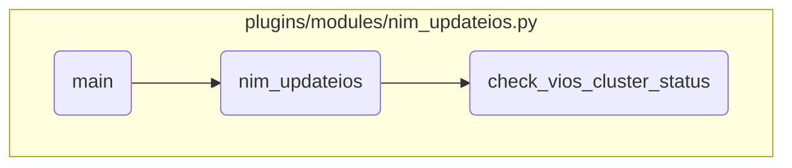

This document explains the process of performing a NIM updateios operation. The process involves initializing the Ansible module, validating input parameters, checking the target NIM clients, and executing the updateios command.

The flow starts with initializing the Ansible module and setting up the required parameters and results structure. It then validates the input parameters and checks the target NIM clients. If the target list is empty, it logs a warning and exits. Otherwise, it proceeds to perform the update operation by calling the <SwmToken path="/plugins/modules/nim_updateios.py" pos="795:2:2" line-data="def nim_updateios(module, targets_list, vios_status, time_limit):" repo-id="Z2l0aHViJTNBJTNBYW5zaWJsZS1wb3dlci1haXglM0ElM0Fzd2ltbWlv" repo-name="ansible-power-aix">`nim_updateios`</SwmToken> function. This function executes the updateios command for each VIOS tuple, retrieves the previous status, checks the cluster name and node status, stops the cluster if necessary, performs the updateios operation, waits for the copy to finish, and starts the cluster if necessary. It updates the status in the results dictionary based on the outcome of the operation.

# Flow drill down



<SwmSnippet path="/plugins/modules/nim_updateios.py" line="929" repo-id="Z2l0aHViJTNBJTNBYW5zaWJsZS1wb3dlci1haXglM0ElM0Fzd2ltbWlv">

---

## Handling the NIM updateios operation

First, the <SwmToken path="/plugins/modules/nim_updateios.py" pos="929:2:2" line-data="def main():" repo-id="Z2l0aHViJTNBJTNBYW5zaWJsZS1wb3dlci1haXglM0ElM0Fzd2ltbWlv" repo-name="ansible-power-aix">`main`</SwmToken> function initializes the Ansible module and sets up the required parameters and results structure. It then validates the input parameters and checks the target NIM clients. If the target list is empty, it logs a warning and exits. Otherwise, it proceeds to perform the update operation by calling the <SwmToken path="/plugins/modules/nim_updateios.py" pos="795:2:2" line-data="def nim_updateios(module, targets_list, vios_status, time_limit):" repo-id="Z2l0aHViJTNBJTNBYW5zaWJsZS1wb3dlci1haXglM0ElM0Fzd2ltbWlv" repo-name="ansible-power-aix">`nim_updateios`</SwmToken> function.

```python
def main():
    global module
    global results

    module = AnsibleModule(
        argument_spec=dict(
            action=dict(choices=['install', 'commit', 'cleanup', 'remove'], required=True, type='str'),
            targets=dict(required=True, type='list', elements='str'),
            filesets=dict(type='str'),
            installp_bundle=dict(type='str'),
            lpp_source=dict(type='str'),
            accept_licenses=dict(type='bool', default=True),
            manage_cluster=dict(type='bool', default=False),
            preview=dict(type='bool', default=True),
            time_limit=dict(type='str'),
            vios_status=dict(type='dict'),
            nim_node=dict(type='dict')
        ),
        required_if=[
            ['action', 'install', ['lpp_source']],
        ],
```

---

</SwmSnippet>

<SwmSnippet path="/plugins/modules/nim_updateios.py" line="795" repo-id="Z2l0aHViJTNBJTNBYW5zaWJsZS1wb3dlci1haXglM0ElM0Fzd2ltbWlv">

---

## Performing the updateios operation

Next, the <SwmToken path="/plugins/modules/nim_updateios.py" pos="795:2:2" line-data="def nim_updateios(module, targets_list, vios_status, time_limit):" repo-id="Z2l0aHViJTNBJTNBYW5zaWJsZS1wb3dlci1haXglM0ElM0Fzd2ltbWlv" repo-name="ansible-power-aix">`nim_updateios`</SwmToken> function executes the updateios command for each VIOS tuple. It retrieves the previous status, checks the cluster name and node status, stops the cluster if necessary, performs the updateios operation, waits for the copy to finish, and starts the cluster if necessary. It updates the status in the results dictionary based on the outcome of the operation.

```python
def nim_updateios(module, targets_list, vios_status, time_limit):
    """
    Execute the updateios command
    For each VIOS tuple,
    - retrieve the previous status if any (looking for SUCCESS-HC and SUCCESS-UPDT)
    - for each VIOS of the tuple, check the cluster name and node status
    - stop the cluster if necessary
    - perform the updateios operation
    - wait for the copy to finish
    - start the cluster if necessary

    arguments:
        module          (dict): The Ansible module
        targets_list    (list): Target tuple list of VIOS
        vios_status     (dict): provided previous status for each tuple
        time_limit       (str): Date and time to perform tuple update
    note:
        Set the update status in results['status'][vios_key].
    return:
        none
    """
```

---

</SwmSnippet>

<SwmSnippet path="/plugins/modules/nim_updateios.py" line="571" repo-id="Z2l0aHViJTNBJTNBYW5zaWJsZS1wb3dlci1haXglM0ElM0Fzd2ltbWlv">

---

## Checking the cluster status

Then, the <SwmToken path="/plugins/modules/nim_updateios.py" pos="571:2:2" line-data="def check_vios_cluster_status(module, target_tuple):" repo-id="Z2l0aHViJTNBJTNBYW5zaWJsZS1wb3dlci1haXglM0ElM0Fzd2ltbWlv" repo-name="ansible-power-aix">`check_vios_cluster_status`</SwmToken> function checks the cluster status of the VIOS tuple. It ensures that the update can only be performed when both VIOSes in the tuple refer to the same cluster and the node states are OK. For a single VIOS, the cluster status must be inactive. It returns True if the cluster status is valid for the update, and False otherwise.

```python
def check_vios_cluster_status(module, target_tuple):
    """
    Check the cluster status of the VIOS tuple.
    Update IOS can only be performed when both VIOSes in the tuple
    refer to the same cluster and the node states is OK.
    For a single VIOS, when the cluster status is inactive.

    arguments:
        module          (dict): The Ansible module
        target_tuple    (list): The tuple of VIOS(es) to check
    return:
        True if the cluster status is valid for update.
        False otherwise.
    """

    vios_key = tuple_str(target_tuple)
    tuple_len = len(target_tuple)

    for vios in target_tuple:
        results['nim_node']['vios'][vios]['cluster'] = {}

```

---

</SwmSnippet>

&nbsp;

*This is an auto-generated document by Swimm 🌊 and has not yet been verified by a human*

<SwmMeta version="3.0.0"><sup>Powered by [Swimm](https://app.swimm.io/)</sup></SwmMeta>
