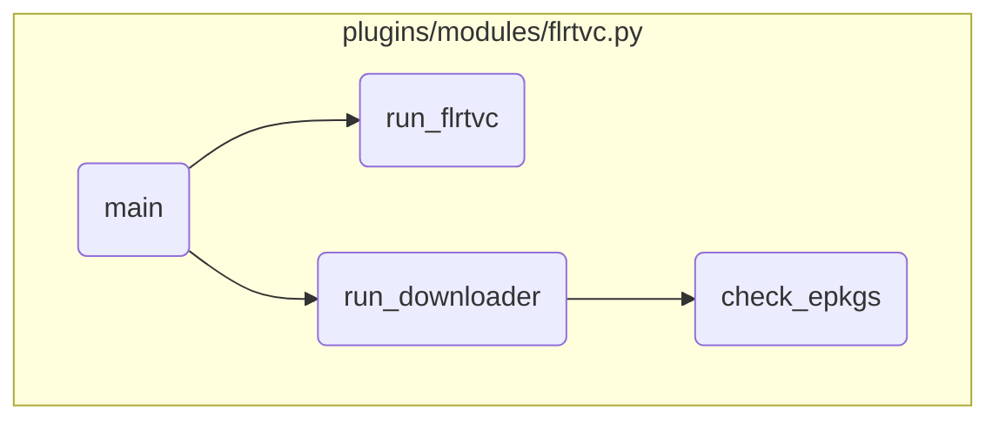

In this document, we will explain the process of the main function. The process involves initializing module parameters, setting up the working directory, installing the FLRTVC script, running the script to generate a report, parsing the report, downloading and checking efixes, and finally installing the efixes.

The flow starts with initializing the necessary parameters for the module to function correctly. Then, it sets up a working directory and installs the FLRTVC script. After that, it runs the script to generate a vulnerabilities report. The report is then parsed to build a list of <SwmToken path="/plugins/modules/flrtvc.py" pos="206:8:8" line-data="            description: List of URLs to download and details on parsing error if any." repo-id="Z2l0aHViJTNBJTNBYW5zaWJsZS1wb3dlci1haXglM0ElM0Fzd2ltbWlv" repo-name="ansible-power-aix">`URLs`</SwmToken> to download. The next step involves downloading and checking efixes. If the download-only parameter is set, the process exits after downloading the efixes. Finally, the efixes are installed, and if successful, the process logs a completion message and exits.

# Flow drill down



<SwmSnippet path="/plugins/modules/flrtvc.py" line="1269" repo-id="Z2l0aHViJTNBJTNBYW5zaWJsZS1wb3dlci1haXglM0ElM0Fzd2ltbWlv">

---

## Initializing Module Parameters

First, the <SwmToken path="/plugins/modules/flrtvc.py" pos="1269:2:2" line-data="def main():" repo-id="Z2l0aHViJTNBJTNBYW5zaWJsZS1wb3dlci1haXglM0ElM0Fzd2ltbWlv" repo-name="ansible-power-aix">`main`</SwmToken> function initializes the module parameters using <SwmToken path="/plugins/modules/flrtvc.py" pos="1274:5:5" line-data="    module = AnsibleModule(" repo-id="Z2l0aHViJTNBJTNBYW5zaWJsZS1wb3dlci1haXglM0ElM0Fzd2ltbWlv" repo-name="ansible-power-aix">`AnsibleModule`</SwmToken>. This sets up the necessary parameters for the module to function correctly, such as <SwmToken path="/plugins/modules/flrtvc.py" pos="1276:1:1" line-data="            apar=dict(required=False, type=&#39;str&#39;, choices=[&#39;sec&#39;, &#39;hiper&#39;, &#39;all&#39;, None], default=None)," repo-id="Z2l0aHViJTNBJTNBYW5zaWJsZS1wb3dlci1haXglM0ElM0Fzd2ltbWlv" repo-name="ansible-power-aix">`apar`</SwmToken>, <SwmToken path="/plugins/modules/flrtvc.py" pos="1277:1:1" line-data="            filesets=dict(required=False, type=&#39;str&#39;)," repo-id="Z2l0aHViJTNBJTNBYW5zaWJsZS1wb3dlci1haXglM0ElM0Fzd2ltbWlv" repo-name="ansible-power-aix">`filesets`</SwmToken>, <SwmToken path="/plugins/modules/flrtvc.py" pos="1278:1:1" line-data="            csv=dict(required=False, type=&#39;str&#39;)," repo-id="Z2l0aHViJTNBJTNBYW5zaWJsZS1wb3dlci1haXglM0ElM0Fzd2ltbWlv" repo-name="ansible-power-aix">`csv`</SwmToken>, <SwmToken path="/plugins/modules/flrtvc.py" pos="1279:1:1" line-data="            path=dict(required=False, type=&#39;str&#39;, default=&#39;/var/adm/ansible&#39;)," repo-id="Z2l0aHViJTNBJTNBYW5zaWJsZS1wb3dlci1haXglM0ElM0Fzd2ltbWlv" repo-name="ansible-power-aix">`path`</SwmToken>, and others.

```python
def main():
    global module
    global results
    global workdir

    module = AnsibleModule(
        argument_spec=dict(
            apar=dict(required=False, type='str', choices=['sec', 'hiper', 'all', None], default=None),
            filesets=dict(required=False, type='str'),
            csv=dict(required=False, type='str'),
            path=dict(required=False, type='str', default='/var/adm/ansible'),
            save_report=dict(required=False, type='bool', default=False),
            verbose=dict(required=False, type='bool', default=False),
            force=dict(required=False, type='bool', default=False),
            clean=dict(required=False, type='bool', default=False),
            check_only=dict(required=False, type='bool', default=False),
            download_only=dict(required=False, type='bool', default=False),
            extend_fs=dict(required=False, type='bool', default=True),
            protocol=dict(required=False, type='str', choices=['https', 'http', 'ftp']),
            localpatchserver=dict(required=False, type='str', default=""),
            localpatchpath=dict(required=False, type='str', default=""),
```

---

</SwmSnippet>

<SwmSnippet path="/plugins/modules/flrtvc.py" line="1334" repo-id="Z2l0aHViJTNBJTNBYW5zaWJsZS1wb3dlci1haXglM0ElM0Fzd2ltbWlv">

---

## Setting Up Working Directory

Next, the `main` function sets up the working directory. If the directory does not exist, it creates it with the appropriate permissions.

```python
    # Create working directory if needed
    workdir = os.path.abspath(os.path.join(flrtvc_params['dst_path'], 'work'))
    if not os.path.exists(workdir):
        os.makedirs(workdir, mode=0o744)
```

---

</SwmSnippet>

<SwmSnippet path="/plugins/modules/flrtvc.py" line="1342" repo-id="Z2l0aHViJTNBJTNBYW5zaWJsZS1wb3dlci1haXglM0ElM0Fzd2ltbWlv">

---

## Installing FLRTVC Script

Then, the `main` function installs the FLRTVC script. It downloads the script, unzips it, and ensures it is executable. If any step fails, it cleans up the working directory and exits with an error.

```python
    module.debug('*** INSTALL ***')
    flrtvc_dir = os.path.abspath(os.path.join('usr', 'bin'))
    flrtvc_path = os.path.abspath(os.path.join(flrtvc_dir, 'flrtvc.ksh'))

    if os.path.exists(flrtvc_path):
        try:
            os.remove(flrtvc_path)
        except OSError as exc:
            msg = f'Exception removing {flrtvc_path}, exception={exc}'
            module.log(msg)
            results['meta']['messages'].append(msg)

    flrtvc_dst = os.path.abspath(os.path.join(workdir, 'FLRTVC-latest.zip'))
    if not download(flrtvczip, flrtvc_dst, resize_fs):
        if clean and os.path.exists(workdir):
            shutil.rmtree(workdir, ignore_errors=True)
        results['msg'] = 'Failed to download FLRTVC-latest.zip'
        module.fail_json(**results)

    if not unzip(flrtvc_dst, flrtvc_dir, resize_fs):
        if clean and os.path.exists(workdir):
```

---

</SwmSnippet>

<SwmSnippet path="/plugins/modules/flrtvc.py" line="1374" repo-id="Z2l0aHViJTNBJTNBYW5zaWJsZS1wb3dlci1haXglM0ElM0Fzd2ltbWlv">

---

## Running FLRTVC Script

Moving to the next step, the `main` function runs the FLRTVC script to generate a vulnerabilities report. If the script fails, it cleans up the working directory and exits with an error.

```python
    module.debug('*** REPORT ***')
    if not run_flrtvc(flrtvc_path, flrtvc_params, force):
        msg = 'Failed to get vulnerabilities report, system will not be updated'
        results['msg'] = msg
        if clean and os.path.exists(workdir):
            shutil.rmtree(workdir, ignore_errors=True)
        module.fail_json(**results)
```

---

</SwmSnippet>

<SwmSnippet path="/plugins/modules/flrtvc.py" line="1391" repo-id="Z2l0aHViJTNBJTNBYW5zaWJsZS1wb3dlci1haXglM0ElM0Fzd2ltbWlv">

---

## Parsing FLRTVC Report

Next, the <SwmToken path="/plugins/modules/flrtvc.py" pos="1269:2:2" line-data="def main():" repo-id="Z2l0aHViJTNBJTNBYW5zaWJsZS1wb3dlci1haXglM0ElM0Fzd2ltbWlv" repo-name="ansible-power-aix">`main`</SwmToken> function parses the FLRTVC report using the <SwmToken path="/plugins/modules/flrtvc.py" pos="1392:1:1" line-data="    run_parser(results[&#39;meta&#39;][&#39;0.report&#39;], localpatchserver, localpatchpath)" repo-id="Z2l0aHViJTNBJTNBYW5zaWJsZS1wb3dlci1haXglM0ElM0Fzd2ltbWlv" repo-name="ansible-power-aix">`run_parser`</SwmToken> function. This step builds the list of <SwmToken path="/plugins/modules/flrtvc.py" pos="206:8:8" line-data="            description: List of URLs to download and details on parsing error if any." repo-id="Z2l0aHViJTNBJTNBYW5zaWJsZS1wb3dlci1haXglM0ElM0Fzd2ltbWlv" repo-name="ansible-power-aix">`URLs`</SwmToken> to download.

```python
    module.debug('*** PARSE ***')
    run_parser(results['meta']['0.report'], localpatchserver, localpatchpath)

```

---

</SwmSnippet>

<SwmSnippet path="/plugins/modules/flrtvc.py" line="1397" repo-id="Z2l0aHViJTNBJTNBYW5zaWJsZS1wb3dlci1haXglM0ElM0Fzd2ltbWlv">

---

## Downloading and Checking Efixes

Then, the <SwmToken path="/plugins/modules/flrtvc.py" pos="1269:2:2" line-data="def main():" repo-id="Z2l0aHViJTNBJTNBYW5zaWJsZS1wb3dlci1haXglM0ElM0Fzd2ltbWlv" repo-name="ansible-power-aix">`main`</SwmToken> function downloads and checks efixes using the <SwmToken path="/plugins/modules/flrtvc.py" pos="1398:1:1" line-data="    run_downloader(results[&#39;meta&#39;][&#39;1.parse&#39;], workdir, resize_fs)" repo-id="Z2l0aHViJTNBJTNBYW5zaWJsZS1wb3dlci1haXglM0ElM0Fzd2ltbWlv" repo-name="ansible-power-aix">`run_downloader`</SwmToken> function. If the <SwmToken path="/plugins/modules/flrtvc.py" pos="1400:3:3" line-data="    if download_only:" repo-id="Z2l0aHViJTNBJTNBYW5zaWJsZS1wb3dlci1haXglM0ElM0Fzd2ltbWlv" repo-name="ansible-power-aix">`download_only`</SwmToken> parameter is set, it exits after downloading the efixes.

```python
    module.debug('*** DOWNLOAD ***')
    run_downloader(results['meta']['1.parse'], workdir, resize_fs)

    if download_only:
        if clean and os.path.exists(workdir):
            shutil.rmtree(workdir, ignore_errors=True)
        results['msg'] = 'exit on download only'
        module.exit_json(**results)
```

---

</SwmSnippet>

<SwmSnippet path="/plugins/modules/flrtvc.py" line="1409" repo-id="Z2l0aHViJTNBJTNBYW5zaWJsZS1wb3dlci1haXglM0ElM0Fzd2ltbWlv">

---

## Installing Efixes

Finally, the <SwmToken path="/plugins/modules/flrtvc.py" pos="1269:2:2" line-data="def main():" repo-id="Z2l0aHViJTNBJTNBYW5zaWJsZS1wb3dlci1haXglM0ElM0Fzd2ltbWlv" repo-name="ansible-power-aix">`main`</SwmToken> function installs the efixes using the <SwmToken path="/plugins/modules/flrtvc.py" pos="1410:5:5" line-data="    if not run_installer(results[&#39;meta&#39;][&#39;4.2.check&#39;], workdir, resize_fs):" repo-id="Z2l0aHViJTNBJTNBYW5zaWJsZS1wb3dlci1haXglM0ElM0Fzd2ltbWlv" repo-name="ansible-power-aix">`run_installer`</SwmToken> function. If the installation fails, it cleans up the working directory and exits with an error. If successful, it logs the completion message and exits.

```python
    module.debug('*** UPDATE ***')
    if not run_installer(results['meta']['4.2.check'], workdir, resize_fs):
        msg = 'Failed to install fixes, please check meta and log data.'
        results['msg'] = msg
        if clean and os.path.exists(workdir):
            shutil.rmtree(workdir, ignore_errors=True)
        module.fail_json(**results)

    if clean and os.path.exists(workdir):
        shutil.rmtree(workdir, ignore_errors=True)

    results['msg'] = 'FLRTVC completed successfully'
    module.log(results['msg'])
    module.exit_json(**results)
```

---

</SwmSnippet>

&nbsp;

*This is an auto-generated document by Swimm 🌊 and has not yet been verified by a human*

<SwmMeta version="3.0.0"><sup>Powered by [Swimm](https://app.swimm.io/)</sup></SwmMeta>
