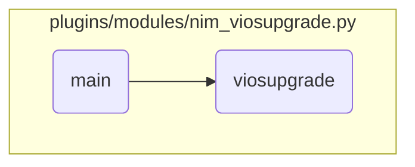

This document explains the flow of the main function in the <SwmPath repo-id="Z2l0aHViJTNBJTNBYW5zaWJsZS1wb3dlci1haXglM0ElM0Fzd2ltbWlv" repo-name="ansible-power-aix" path="/plugins/modules/nim_viosupgrade.py">`(ansible-power-aix) plugins/modules/nim_viosupgrade.py`</SwmPath> module. The main function is responsible for initializing the module, validating targets, performing the upgrade, and managing the results.

The flow starts with initializing the module with the required parameters and setting up the results dictionary. Next, it validates the targets to ensure they are valid NIM clients. Then, it decides whether to query the status or perform the upgrade based on the action parameter. Finally, it manages the results of the upgrade operation by logging the status and updating the results dictionary with success or failure messages.

# Flow drill down



<SwmSnippet path="/plugins/modules/nim_viosupgrade.py" line="729" repo-id="Z2l0aHViJTNBJTNBYW5zaWJsZS1wb3dlci1haXglM0ElM0Fzd2ltbWlv">

---

## Initializing the Module

First, the <SwmToken path="/plugins/modules/nim_viosupgrade.py" pos="729:2:2" line-data="def main():" repo-id="Z2l0aHViJTNBJTNBYW5zaWJsZS1wb3dlci1haXglM0ElM0Fzd2ltbWlv" repo-name="ansible-power-aix">`main`</SwmToken> function initializes the Ansible module with the required parameters and sets up the results dictionary. This step ensures that all necessary inputs are provided and prepares the structure to store the results of the upgrade operation.

```python
def main():
    global module
    global results

    module = AnsibleModule(
        argument_spec=dict(
            action=dict(type='str', required=True,
                        choices=['altdisk', 'bosinst', 'get_status']),
            vios_status=dict(type='dict'),
            nim_node=dict(type='dict'),
            targets=dict(type='list', elements='str'),
            target_file=dict(type='str'),
            # viosupgrade_params={
            #   all:   { ios_mksysb: 'vios3-1-1-0_mksysb', preview: false, resources: 'my_resolv_conf:my_fb_script'}
            #   vios1: { rootvg_clone_disk: 'hdisk1', 'backup_file_resource': 'vios1_fb'}
            #   vios2: { rootvg_clone_disk: 'hdisk2:hdisk3', 'backup_file_resource': 'vios2_filebackup'}
            viosupgrade_params=dict(type='dict'),
        ),
        mutually_exclusive=[['targets', 'target_file']],
    )
```

---

</SwmSnippet>

<SwmSnippet path="/plugins/modules/nim_viosupgrade.py" line="787" repo-id="Z2l0aHViJTNBJTNBYW5zaWJsZS1wb3dlci1haXglM0ElM0Fzd2ltbWlv">

---

## Validating Targets

Next, the function validates the targets by checking if they are valid NIM clients. If the target list is empty, it logs a warning and exits. This step ensures that only valid and reachable targets are processed for the upgrade.

```python
    param_one_of(module.params, ['targets', 'target_file'])
    if not module.params['viosupgrade_params']:
        module.params['viosupgrade_params'] = {}
    if not module.params['target_file']:
        if 'all' not in module.params['viosupgrade_params']:
            module.params['viosupgrade_params']['all'] = {}

    # build NIM node info (if needed)
    refresh_nim_node(module, 'vios')

    # get targests and check they are valid NIM clients
    targets = []
    if module.params['target_file']:
        try:
            with open(module.params['target_file'], mode='r', encoding="utf-8") as myfile:
                csvreader = csv.reader(myfile, delimiter=':')
                for line in csvreader:
                    targets.append(line[0].strip())
                myfile.close()
        except IOError as e:
            file_name = e.filename
```

---

</SwmSnippet>

<SwmSnippet path="/plugins/modules/nim_viosupgrade.py" line="838" repo-id="Z2l0aHViJTNBJTNBYW5zaWJsZS1wb3dlci1haXglM0ElM0Fzd2ltbWlv">

---

## Performing the Upgrade

Then, the function decides whether to query the status or perform the upgrade based on the action parameter. If the action is <SwmToken path="/plugins/modules/nim_viosupgrade.py" pos="838:4:4" line-data="    if &#39;get_status&#39; in module.params[&#39;action&#39;]:" repo-id="Z2l0aHViJTNBJTNBYW5zaWJsZS1wb3dlci1haXglM0ElM0Fzd2ltbWlv" repo-name="ansible-power-aix">`get_status`</SwmToken>, it calls the <SwmToken path="/plugins/modules/nim_viosupgrade.py" pos="839:1:1" line-data="        viosupgrade_query(module, params_flags)" repo-id="Z2l0aHViJTNBJTNBYW5zaWJsZS1wb3dlci1haXglM0ElM0Fzd2ltbWlv" repo-name="ansible-power-aix">`viosupgrade_query`</SwmToken> function; otherwise, it calls the <SwmToken path="/plugins/modules/nim_viosupgrade.py" pos="589:12:12" line-data="    cmd = [&#39;/usr/sbin/viosupgrade&#39;]" repo-id="Z2l0aHViJTNBJTNBYW5zaWJsZS1wb3dlci1haXglM0ElM0Fzd2ltbWlv" repo-name="ansible-power-aix">`viosupgrade`</SwmToken> function to perform the upgrade.

```python
    if 'get_status' in module.params['action']:
        viosupgrade_query(module, params_flags)
    else:
        viosupgrade(module, params_flags)
```

---

</SwmSnippet>

<SwmSnippet path="/plugins/modules/nim_viosupgrade.py" line="844" repo-id="Z2l0aHViJTNBJTNBYW5zaWJsZS1wb3dlci1haXglM0ElM0Fzd2ltbWlv">

---

## Managing the Upgrade Results

Finally, the function manages the results of the upgrade operation. It logs the status and updates the results dictionary with success or failure messages. This step ensures that the outcome of the upgrade is clearly communicated and logged for further analysis.

```python
    # set status and exit
    if not results['status']:
        module.log(f'NIM upgradeios {action} operation: status table is empty')
        results['meta']['messages'].append('Warning: status table is empty, returning initial vios_status.')
        results['status'] = module.params['vios_status']
        results['msg'] = f'NIM updateios {action} operation completed. See meta data for details.'
        module.log(results['msg'])
    else:
        target_errored = [key for key, val in results['status'].items() if 'FAILURE' in val]
        if len(target_errored):
            results['msg'] = f'NIM upgradeios {action} operation failed for {target_errored}. See status and meta for details.'
            module.log(results['msg'])
            module.fail_json(**results)
        else:
            results['msg'] = f'NIM upgradeios {action} operation completed. See status and meta for details.'
            module.log(results['msg'])
            module.exit_json(**results)
```

---

</SwmSnippet>

<SwmSnippet path="/plugins/modules/nim_viosupgrade.py" line="589" repo-id="Z2l0aHViJTNBJTNBYW5zaWJsZS1wb3dlci1haXglM0ElM0Fzd2ltbWlv">

---

## Constructing the Upgrade Command

Moving to the <SwmToken path="/plugins/modules/nim_viosupgrade.py" pos="589:12:12" line-data="    cmd = [&#39;/usr/sbin/viosupgrade&#39;]" repo-id="Z2l0aHViJTNBJTNBYW5zaWJsZS1wb3dlci1haXglM0ElM0Fzd2ltbWlv" repo-name="ansible-power-aix">`viosupgrade`</SwmToken> function, it constructs the upgrade command based on the provided parameters. This step ensures that the correct command is formed to perform the upgrade operation on the specified targets.

```python
    cmd = ['/usr/sbin/viosupgrade']
    cmd += ['-t', module.params['action']]

    # viosupgrade -t {bosinst | altdisk} -f filename [-v]
    if module.params['target_file']:
        # check parameters
        for key in module.params['viosupgrade_params']['all'].keys():
            flag_file = params_flags['file']
            if key not in params_flags['file']:
                msg = f'key \'{key}\' is not valid, supported keys for viosupgrade_params are: {flag_file}'
                ret += 1
                module.log(msg)
                results['meta']['messages'].append(msg)
        if ret != 0:
            results['status']['all'] = 'FAILURE'
            return ret

        cmd += ['-f', module.params['target_file']]

        for key, flag in params_flags['file'].items():
            if key in module.params['viosupgrade_params']['all']:
```

---

</SwmSnippet>

<SwmSnippet path="/plugins/modules/nim_viosupgrade.py" line="702" repo-id="Z2l0aHViJTNBJTNBYW5zaWJsZS1wb3dlci1haXglM0ElM0Fzd2ltbWlv">

---

## Executing the Upgrade Command

Then, the function executes the upgrade command and logs the output. It updates the results dictionary with the command's stdout and stderr, and sets the status to success or failure based on the return code. This step ensures that the upgrade operation is executed and the results are captured for each target.

```python
        rc, stdout, stderr = module.run_command(cmd)

        results['meta'][vios]['cmd'] = ' '.join(cmd)
        results['meta'][vios]['stdout'] = stdout
        results['meta'][vios]['stderr'] = stderr
        module.log(f'stdout: {stdout}')
        module.log(f'stderr: {stderr}')

        if rc == 0:
            if vios in module.params['viosupgrade_params'] and 'preview' in module.params['viosupgrade_params'][vios] and \
               not module.params['viosupgrade_params'][vios]['preview'] or 'preview' in module.params['viosupgrade_params']['all'] and \
               not module.params['viosupgrade_params']['all']['preview']:
                results['changed'] = True
            msg = 'viosupgrade command successful.'
            results['status'][vios] = 'SUCCESS'
        else:
            msg = f'Command failed with rc: {rc}'
            results['status'][vios] = 'FAILURE'
            ret += 1
        results['meta'][vios]['messages'].append(msg)
        module.log(msg)
```

---

</SwmSnippet>

&nbsp;

*This is an auto-generated document by Swimm 🌊 and has not yet been verified by a human*

<SwmMeta version="3.0.0"><sup>Powered by [Swimm](https://app.swimm.io/)</sup></SwmMeta>
