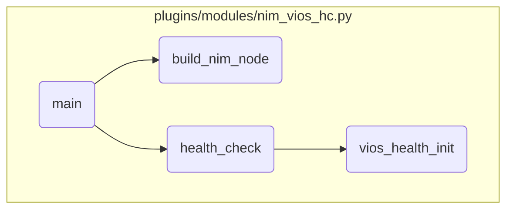

This document explains the process of managing configurations and deployments of Power AIX systems using the IBM Power Systems AIX Collection. The process involves building NIM node information, performing health checks on VIOS targets, and initializing VIOS health.

The flow starts with building the NIM node information, which includes gathering HMC, CEC, and VIOS information. This step sets up the necessary data structures and information required for subsequent health checks. Next, health checks are performed on the VIOS targets to ensure they can support a rolling update operation. This involves collecting VIOS <SwmToken path="plugins/modules/nim_vios_hc.py" pos="398:9:9" line-data="    Collect CEC and VIOS UUIDs using vioshc.py script for a given HMC.">`UUIDs`</SwmToken> and checking their health status. Finally, the VIOS health is initialized by collecting CEC and VIOS <SwmToken path="plugins/modules/nim_vios_hc.py" pos="398:9:9" line-data="    Collect CEC and VIOS UUIDs using vioshc.py script for a given HMC.">`UUIDs`</SwmToken> using a script, ensuring that accurate health checks can be performed.

# Flow drill down



<SwmSnippet path="/plugins/modules/nim_vios_hc.py" line="229">

---

## Building NIM Node Information

First, we build the NIM node information which includes gathering HMC, CEC, and VIOS information. This step is crucial as it sets up the necessary data structures and information required for subsequent health checks.

```python
def build_nim_node(module):
    """
    Build the nim node containing the nim vios and hmc info.
    """

    # Build hmc info list
    nim_hmc = get_hmc_info(module)
    NIM_NODE['nim_hmc'] = nim_hmc
    module.debug(f'NIM HMC: {nim_hmc}')

    # Build CEC info list
    nim_cec = get_nim_cecs_info(module)

    # Build vios info list
    nim_vios = get_nim_clients_info(module, 'vios')

    # Complete the CEC serial in nim_vios dict
    for key, nimvios in nim_vios.items():
        mgmt_cec = nimvios['mgmt_cec']
        if mgmt_cec in nim_cec:
            nimvios['mgmt_cec_serial'] = nim_cec[mgmt_cec]['serial']
```

---

</SwmSnippet>

<SwmSnippet path="/plugins/modules/nim_vios_hc.py" line="496">

---

## Performing Health Checks

Next, we perform health checks on the VIOS targets. This involves calling the <SwmPath>[roles/power_aix_vioshc/files/vioshc.py](roles/power_aix_vioshc/files/vioshc.py)</SwmPath> script to collect VIOS <SwmToken path="plugins/modules/nim_vios_hc.py" pos="502:23:23" line-data="    - call vioshc.py a first time to collect the VIOS UUIDs">`UUIDs`</SwmToken> and check their health status. The results of these checks determine if the VIOS targets can support a rolling update operation.

```python
def health_check(module, targets):
    """
    Health assessment of the VIOS targets to ensure they can support
    a rolling update operation.

    For each VIOS tuple:
    - call vioshc.py a first time to collect the VIOS UUIDs
    - call vioshc.py a second time to check the healthiness

    return: a dictionary with the state of each VIOS tuple
    """

    module.debug(f'targets: {targets}')

    health_tab = {}
    vios_key = []
    for target_tuple in targets:
        OUTPUT.append(f'Checking: {target_tuple}')
        module.debug(f'target_tuple: {target_tuple}')

        tup_len = len(target_tuple)
```

---

</SwmSnippet>

<SwmSnippet path="/plugins/modules/nim_vios_hc.py" line="396">

---

### Initializing VIOS Health

Then, we initialize the VIOS health by collecting CEC and VIOS <SwmToken path="plugins/modules/nim_vios_hc.py" pos="398:9:9" line-data="    Collect CEC and VIOS UUIDs using vioshc.py script for a given HMC.">`UUIDs`</SwmToken> using the <SwmPath>[roles/power_aix_vioshc/files/vioshc.py](roles/power_aix_vioshc/files/vioshc.py)</SwmPath> script. This step ensures that we have the necessary <SwmToken path="plugins/modules/nim_vios_hc.py" pos="398:9:9" line-data="    Collect CEC and VIOS UUIDs using vioshc.py script for a given HMC.">`UUIDs`</SwmToken> to perform accurate health checks.

```python
def vios_health_init(module, hmc_id, hmc_ip):
    """
    Collect CEC and VIOS UUIDs using vioshc.py script for a given HMC.

    return: True if ok,
            False otherwise
    """

    module.debug(f'hmc_id: {hmc_id}, hmc_ip: {hmc_ip}')

    # Call the vioshc.py script a first time to collect UUIDs
    cmd = [vioshc_interpreter, vioshc_cmd, '-i', hmc_ip, '-l', 'a']
    if module._verbosity > 0:
        cmd.extend(['-' + 'v' * module._verbosity])
        if module._verbosity >= 3:
            cmd.extend(['-D'])
    # path prefix is used here to ensure the dependent module paths are present.
    # In this case, curl module.
    ret, stdout, stderr = module.run_command(cmd, path_prefix=os.path.dirname(vioshc_interpreter))
    if ret != 0:
        OUTPUT.append(f'    Failed to get the VIOS information, vioshc returned: {stderr}')
```

---

</SwmSnippet>

&nbsp;

*This is an auto-generated document by Swimm 🌊 and has not yet been verified by a human*

<SwmMeta version="3.0.0" repo-id="Z2l0aHViJTNBJTNBYW5zaWJsZS1wb3dlci1haXglM0ElM0Fzd2ltbWlv" repo-name="ansible-power-aix"><sup>Powered by [Swimm](/)</sup></SwmMeta>
