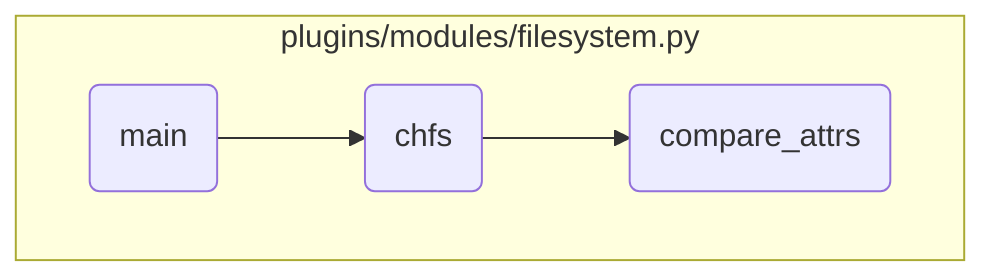

This document explains the process of managing filesystem states and attributes in an AIX system. The process involves checking the desired state of the filesystem, creating or modifying the filesystem if necessary, and comparing the filesystem attributes to ensure they are updated correctly.

The flow starts by checking if the filesystem should be present or absent. If it should be present, the system either creates or modifies the filesystem. If it should be absent, the system removes it if it exists. When modifying the filesystem, the system compares the current attributes with the new ones and updates only the necessary attributes.

# Flow drill down



<SwmSnippet path="/plugins/modules/filesystem.py" line="605" repo-id="Z2l0aHViJTNBJTNBYW5zaWJsZS1wb3dlci1haXglM0ElM0Fzd2ltbWlv">

---

## Handling Filesystem State

First, we check the desired state of the filesystem. If the state is 'present', we either create or modify the filesystem. If the state is 'absent', we remove the filesystem if it exists. This ensures that the filesystem is in the correct state as specified by the user.

```python
    if state == 'present':
        # Create/Modify filesystem
        if fs_state(module, filesystem) is None:
            mkfs(module, filesystem)
        else:
            chfs(module, filesystem)
    elif state == 'absent':
        # Remove filesystem
        if fs_state(module, filesystem) is None:
            result["msg"] = "No action needed as filesystem does not exist."
            result["rc"] = 0
        else:
            rmfs(module, filesystem)
    else:
        result["msg"] = f"Invalid state { state }"

```

---

</SwmSnippet>

<SwmSnippet path="/plugins/modules/filesystem.py" line="420" repo-id="Z2l0aHViJTNBJTNBYW5zaWJsZS1wb3dlci1haXglM0ElM0Fzd2ltbWlv">

---

## Modifying Filesystem Attributes

Next, if the filesystem needs to be modified, we call the <SwmToken path="/plugins/modules/filesystem.py" pos="420:2:2" line-data="def chfs(module, filesystem):" repo-id="Z2l0aHViJTNBJTNBYW5zaWJsZS1wb3dlci1haXglM0ElM0Fzd2ltbWlv" repo-name="ansible-power-aix">`chfs`</SwmToken> function. This function changes the attributes of the filesystem based on the provided parameters. It constructs the appropriate command to modify the filesystem and executes it, updating the result with the command output and status.

```python
def chfs(module, filesystem):
    """
    Changes the attributes of the filesystem.
    param module: Ansible module argument spec.
    param filesystem: Filesystem name.
    return: changed - True/False(filesystem state modified or not),
            msg - message
    """
    amount = module.params["auto_mount"]
    perms = module.params["permissions"]
    mgroup = module.params["mount_group"]
    acct_sub_sys = module.params["account_subsystem"]

    # compare initial and the provided attributes. Exit if no change is required.
    if module.params['attributes'] or amount or perms or mgroup or acct_sub_sys:
        compare_attrs(module)

    opts = ""
    nfs = is_nfs(module, filesystem)
    if nfs:
        opts = nfs_opts(module)
```

---

</SwmSnippet>

<SwmSnippet path="/plugins/modules/filesystem.py" line="231" repo-id="Z2l0aHViJTNBJTNBYW5zaWJsZS1wb3dlci1haXglM0ElM0Fzd2ltbWlv">

---

## Comparing Filesystem Attributes

Then, within the <SwmToken path="/plugins/modules/filesystem.py" pos="420:2:2" line-data="def chfs(module, filesystem):" repo-id="Z2l0aHViJTNBJTNBYW5zaWJsZS1wb3dlci1haXglM0ElM0Fzd2ltbWlv" repo-name="ansible-power-aix">`chfs`</SwmToken> function, we call <SwmToken path="/plugins/modules/filesystem.py" pos="231:2:2" line-data="def compare_attrs(module):" repo-id="Z2l0aHViJTNBJTNBYW5zaWJsZS1wb3dlci1haXglM0ElM0Fzd2ltbWlv" repo-name="ansible-power-aix">`compare_attrs`</SwmToken> to compare the provided attributes with the existing ones. This function retrieves the current attributes of the filesystem and compares them with the new attributes. If there are differences, it prepares a list of attributes that need to be updated. This ensures that only the necessary changes are made to the filesystem.

```python
def compare_attrs(module):
    """
    Helper function to compare the provided and already existing attributes of a filesystem
    params:
        module - Ansible module argument spec.
    return:
        updated_attrs (list) - List of updated attributes and their values, that need to be changed
    """

    fs_mount_pt = module.params['filesystem']
    cmd1 = f"lsfs -c {fs_mount_pt}"
    cmd2 = f"lsfs -q {fs_mount_pt}"

    rc1, stdout1, stderr1 = module.run_command(cmd1)

    if rc1:
        result['stdout'] = stdout1
        result['cmd'] = cmd1
        result['stderr'] = stderr1
        result['msg'] = "Could not get information about the provided filesystem."
        module.fail_json(**result)
```

---

</SwmSnippet>

&nbsp;

*This is an auto-generated document by Swimm 🌊 and has not yet been verified by a human*

<SwmMeta version="3.0.0"><sup>Powered by [Swimm](https://app.swimm.io/)</sup></SwmMeta>
