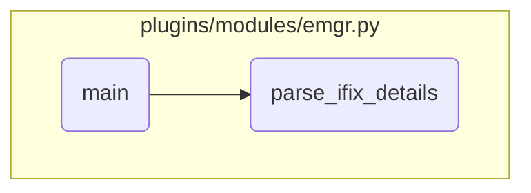

In this document, we will explain the process of managing iFixes using the `main` function. The process involves initializing the Ansible module, determining the action to be performed, constructing the appropriate command, and processing the output.

The flow starts with initializing the Ansible module with various parameters and setting up the results dictionary. It then determines the action to be performed based on the `action` parameter. Depending on the action, it constructs the appropriate command for managing iFixes, such as installing, committing, checking, mounting, unmounting, removing, viewing packages, displaying iFixes, or listing them. The function ensures that the necessary parameters are provided, executes the command, and processes the output to update the results dictionary.

# Flow drill down



<SwmSnippet path="/plugins/modules/emgr.py" line="378" repo-id="Z2l0aHViJTNBJTNBYW5zaWJsZS1wb3dlci1haXglM0ElM0Fzd2ltbWlv">

---

## Handling different actions for managing iFixes

First, the `main` function initializes the Ansible module with various parameters and sets up the results dictionary. It then determines the action to be performed based on the `action` parameter and constructs the appropriate command for managing iFixes. For example, if the action is 'install', it checks if the iFix is already installed and constructs the command accordingly. Similarly, it handles other actions like 'commit', 'check', 'mount', 'unmount', 'remove', 'view_package', 'display_ifix', and 'list'. The function ensures that the appropriate parameters are provided and constructs the command with the necessary options. It then executes the command and processes the output to update the results dictionary.

```python
def main():
    global module
    global results

    module = AnsibleModule(
        supports_check_mode=True,
        argument_spec=dict(
            action=dict(type='str', default='list', choices=['install', 'commit', 'check', 'mount', 'unmount',
                                                             'remove', 'view_package', 'display_ifix', 'list']),
            ifix_package=dict(type='path'),
            ifix_label=dict(type='str'),
            ifix_number=dict(type='str'),
            ifix_vuid=dict(type='str'),
            package=dict(type='str'),
            alternate_dir=dict(type='path'),
            list_file=dict(type='path'),
            working_dir=dict(type='path'),
            from_epkg=dict(type='bool', default=False),
            mount_install=dict(type='bool', default=False),
            commit=dict(type='bool', default=False),
            extend_fs=dict(type='bool', default=False),
```

---

</SwmSnippet>

<SwmSnippet path="/plugins/modules/emgr.py" line="307" repo-id="Z2l0aHViJTNBJTNBYW5zaWJsZS1wb3dlci1haXglM0ElM0Fzd2ltbWlv">

---

## Parsing iFix details

Next, the `parse_ifix_details` function is called to parse the output of the 'emgr -l' command. This function processes the command's output to extract details about the iFixes and returns a list of dictionaries containing information such as ID, state, label, install time, updated by, and abstract. This parsed information is then added to the results dictionary under the 'ifix_details' key.

```python
def parse_ifix_details(output):
    """
    Parses the output of "emgr -l" command to return the ifixes as a list instead of str.

    argument:
      stdout (str) standard output of the command.

    return:
      List of dictionaries containing information about the iFixes.
    """
    ifix_name = []

    info_list = ["ID", "STATE", "LABEL", "INSTALL TIME", "UPDATED BY", "ABSTRACT"]
    position_dict = {}

    def get_value(line, field):
        field_index = info_list.index(field)
        next_field_index = field_index + 1
        start_position = position_dict[field]

        # End-of-line
```

---

</SwmSnippet>

&nbsp;

*This is an auto-generated document by Swimm 🌊 and has not yet been verified by a human*

<SwmMeta version="3.0.0"><sup>Powered by [Swimm](https://staging.swimm.cloud/)</sup></SwmMeta>
