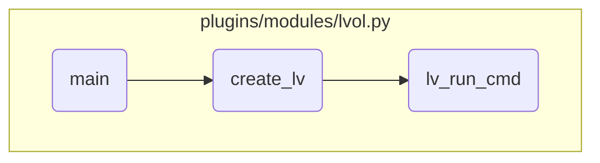

In this document, we will explain the process of managing logical volumes. The process involves initializing the module, creating or modifying the logical volume, and executing the necessary commands.

The flow starts with initializing the Ansible module and setting up the required parameters. Depending on whether the logical volume should be present or absent, it either creates or removes the logical volume. If creating, it constructs the command with the specified attributes and executes it, checking the result for success or failure.

# Flow drill down



<SwmSnippet path="/plugins/modules/lvol.py" line="570" repo-id="Z2l0aHViJTNBJTNBYW5zaWJsZS1wb3dlci1haXglM0ElM0Fzd2ltbWlv">

---

## Main Function

First, the <SwmToken path="/plugins/modules/lvol.py" pos="570:2:2" line-data="def main():" repo-id="Z2l0aHViJTNBJTNBYW5zaWJsZS1wb3dlci1haXglM0ElM0Fzd2ltbWlv" repo-name="ansible-power-aix">`main`</SwmToken> function initializes the Ansible module and sets up the parameters required for managing logical volumes. It checks the state of the logical volume (present or absent) and proceeds accordingly. If the state is 'present', it checks if the logical volume already exists and either modifies it or creates a new one. If the state is 'absent', it removes the logical volume if it exists.

```python
def main():
    """
    Main function
    """

    global result

    module = AnsibleModule(
        argument_spec=dict(
            state=dict(type='str', required=True, choices=['present', 'absent']),
            lv=dict(type='str', required=True, aliases=['logical_volume']),
            vg=dict(type='str'),
            lv_type=dict(type='str', default='jfs2'),
            strip_size=dict(type='str'),
            extra_opts=dict(type='str', default=''),
            copies=dict(type='int', default=1),
            size=dict(type='str'),
            pv_list=dict(type='list', elements='str'),
            policy=dict(type='str', default='maximum', choices=['maximum', 'minimum']),
            lv_new_name=dict(type='str'),
        ),
```

---

</SwmSnippet>

<SwmSnippet path="/plugins/modules/lvol.py" line="221" repo-id="Z2l0aHViJTNBJTNBYW5zaWJsZS1wb3dlci1haXglM0ElM0Fzd2ltbWlv">

---

## Creating Logical Volume

Next, the <SwmToken path="/plugins/modules/lvol.py" pos="221:2:2" line-data="def create_lv(module, name):" repo-id="Z2l0aHViJTNBJTNBYW5zaWJsZS1wb3dlci1haXglM0ElM0Fzd2ltbWlv" repo-name="ansible-power-aix">`create_lv`</SwmToken> function is called to create a logical volume with the specified attributes. It constructs the command to create the logical volume based on the provided parameters such as volume group, size, and type. This function ensures that all necessary options are included in the command and validates the strip size if provided.

```python
def create_lv(module, name):
    """
    Creates a logical volume with the attributes provided in the
    lv_attributes field.
    arguments:
        module (dict): The Ansible module
        name (str): Logical Volume Name
    note:
        Exits with fail_json in case of error
    return:
        none
    """

    opts = ''
    lv_type = module.params['lv_type']
    strip_size = module.params['strip_size']
    copies = module.params['copies']
    policy = module.params['policy']
    vg = module.params['vg']
    num_log_part = module.params['size']

```

---

</SwmSnippet>

<SwmSnippet path="/plugins/modules/lvol.py" line="526" repo-id="Z2l0aHViJTNBJTNBYW5zaWJsZS1wb3dlci1haXglM0ElM0Fzd2ltbWlv">

---

## Running Logical Volume Command

Then, the <SwmToken path="/plugins/modules/lvol.py" pos="526:2:2" line-data="def lv_run_cmd(module, cmd, success_msg, fail_msg, init_props=None, fetch=False):" repo-id="Z2l0aHViJTNBJTNBYW5zaWJsZS1wb3dlci1haXglM0ElM0Fzd2ltbWlv" repo-name="ansible-power-aix">`lv_run_cmd`</SwmToken> function executes the command to create or modify the logical volume. It runs the command and checks the result. If the command is successful, it updates the result message and marks the change as successful. If the command fails, it sets the failure message and exits with an error.

```python
def lv_run_cmd(module, cmd, success_msg, fail_msg, init_props=None, fetch=False):
    """
    Helper function for running commands to create/modify a
    logical volume.
    return: True - if any of the logical volume properties are modified
            False - if nothing changed
    """

    if success_msg is None:
        success_msg = ""

    rc, stdout, stderr = module.run_command(cmd)
    result['cmd'] = cmd
    result['rc'] = rc
    result['stdout'] = stdout
    result['stderr'] = stderr
    if rc != 0:
        result['msg'] += fail_msg
        module.fail_json(**result)
    else:
        if (init_props is None) or (init_props != get_lv_props(module)):
```

---

</SwmSnippet>

&nbsp;

*This is an auto-generated document by Swimm 🌊 and has not yet been verified by a human*

<SwmMeta version="3.0.0"><sup>Powered by [Swimm](https://app.swimm.io/)</sup></SwmMeta>
