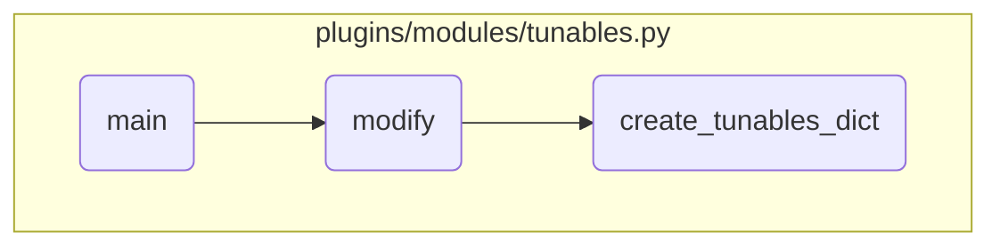

In this document, we will explain the process of managing tunables in the AIX system using the Ansible module. The process involves initializing the module, handling different actions like showing, modifying, or resetting tunables, and creating a dictionary of current tunable values.

The flow starts with initializing the Ansible module with the required parameters. Depending on the action specified (show, modify, or reset), the module performs the corresponding task. If the action is 'modify', it ensures compatibility of the change type and bosboot tunables before calling the modify function. The modify function checks for necessary parameters, creates a dictionary of current tunable values, validates new values, constructs the command to modify the tunables, and executes it. If successful, it updates the results with a success message; otherwise, it fails with an error message.

# Flow drill down



<SwmSnippet path="/plugins/modules/tunables.py" line="633" repo-id="Z2l0aHViJTNBJTNBYW5zaWJsZS1wb3dlci1haXglM0ElM0Fzd2ltbWlv">

---

## Main Function

First, the <SwmToken path="/plugins/modules/tunables.py" pos="633:2:2" line-data="def main():" repo-id="Z2l0aHViJTNBJTNBYW5zaWJsZS1wb3dlci1haXglM0ElM0Fzd2ltbWlv" repo-name="ansible-power-aix">`main`</SwmToken> function initializes the Ansible module with the required parameters and sets up the initial results dictionary. It then checks the action parameter to determine whether to show, modify, or reset tunables. If the action is 'modify', it ensures that the change type and bosboot tunables are compatible before calling the <SwmToken path="/plugins/modules/tunables.py" pos="640:26:26" line-data="            action=dict(type=&#39;str&#39;, required=True, choices=[&#39;show&#39;, &#39;modify&#39;, &#39;reset&#39;])," repo-id="Z2l0aHViJTNBJTNBYW5zaWJsZS1wb3dlci1haXglM0ElM0Fzd2ltbWlv" repo-name="ansible-power-aix">`modify`</SwmToken> function.

```python
def main():
    '''
    Main function
    '''
    global results
    module = AnsibleModule(
        argument_spec=dict(
            action=dict(type='str', required=True, choices=['show', 'modify', 'reset']),
            component=dict(type='str', required=True, choices=['vmo', 'ioo', 'schedo', 'no',
                                                               'raso', 'nfso', 'asoo']),
            change_type=dict(type='str', default='current', choices=['current', 'reboot', 'both']),
            bosboot_tunables=dict(type='bool', default=False),
            tunable_params=dict(type='list', elements='str'),
            tunable_params_with_value=dict(type='dict'),
            restricted_tunables=dict(type='bool', default=False)
        ),
        supports_check_mode=False
    )

    results = dict(
        changed=False,
```

---

</SwmSnippet>

<SwmSnippet path="/plugins/modules/tunables.py" line="534" repo-id="Z2l0aHViJTNBJTNBYW5zaWJsZS1wb3dlci1haXglM0ElM0Fzd2ltbWlv">

---

## Handling the Modify Action

Next, the <SwmToken path="/plugins/modules/tunables.py" pos="534:2:2" line-data="def modify(module):" repo-id="Z2l0aHViJTNBJTNBYW5zaWJsZS1wb3dlci1haXglM0ElM0Fzd2ltbWlv" repo-name="ansible-power-aix">`modify`</SwmToken> function handles the modification of tunables. It first checks if the user has provided the necessary tunable parameters and values. It then calls <SwmToken path="/plugins/modules/tunables.py" pos="257:2:2" line-data="def create_tunables_dict(module):" repo-id="Z2l0aHViJTNBJTNBYW5zaWJsZS1wb3dlci1haXglM0ElM0Fzd2ltbWlv" repo-name="ansible-power-aix">`create_tunables_dict`</SwmToken> to create a dictionary of current tunable values. After validating the new tunable values, it constructs the command to modify the tunables and executes it. If the command is successful, it updates the results dictionary with a success message; otherwise, it fails with an error message.

```python
def modify(module):
    '''
    Handles the modify action

    arguments:
        module  (dict): The Ansible module
    note:
        Exits with fail_json in case of error
    return:
        Message for successful command along with display standard output
    '''

    component = module.params['component']
    bosboot_tunables = module.params['bosboot_tunables']
    change_type = module.params['change_type']
    restricted_tunables = module.params['restricted_tunables']
    tunable_params_with_value = module.params['tunable_params_with_value']
    parameters = ''
    changed_tunables = ''
    cmd = ''

```

---

</SwmSnippet>

<SwmSnippet path="/plugins/modules/tunables.py" line="257" repo-id="Z2l0aHViJTNBJTNBYW5zaWJsZS1wb3dlci1haXglM0ElM0Fzd2ltbWlv">

---

## Creating the Tunables Dictionary

Then, the <SwmToken path="/plugins/modules/tunables.py" pos="257:2:2" line-data="def create_tunables_dict(module):" repo-id="Z2l0aHViJTNBJTNBYW5zaWJsZS1wb3dlci1haXglM0ElM0Fzd2ltbWlv" repo-name="ansible-power-aix">`create_tunables_dict`</SwmToken> function creates a dictionary of current tunable values by running a command specific to the component. If the command fails, it exits with an error message. Otherwise, it converts the command output into a dictionary format for further processing.

```python
def create_tunables_dict(module):
    '''
    Utility function to create tunables dictionary with values

    arguments:
        module  (dict): The Ansible module
    note:
        Exits with fail_json in case of error
    return:
        creates a dictionary with all tunables and their values
    '''

    component = module.params['component']
    global tunables_dict
    cmd = component + ' -F -x'

    rc, std_out, std_err = module.run_command(cmd, use_unsafe_shell=True)

    if rc != 0:
        # In case command returns non zero return code, fail case
        results['msg'] = "Failed to get tunables existing values for validation."
```

---

</SwmSnippet>

&nbsp;

*This is an auto-generated document by Swimm 🌊 and has not yet been verified by a human*

<SwmMeta version="3.0.0"><sup>Powered by [Swimm](https://app.swimm.io/)</sup></SwmMeta>
