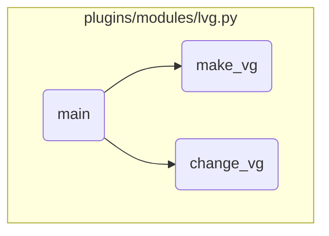

This document explains the process of managing volume groups. The process involves initializing the module, determining the current state of the volume group, and deciding whether to create, modify, or remove it based on the provided parameters.

The flow starts by initializing the module and setting up the necessary parameters. It then checks the current state of the volume group. If the volume group does not exist, it creates it with the specified properties. If the volume group already exists, it modifies its properties as needed.

# Flow drill down



<SwmSnippet path="/plugins/modules/lvg.py" line="741" repo-id="Z2l0aHViJTNBJTNBYW5zaWJsZS1wb3dlci1haXglM0ElM0Fzd2ltbWlv">

---

## Handling Volume Group Creation and Modification

First, the <SwmToken path="/plugins/modules/lvg.py" pos="741:2:2" line-data="def main():" repo-id="Z2l0aHViJTNBJTNBYW5zaWJsZS1wb3dlci1haXglM0ElM0Fzd2ltbWlv" repo-name="ansible-power-aix">`main`</SwmToken> function initializes the Ansible module and sets up the parameters required for managing volume groups. It then determines the current state of the volume group and decides whether to create, modify, or remove it based on the provided parameters.

```python
def main():
    global result

    module = AnsibleModule(
        supports_check_mode=False,
        argument_spec=dict(
            state=dict(type='str', choices=['absent', 'present', 'varyoff', 'varyon'],
                       default='present'),
            vg_name=dict(type='str', required=True),
            vg_type=dict(type='str', choices=['none', 'big', 'scalable']),
            enhanced_concurrent_vg=dict(type='bool'),
            critical_vg=dict(type='bool'),
            pvs=dict(type='list', elements='str'),
            critical_pvs=dict(type='bool'),
            num_lvs=dict(type='int', choices=[256, 512, 1024, 2048, 4096]),
            delete_lvs=dict(type='bool'),
            num_partitions=dict(type='int', choices=[32, 64, 128, 256, 512, 768, 1024, 2048]),
            pp_size=dict(type='int'),
            pp_limit=dict(type='int'),
            force=dict(type='bool'),
            mirror_pool=dict(type='str'),
```

---

</SwmSnippet>

<SwmSnippet path="/plugins/modules/lvg.py" line="283" repo-id="Z2l0aHViJTNBJTNBYW5zaWJsZS1wb3dlci1haXglM0ElM0Fzd2ltbWlv">

---

### Creating a Volume Group

Next, if the volume group does not exist, the <SwmToken path="/plugins/modules/lvg.py" pos="283:2:2" line-data="def make_vg(module, vg_name):" repo-id="Z2l0aHViJTNBJTNBYW5zaWJsZS1wb3dlci1haXglM0ElM0Fzd2ltbWlv" repo-name="ansible-power-aix">`make_vg`</SwmToken> function is called to create it. This function builds the necessary options for the volume group creation command and executes it, ensuring that the volume group is created with the specified properties.

```python
def make_vg(module, vg_name):
    """
    Creates volume group
    arguments:
        module:     Ansible module argument spec.
        vg_name:    Volume group name
    note:
        Exits with fail_json in case of error
    return:
        none
    """

    pvs = module.params['pvs']
    opt = build_vg_opts(module)

    vg_type_opt = {
        "none": '',
        "big": '-B ',
        "scalable": '-S ',
    }
    vg_type = module.params["vg_type"]
```

---

</SwmSnippet>

<SwmSnippet path="/plugins/modules/lvg.py" line="384" repo-id="Z2l0aHViJTNBJTNBYW5zaWJsZS1wb3dlci1haXglM0ElM0Fzd2ltbWlv">

---

### Modifying a Volume Group

Then, if the volume group already exists, the <SwmToken path="/plugins/modules/lvg.py" pos="384:2:2" line-data="def change_vg(module, vg_name, init_props):" repo-id="Z2l0aHViJTNBJTNBYW5zaWJsZS1wb3dlci1haXglM0ElM0Fzd2ltbWlv" repo-name="ansible-power-aix">`change_vg`</SwmToken> function is called to modify its properties. This function checks the initial properties of the volume group and applies any necessary changes, such as updating the volume group type or other attributes.

```python
def change_vg(module, vg_name, init_props):
    """
    Modifies volume group
    arguments:
        module: Ansible module argument spec.
        vg_name: Volume group name
        init_props: Initial properties of the volume group
    note:
        Exits with fail_json in case of error
    return:
        none
    """

    major_num = module.params["major_num"]
    pp_size = module.params["pp_size"]
    mirror_pool = module.params["mirror_pool"]
    if major_num or pp_size or mirror_pool:
        result['msg'] += "Attributes major_num, pp_size or mirror_pool "
        result['msg'] += f"are not supported while changing volume group { vg_name }\n"

    # get initial vg type
```

---

</SwmSnippet>

&nbsp;

*This is an auto-generated document by Swimm 🌊 and has not yet been verified by a human*

<SwmMeta version="3.0.0"><sup>Powered by [Swimm](https://app.swimm.io/)</sup></SwmMeta>
