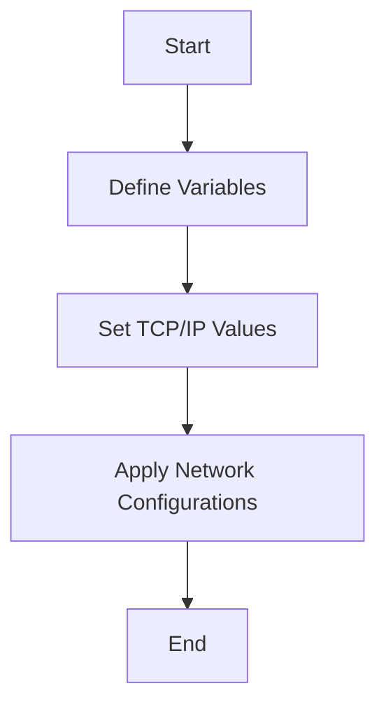

## Overview

Network Demos in Playbooks are used to showcase how to configure network settings on AIX systems using Ansible. These demos include tasks such as setting up <SwmToken path="playbooks/demo_mktcpip.yml" pos="12:18:20" line-data="    - name: Set the required values for starting TCP/IP">`TCP/IP`</SwmToken> configurations, defining hostnames, IP addresses, interfaces, nameservers, and domains.

## Usage Example

The playbook <SwmPath>[playbooks/demo_mktcpip.yml](playbooks/demo_mktcpip.yml)</SwmPath> is an example that demonstrates setting the required values for starting <SwmToken path="playbooks/demo_mktcpip.yml" pos="12:18:20" line-data="    - name: Set the required values for starting TCP/IP">`TCP/IP`</SwmToken> on an AIX system. It uses the <SwmToken path="playbooks/demo_mktcpip.yml" pos="13:1:5" line-data="      ibm.power_aix.mktcpip:">`ibm.power_aix.mktcpip`</SwmToken> module to apply the network configurations specified in the playbook.

<SwmSnippet path="/playbooks/demo_mktcpip.yml" line="1">

---

The playbook <SwmPath>[playbooks/demo_mktcpip.yml](playbooks/demo_mktcpip.yml)</SwmPath> demonstrates setting the required values for starting <SwmToken path="playbooks/demo_mktcpip.yml" pos="12:18:20" line-data="    - name: Set the required values for starting TCP/IP">`TCP/IP`</SwmToken> on an AIX system. It uses the <SwmToken path="playbooks/demo_mktcpip.yml" pos="13:1:5" line-data="      ibm.power_aix.mktcpip:">`ibm.power_aix.mktcpip`</SwmToken> module to apply the network configurations specified in the playbook. The playbook includes tasks such as setting up <SwmToken path="playbooks/demo_mktcpip.yml" pos="12:18:20" line-data="    - name: Set the required values for starting TCP/IP">`TCP/IP`</SwmToken> configurations, defining hostnames, IP addresses, interfaces, nameservers, and domains.

```yaml
---
- name: MKTCPIP on AIX
  hosts: "{{ host_name }}"
  gather_facts: false
  vars:
    host_name: all
    address_v: 192.9.200.4
    nameserver_v: 192.9.200.1
    interface_v: en0
    domain_v: austin.century.com
  tasks:
    - name: Set the required values for starting TCP/IP
      ibm.power_aix.mktcpip:
        hostname: fred.austin.century.com
        address: "{{ address_v }}"
        interface: "{{ interface_v }}"
        nameserver: "{{ nameserver_v }}"
        domain: "{{ domain_v }}"
        start_daemons: true
```

---

</SwmSnippet>



&nbsp;

*This is an auto-generated document by Swimm 🌊 and has not yet been verified by a human*

<SwmMeta version="3.0.0" repo-id="Z2l0aHViJTNBJTNBYW5zaWJsZS1wb3dlci1haXglM0ElM0Fzd2ltbWlv" repo-name="ansible-power-aix"><sup>Powered by [Swimm](/)</sup></SwmMeta>
