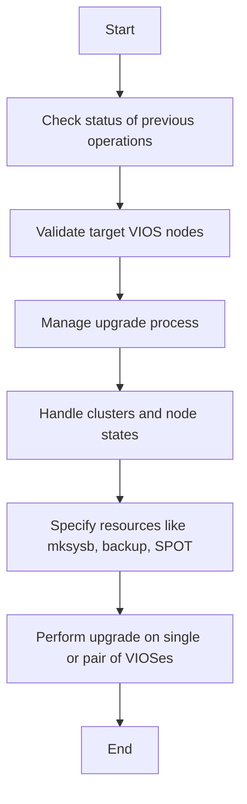

# NIM Upgrade IOS Overview

NIM Upgrade IOS refers to the process of upgrading Virtual <SwmToken path="plugins/modules/_nim_upgradeios.py" pos="19:25:27" line-data="short_description: Use NIM to update a single or a pair of Virtual I/O Servers.">`I/O`</SwmToken> Servers (VIOS) using the Network Installation Manager (NIM). This process involves performing operations such as migrating system software, backing up configurations, and updating system images.

## Module <SwmToken path="plugins/modules/_nim_upgradeios.py" pos="229:1:1" line-data="  _nim_upgradeios:">`_nim_upgradeios`</SwmToken>

The module <SwmToken path="plugins/modules/_nim_upgradeios.py" pos="229:1:1" line-data="  _nim_upgradeios:">`_nim_upgradeios`</SwmToken> is used to execute these operations, ensuring that the VIOS targets are properly updated. The module checks the status of previous operations, validates the target VIOS nodes, and manages the upgrade process, including handling clusters and node states.

## Supported Parameters

The module supports various parameters to specify resources like mksysb, backup, SPOT, and others required for the upgrade. The upgrade process can be performed on a single VIOS or a pair of <SwmToken path="plugins/modules/_nim_upgradeios.py" pos="23:2:2" line-data="- VIOSes of a tuple must be on the same cluster and the node states must be OK.">`VIOSes`</SwmToken>, ensuring they are on the same cluster and in the correct state before proceeding.

## Example Usage

This example shows how to perform a backup of a VIOS using the <SwmToken path="plugins/modules/_nim_upgradeios.py" pos="229:1:1" line-data="  _nim_upgradeios:">`_nim_upgradeios`</SwmToken> module.

<SwmSnippet path="/plugins/modules/_nim_upgradeios.py" line="225">

---

The following code snippet demonstrates how to perform a backup of a VIOS using the <SwmToken path="plugins/modules/_nim_upgradeios.py" pos="229:1:1" line-data="  _nim_upgradeios:">`_nim_upgradeios`</SwmToken> module.

```python
'''

EXAMPLES = r'''
- name: Perform a backup of nimvios01
  _nim_upgradeios:
    targets: "(nimvios01)"
    action: backup
'''
```

---

</SwmSnippet>



&nbsp;

*This is an auto-generated document by Swimm 🌊 and has not yet been verified by a human*

<SwmMeta version="3.0.0" repo-id="Z2l0aHViJTNBJTNBYW5zaWJsZS1wb3dlci1haXglM0ElM0Fzd2ltbWlv" repo-name="ansible-power-aix"><sup>Powered by [Swimm](/)</sup></SwmMeta>
