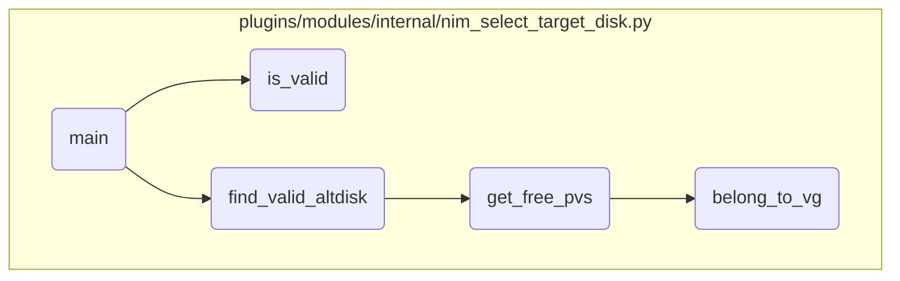

In this document, we will explain the process of selecting a valid alternate disk for installation. The process involves validating the target disk, finding a valid alternate disk, retrieving free physical volumes, and checking volume group membership.

The flow starts with validating the target disk to ensure it is suitable for use as an alternate disk. If the target disk is not specified or invalid, the process searches for a valid alternate disk that meets the necessary criteria. It then retrieves a list of free physical volumes that are not part of any volume group. Finally, it checks if a given disk belongs to any volume group to determine its eligibility for use as an alternate disk.

# Flow drill down



<SwmSnippet path="/plugins/modules/internal/nim_select_target_disk.py" line="216">

---

## Validating the Target Disk

First, the <SwmToken path="plugins/modules/internal/nim_select_target_disk.py" pos="216:2:2" line-data="def is_valid(module, target_disk):">`is_valid`</SwmToken> function checks if the target disk is suitable for use as an alternate disk. It ensures the disk does not belong to any volume group and has enough space for the root volume group (rootvg). If the disk does not meet these criteria, it is deemed invalid.

```python
def is_valid(module, target_disk):
    """
    Check if target disk is valid
    - must not belong to a volume group
    - must have space big enough for rootvg used PPs
    return:
        True - target disk can be used for alt_disk
        False - target disk cannot be used for alt_disk
    """
    nim_client = module.params['nim_client']
    force = module.params['force']

    # fetch rootvg disk information on the NIM client
    rootvg_info = check_rootvg(module)

    # fetch physical volume size or the target disk
    cmd = [
        '/usr/lpp/bos.sysmgt/nim/methods/c_rsh',
        nim_client,
        '/usr/sbin/bootinfo -s {0}'.format(target_disk)
    ]
```

---

</SwmSnippet>

<SwmSnippet path="/plugins/modules/internal/nim_select_target_disk.py" line="408">

---

## Selecting a Valid Alternate Disk

Next, the <SwmToken path="plugins/modules/internal/nim_select_target_disk.py" pos="408:2:2" line-data="def find_valid_altdisk(module):">`find_valid_altdisk`</SwmToken> function searches for a valid alternate disk if the target disk is not specified or invalid. It looks for disks that are not part of any volume group and have the appropriate size based on the specified policy (minimize, upper, lower, nearest). This function ensures that the selected disk meets the necessary criteria for the alternate disk installation.

```python
def find_valid_altdisk(module):
    """
    Find a valid alternate disk that:
    - exists,
    - is not part of a VG
    - with a correct size
    and so can be used.
    """
    disk_size_policy = module.params['target_disk_policy']
    force = module.params['force']
    rootvg_info = check_rootvg(module)

    # check rootvg
    if rootvg_info['status'] != 0:
        results['msg'] = 'Wrong rootvg state'
        module.fail_json(**results)

    # get pv list
    pvs = get_pvs(module)
    if pvs is None:
        module.fail_json(**results)
```

---

</SwmSnippet>

<SwmSnippet path="/plugins/modules/internal/nim_select_target_disk.py" line="369">

---

## Getting Free Physical Volumes

Then, the <SwmToken path="plugins/modules/internal/nim_select_target_disk.py" pos="369:2:2" line-data="def get_free_pvs(module, pvs):">`get_free_pvs`</SwmToken> function retrieves a list of free physical volumes (<SwmToken path="plugins/modules/internal/nim_select_target_disk.py" pos="371:11:11" line-data="    Get the list of free PVs.">`PVs`</SwmToken>) that are not part of any volume group. This list is used by <SwmToken path="plugins/modules/internal/nim_select_target_disk.py" pos="408:2:2" line-data="def find_valid_altdisk(module):">`find_valid_altdisk`</SwmToken> to select a suitable disk for the alternate disk installation.

```python
def get_free_pvs(module, pvs):
    """
    Get the list of free PVs.

    return: dictionary with free PVs information
    """
    nim_client = module.params["nim_client"]

    # hdisk0           000018fa3b12f5cb                     rootvg           active
    free_pvs = {}
    for pv in pvs.keys():
        # Only match disks that have no volume groups
        if pvs[pv]['vg'] == 'None':
            # Check if the disk has VG info in ODM using getlvodm
            if belong_to_vg(module, pv):
                continue

            # Retrieve disk size
            cmd = [
                '/usr/lpp/bos.sysmgt/nim/methods/c_rsh',
                nim_client,
```

---

</SwmSnippet>

<SwmSnippet path="/plugins/modules/internal/nim_select_target_disk.py" line="187">

---

## Checking Volume Group Membership

Finally, the <SwmToken path="plugins/modules/internal/nim_select_target_disk.py" pos="187:2:2" line-data="def belong_to_vg(module, target_disk):">`belong_to_vg`</SwmToken> function checks if a given disk belongs to any volume group. This check is crucial for determining whether a disk can be used as an alternate disk. If the disk is part of a volume group, it cannot be used for the alternate disk installation.

```python
def belong_to_vg(module, target_disk):
    """
    Check in ODM if target_disk belongs to a volume group.
    return:
        True - target disk belongs to a volume group
        False - target disk does not belong to a volume group
    """
    nim_client = module.params['nim_client']
    # check if 'target_disk' does not belong to any volume group
    cmd = [
        '/usr/lpp/bos.sysmgt/nim/methods/c_rsh',
        nim_client,
        '/usr/sbin/getlvodm -j {0}'.format(target_disk)
    ]
    rc, stdout, stderr = module.run_command(cmd)
    # 0516-320 /usr/sbin/getlvodm: Physical volume hdisk1 is not assigned to
    #        a volume group.
    # physical volume belongs to a volume group if 'found' is not null
    # pattern = r"0516-320"
    pattern = r"0516-320|0516-1396"
    found = re.search(pattern, stderr, re.MULTILINE)
```

---

</SwmSnippet>

&nbsp;

*This is an auto-generated document by Swimm 🌊 and has not yet been verified by a human*

<SwmMeta version="3.0.0" repo-id="Z2l0aHViJTNBJTNBYW5zaWJsZS1wb3dlci1haXglM0ElM0Fzd2ltbWlv" repo-name="ansible-power-aix"><sup>Powered by [Swimm](/)</sup></SwmMeta>
