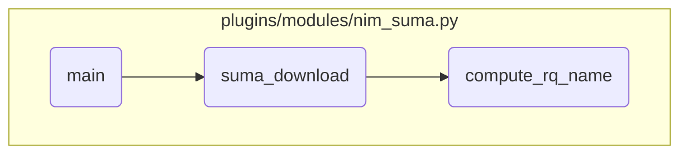

In this document, we will explain the flow of the main function in the <SwmPath repo-id="Z2l0aHViJTNBJTNBYW5zaWJsZS1wb3dlci1haXglM0ElM0Fzd2ltbWlv" repo-name="ansible-power-aix" path="/plugins/modules/nim_suma.py">`(ansible-power-aix) plugins/modules/nim_suma.py`</SwmPath> module. The process involves initializing and validating SUMA parameters, running the SUMA download or preview, validating target machines, computing the request type, computing the SUMA request name, and finally building and executing the SUMA command.

The flow starts with initializing and validating the SUMA parameters to ensure all necessary inputs are correctly set. Then, it runs the SUMA download or preview action based on these parameters. Next, it validates the target machines and computes the request type to ensure everything is correctly specified. After that, it computes the SUMA request name based on metadata information. Finally, it builds and executes the SUMA command to perform the actual operation of previewing or downloading software updates.

# Flow drill down



<SwmSnippet path="/plugins/modules/nim_suma.py" line="1034" repo-id="Z2l0aHViJTNBJTNBYW5zaWJsZS1wb3dlci1haXglM0ElM0Fzd2ltbWlv">

---

## Initializing and validating SUMA parameters

First, the <SwmToken path="/plugins/modules/nim_suma.py" pos="1034:2:2" line-data="def main():" repo-id="Z2l0aHViJTNBJTNBYW5zaWJsZS1wb3dlci1haXglM0ElM0Fzd2ltbWlv" repo-name="ansible-power-aix">`main`</SwmToken> function initializes the SUMA parameters and validates the input arguments. This step ensures that all necessary parameters for the SUMA operation are correctly set up and validated before proceeding with the download or preview action.

```python
def main():
    global results
    suma_params = {}

    module = AnsibleModule(
        argument_spec=dict(
            action=dict(required=False,
                        choices=['download', 'preview'],
                        type='str', default='preview'),
            targets=dict(required=True, type='list', elements='str'),
            oslevel=dict(required=False, type='str', default='Latest'),
            lpp_source_name=dict(required=False, type='str'),
            download_dir=dict(required=False, type='path'),
            download_only=dict(required=False, type='bool', default=False),
            extend_fs=dict(required=False, type='bool', default=True),
            description=dict(required=False, type='str'),
            metadata_dir=dict(required=False, type='path', default='/var/adm/ansible/metadata'),
        ),
        supports_check_mode=True
    )

```

---

</SwmSnippet>

<SwmSnippet path="/plugins/modules/nim_suma.py" line="1088" repo-id="Z2l0aHViJTNBJTNBYW5zaWJsZS1wb3dlci1haXglM0ElM0Fzd2ltbWlv">

---

## Running SUMA download or preview

Next, the <SwmToken path="/plugins/modules/nim_suma.py" pos="1034:2:2" line-data="def main():" repo-id="Z2l0aHViJTNBJTNBYW5zaWJsZS1wb3dlci1haXglM0ElM0Fzd2ltbWlv" repo-name="ansible-power-aix">`main`</SwmToken> function calls <SwmToken path="/plugins/modules/nim_suma.py" pos="1089:1:1" line-data="    suma_download(module, suma_params)" repo-id="Z2l0aHViJTNBJTNBYW5zaWJsZS1wb3dlci1haXglM0ElM0Fzd2ltbWlv" repo-name="ansible-power-aix">`suma_download`</SwmToken> to execute the SUMA download or preview action based on the initialized parameters. This step is crucial as it performs the core functionality of downloading or previewing software updates.

```python
    # Run Suma preview or download
    suma_download(module, suma_params)

    # Exit
    msg = f'Suma {action} completed successfully'
```

---

</SwmSnippet>

<SwmSnippet path="/plugins/modules/nim_suma.py" line="818" repo-id="Z2l0aHViJTNBJTNBYW5zaWJsZS1wb3dlci1haXglM0ElM0Fzd2ltbWlv">

---

## Validating target machines and computing request type

Moving to the <SwmToken path="/plugins/modules/nim_suma.py" pos="1089:1:1" line-data="    suma_download(module, suma_params)" repo-id="Z2l0aHViJTNBJTNBYW5zaWJsZS1wb3dlci1haXglM0ElM0Fzd2ltbWlv" repo-name="ansible-power-aix">`suma_download`</SwmToken> function, it first validates the target machines and computes the request type. This step ensures that the target machines are correctly specified and the request type is valid, which is essential for the subsequent SUMA operations.

```python
    if not targets_list:
        if req_oslevel == 'Latest':
            msg = 'Oslevel target could not be empty or equal "Latest" when' \
                  ' target machine list is empty'
            module.log(msg)
            results['msg'] = msg
            module.fail_json(**results)
        elif re.match(r"^([0-9]{4}-[0-9]{2})(-00|-00-0000)$", req_oslevel):
            msg = 'When no Service Pack is provided, a target machine list is required'
            module.log(msg)
            results['msg'] = msg
            module.fail_json(**results)
    else:
        if re.match(r"^([0-9]{4})(|-00|-00-00|-00-00-0000)$", req_oslevel):
            msg = 'Specify a non 0 value for the Technical Level or the Service Pack'
            module.log(msg)
            results['msg'] = msg
            module.fail_json(**results)
```

---

</SwmSnippet>

<SwmSnippet path="/plugins/modules/nim_suma.py" line="891" repo-id="Z2l0aHViJTNBJTNBYW5zaWJsZS1wb3dlci1haXglM0ElM0Fzd2ltbWlv">

---

## Computing SUMA request name

Then, the <SwmToken path="/plugins/modules/nim_suma.py" pos="1089:1:1" line-data="    suma_download(module, suma_params)" repo-id="Z2l0aHViJTNBJTNBYW5zaWJsZS1wb3dlci1haXglM0ElM0Fzd2ltbWlv" repo-name="ansible-power-aix">`suma_download`</SwmToken> function calls <SwmToken path="/plugins/modules/nim_suma.py" pos="892:5:5" line-data="    rq_name = compute_rq_name(module, suma_params, rq_type, suma_params[&#39;req_oslevel&#39;], clients_oslevel)" repo-id="Z2l0aHViJTNBJTNBYW5zaWJsZS1wb3dlci1haXglM0ElM0Fzd2ltbWlv" repo-name="ansible-power-aix">`compute_rq_name`</SwmToken> to compute the SUMA request name based on the metadata information. This step is important as it determines the specific software update request name that will be used in the SUMA operation.

```python
    # compute SUMA request name based on metadata info
    rq_name = compute_rq_name(module, suma_params, rq_type, suma_params['req_oslevel'], clients_oslevel)
    suma_params['RqName'] = rq_name
    module.debug(f"Suma req Name: {rq_name}")
```

---

</SwmSnippet>

<SwmSnippet path="/plugins/modules/nim_suma.py" line="933" repo-id="Z2l0aHViJTNBJTNBYW5zaWJsZS1wb3dlci1haXglM0ElM0Fzd2ltbWlv">

---

## Building and executing SUMA command

Finally, the <SwmToken path="/plugins/modules/nim_suma.py" pos="1089:1:1" line-data="    suma_download(module, suma_params)" repo-id="Z2l0aHViJTNBJTNBYW5zaWJsZS1wb3dlci1haXglM0ElM0Fzd2ltbWlv" repo-name="ansible-power-aix">`suma_download`</SwmToken> function builds and executes the SUMA command for preview. This step performs the actual SUMA operation, either previewing or downloading the software updates based on the specified parameters.

```python
    # SUMA command for preview
    stdout = suma_command(module, 'Preview', suma_params)
    module.debug(f"SUMA preview stdout:{stdout}")

```

---

</SwmSnippet>

&nbsp;

*This is an auto-generated document by Swimm 🌊 and has not yet been verified by a human*

<SwmMeta version="3.0.0"><sup>Powered by [Swimm](https://app.swimm.io/)</sup></SwmMeta>
