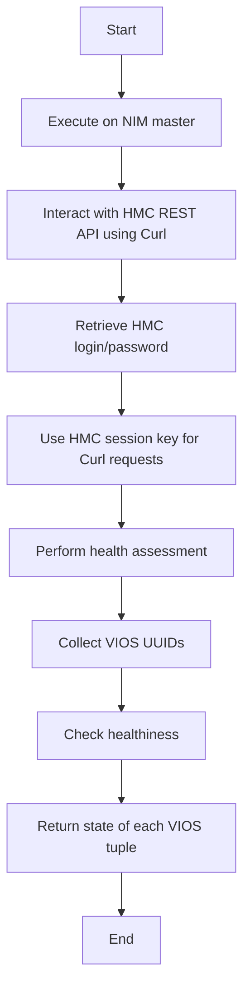

## Purpose

The Power AIX VIOS Health Check is a health assessment tool used for pre-install routines of VIOS (Virtual <SwmToken path="plugins/modules/nim_vios_hc.py" pos="22:17:19" line-data="  settings required to update a pair of Virtual I/O Servers (VIOS).">`I/O`</SwmToken> Server). It checks if a VIO Server or a pair of VIO Servers can be updated by assessing various configurations. The tool evaluates active client LPARs, <SwmToken path="plugins/modules/nim_vios_hc.py" pos="23:17:17" line-data="- In the current version, it validates the vSCSI, NPIv, SEA mappings configurations and vNIC">`vSCSI`</SwmToken> mapping, NPIV Path for Fibre Channel configuration, SEA configuration, and VNIC configuration.

## How to Use

The tool should be executed on the NIM master and uses Curl (pycurl) to interact with the HMC REST API. It retrieves the HMC login/password from the HMC password file if not specified and uses an HMC session key for Curl requests.

## Example Usage

The <SwmToken path="plugins/modules/nim_vios_hc.py" pos="496:2:2" line-data="def health_check(module, targets):">`health_check`</SwmToken> function in <SwmPath>[plugins/modules/nim_vios_hc.py](plugins/modules/nim_vios_hc.py)</SwmPath> performs a health assessment of the VIOS targets to ensure they can support a rolling update operation.

<SwmSnippet path="/plugins/modules/nim_vios_hc.py" line="496">

---

The <SwmToken path="plugins/modules/nim_vios_hc.py" pos="496:2:2" line-data="def health_check(module, targets):">`health_check`</SwmToken> function is defined in <SwmPath>[plugins/modules/nim_vios_hc.py](plugins/modules/nim_vios_hc.py)</SwmPath>. It performs a health assessment of the VIOS targets to ensure they can support a rolling update operation. For each VIOS tuple, it calls <SwmPath>[roles/power_aix_vioshc/files/vioshc.py](roles/power_aix_vioshc/files/vioshc.py)</SwmPath> twice: first to collect the VIOS <SwmToken path="plugins/modules/nim_vios_hc.py" pos="502:23:23" line-data="    - call vioshc.py a first time to collect the VIOS UUIDs">`UUIDs`</SwmToken> and second to check the healthiness. The function returns a dictionary with the state of each VIOS tuple.

```python
def health_check(module, targets):
    """
    Health assessment of the VIOS targets to ensure they can support
    a rolling update operation.

    For each VIOS tuple:
    - call vioshc.py a first time to collect the VIOS UUIDs
    - call vioshc.py a second time to check the healthiness

    return: a dictionary with the state of each VIOS tuple
    """
```

---

</SwmSnippet>



&nbsp;

*This is an auto-generated document by Swimm 🌊 and has not yet been verified by a human*

<SwmMeta version="3.0.0" repo-id="Z2l0aHViJTNBJTNBYW5zaWJsZS1wb3dlci1haXglM0ElM0Fzd2ltbWlv" repo-name="ansible-power-aix"><sup>Powered by [Swimm](/)</sup></SwmMeta>
