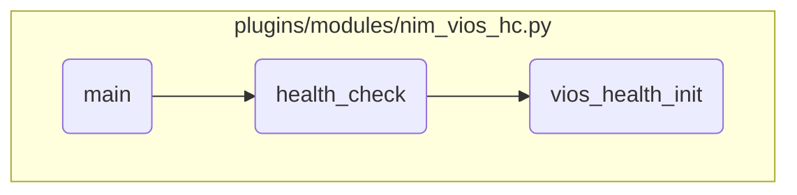

This document explains the flow of the main function in the <SwmPath repo-id="Z2l0aHViJTNBJTNBYW5zaWJsZS1wb3dlci1haXglM0ElM0Fzd2ltbWlv" repo-name="ansible-power-aix" path="/plugins/modules/nim_vios_hc.py">`(ansible-power-aix) plugins/modules/nim_vios_hc.py`</SwmPath> module. The main function orchestrates the process of performing a health check on VIOS targets. It involves building a target list, checking the health status of each target, collecting necessary UUIDs, and running the health check.

The flow starts by building a list of targets from the module parameters. If the list is empty, a warning is logged. Next, the health status of each target is checked and logged. If UUIDs for the targets are not available, they are collected. Finally, a health check is performed to determine if the targets can support a rolling update, and the results are logged.

# Flow drill down



<SwmSnippet path="/plugins/modules/nim_vios_hc.py" line="649" repo-id="Z2l0aHViJTNBJTNBYW5zaWJsZS1wb3dlci1haXglM0ElM0Fzd2ltbWlv">

---

## Building the Target List

First, we retrieve the list of targets from the module parameters and build the target list. If the target list is empty, a warning is logged, and the process continues. This step ensures that we have a valid list of targets to perform the health check on.

```python
    targets = module.params['targets']

    OUTPUT.append(f'VIOS Health Check operation for {targets}')

    target_list = []
    targets_health_status = {}

    # Build nim node info
    build_nim_node(module)

    ret = check_vios_targets(module, targets)
    if (ret is None) or (not ret):
        OUTPUT.append('    Warning: Empty target list')
        module.log(f'[WARNING] Empty target list: "{targets}"')
    else:
        target_list = ret
        OUTPUT.append(f'    Targets list: {target_list}')
        module.debug(f'Targets list: {target_list}')
```

---

</SwmSnippet>

<SwmSnippet path="/plugins/modules/nim_vios_hc.py" line="679" repo-id="Z2l0aHViJTNBJTNBYW5zaWJsZS1wb3dlci1haXglM0ElM0Fzd2ltbWlv">

---

## Checking the Health Status of VIOS Targets

Next, we call the <SwmToken path="/plugins/modules/nim_vios_hc.py" pos="679:5:5" line-data="        targets_health_status = health_check(module, target_list)" repo-id="Z2l0aHViJTNBJTNBYW5zaWJsZS1wb3dlci1haXglM0ElM0Fzd2ltbWlv" repo-name="ansible-power-aix">`health_check`</SwmToken> function to assess the health status of each VIOS target. The results are logged and stored in the <SwmToken path="/plugins/modules/internal/nim_select_target_disk.py" pos="118:0:0" line-data="results = None" repo-id="Z2l0aHViJTNBJTNBYW5zaWJsZS1wb3dlci1haXglM0ElM0Fzd2ltbWlv" repo-name="ansible-power-aix">`results`</SwmToken> dictionary. This step is crucial as it determines whether the VIOS targets are in a healthy state and can support a rolling update operation.

```python
        targets_health_status = health_check(module, target_list)

        OUTPUT.append('VIOS Health Check status:')
        module.log('VIOS Health Check status:')
        for vios_key, vios_health_status in targets_health_status.items():
            OUTPUT.append(f"    {vios_key} : {vios_health_status}")
            module.log(f'    {vios_key} : {vios_health_status}')
```

---

</SwmSnippet>

<SwmSnippet path="/plugins/modules/nim_vios_hc.py" line="538" repo-id="Z2l0aHViJTNBJTNBYW5zaWJsZS1wb3dlci1haXglM0ElM0Fzd2ltbWlv">

---

### Collecting VIOS UUIDs

Diving into the <SwmToken path="/plugins/modules/nim_vios_hc.py" pos="679:5:5" line-data="        targets_health_status = health_check(module, target_list)" repo-id="Z2l0aHViJTNBJTNBYW5zaWJsZS1wb3dlci1haXglM0ElM0Fzd2ltbWlv" repo-name="ansible-power-aix">`health_check`</SwmToken> function, we first check if the UUIDs for the VIOS targets are available. If not, we call the <SwmToken path="/plugins/modules/nim_vios_hc.py" pos="543:5:5" line-data="            ret = vios_health_init(module, hmc_id, hmc_ip)" repo-id="Z2l0aHViJTNBJTNBYW5zaWJsZS1wb3dlci1haXglM0ElM0Fzd2ltbWlv" repo-name="ansible-power-aix">`vios_health_init`</SwmToken> function to collect the UUIDs. This step ensures that we have the necessary UUIDs to perform the health check.

```python
        # if needed call vios_health_init to get the UUIDs value
        if 'vios_uuid' not in NIM_NODE['nim_vios'][vios1] \
           or tup_len == 2 and 'vios_uuid' not in NIM_NODE['nim_vios'][vios2]:
            OUTPUT.append('    Getting VIOS UUID')

            ret = vios_health_init(module, hmc_id, hmc_ip)
            if ret != 0:
                OUTPUT.append(f'    Unable to get UUIDs of {vios1} and {vios2}, ret: {ret}')
                module.log(f"[WARNING] Unable to get UUIDs of {vios1} and {vios2}, ret: {ret}")
                health_tab[vios_key] = 'FAILURE-HC'
                continue
```

---

</SwmSnippet>

<SwmSnippet path="/plugins/modules/nim_vios_hc.py" line="558" repo-id="Z2l0aHViJTNBJTNBYW5zaWJsZS1wb3dlci1haXglM0ElM0Fzd2ltbWlv">

---

### Running the Health Check

Then, we run the <SwmToken path="/plugins/modules/nim_vios_hc.py" pos="566:5:5" line-data="            ret = vios_health(module, mgmt_uuid, hmc_ip, vios_uuid)" repo-id="Z2l0aHViJTNBJTNBYW5zaWJsZS1wb3dlci1haXglM0ElM0Fzd2ltbWlv" repo-name="ansible-power-aix">`vios_health`</SwmToken> function to check if the VIOS targets can support a rolling update. The results of the health check are logged and stored in the <SwmToken path="/plugins/modules/nim_vios_hc.py" pos="571:1:1" line-data="                health_tab[vios_key] = &#39;SUCCESS-HC&#39;" repo-id="Z2l0aHViJTNBJTNBYW5zaWJsZS1wb3dlci1haXglM0ElM0Fzd2ltbWlv" repo-name="ansible-power-aix">`health_tab`</SwmToken> dictionary. This step is critical as it determines the success or failure of the health check for each VIOS target.

```python
            # run the vios_health check for the vios tuple
            vios_uuid.append(NIM_NODE['nim_vios'][vios1]['vios_uuid'])
            if tup_len == 2:
                vios_uuid.append(NIM_NODE['nim_vios'][vios2]['vios_uuid'])

            mgmt_uuid = NIM_NODE['nim_vios'][vios1]['cec_uuid']

            OUTPUT.append('    Checking if we can update the VIOS')
            ret = vios_health(module, mgmt_uuid, hmc_ip, vios_uuid)

            if ret == 0:
                OUTPUT.append('    Health check succeeded')
                module.log(f"Health check succeeded for {vios_key}")
                health_tab[vios_key] = 'SUCCESS-HC'
            else:
                OUTPUT.append('    Health check failed')
                module.log(f"Health check failed for {vios_key}")
                health_tab[vios_key] = 'FAILURE-HC'
```

---

</SwmSnippet>

&nbsp;

*This is an auto-generated document by Swimm 🌊 and has not yet been verified by a human*

<SwmMeta version="3.0.0"><sup>Powered by [Swimm](https://app.swimm.io/)</sup></SwmMeta>
