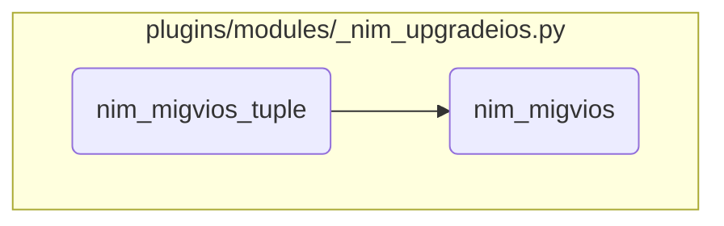
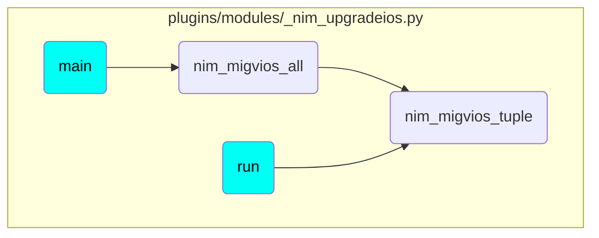

In this document, we will explain the process of migrating Virtual <SwmToken path="plugins/modules/_nim_upgradeios.py" pos="19:25:27" line-data="short_description: Use NIM to update a single or a pair of Virtual I/O Servers.">`I/O`</SwmToken> Servers (VIOS) using the <SwmToken path="plugins/modules/_nim_upgradeios.py" pos="616:1:1" line-data="        nim_migvios_tuple(self._module, self._target_tuple, self._stop_event)">`nim_migvios_tuple`</SwmToken> function. The process involves checking the previous status of the VIOS, verifying the time limit, executing the migration command, and finalizing the migration.

The flow starts by checking the previous status of the VIOS. If no previous status is found or if the previous status is not 'SUCCESS', the migration is skipped. Next, it checks if the time limit has been reached, and if so, the migration is skipped. Then, the migration command is executed, and the status is updated based on the return code. Finally, the operation progress is checked, and the status is updated accordingly.

# Flow drill down



<SwmSnippet path="/plugins/modules/_nim_upgradeios.py" line="705">

---

## Handling the Migration Status

First, we check the previous status of the VIOS. If no previous status is found, the migration is skipped, and a message is logged. If the previous status is not 'SUCCESS', the migration is also skipped, and the status is updated accordingly.

```python
        if module.params['vios_status'] is not None:
            if vios_key not in module.params['vios_status']:
                msg = f'{vios_key} vioses skipped (no previous status found)'
                module.log('[WARNING] ' + msg)
                results['meta'][vios_key]['messages'].append(msg)
                results['status'][vios_key] = 'SKIPPED-NO-PREV-STATUS'
                continue

            if 'SUCCESS' not in module.params['vios_status'][vios_key]:
                vios_status = module.params['vios_status'][vios_key]
                msg = f'{vios_key} VIOSes skipped (vios_status: {vios_status})'
                module.log(msg)
                results['meta'][vios_key]['messages'].append(msg)
                results['status'][vios_key] = module.params['vios_status'][vios_key]
                continue
```

---

</SwmSnippet>

<SwmSnippet path="/plugins/modules/_nim_upgradeios.py" line="721">

---

## Checking for Time Limit

Next, we check if the <SwmToken path="plugins/modules/_nim_upgradeios.py" pos="722:3:3" line-data="        if stop_event and stop_event.isSet():">`stop_event`</SwmToken> is set, indicating that the time limit has been reached. If so, the migration is skipped, and a message is logged.

```python
        # check if we are asked to stop (time_limit might be reached)
        if stop_event and stop_event.isSet():
            time_limit = time.strftime('%m/%d/%Y %H:%M', module.params['time_limit'])
            msg = f'Time limit {time_limit} reached, no further operation'
            module.log('[WARNING] ' + msg)
            results['meta'][vios_key]['messages'].append(msg)
            results['status'][vios_key] = "SKIPPED-TIMEOUT"
            return
```

---

</SwmSnippet>

<SwmSnippet path="/plugins/modules/_nim_upgradeios.py" line="730">

---

## Executing the Migration Command

Then, we call the <SwmToken path="plugins/modules/_nim_upgradeios.py" pos="730:5:5" line-data="        rc = nim_migvios(module, vios_key, vios)">`nim_migvios`</SwmToken> function to execute the migration command. The status is updated based on the return code of the command.

```python
        rc = nim_migvios(module, vios_key, vios)
        if rc == 0:
            if vios == vios1:
                results['status'][vios_key] = 'SUCCESS-UPGR1-INIT'
            else:
                results['status'][vios_key] = 'SUCCESS-UPGR2-INIT'
        else:
            if vios == vios1:
                results['status'][vios_key] = 'FAILURE-UPGR1-INIT'
            else:
                results['status'][vios_key] = 'FAILURE-UPGR2-INIT'
            return
```

---

</SwmSnippet>

<SwmSnippet path="/plugins/modules/_nim_upgradeios.py" line="751">

---

## Finalizing the Migration

Finally, we check the operation progress and wait for completion. The status is updated based on the return code of the <SwmToken path="plugins/modules/_nim_upgradeios.py" pos="752:5:5" line-data="        rc = nim_wait_migvios(module, vios_key, vios)">`nim_wait_migvios`</SwmToken> function.

```python
        # check the operation progress, wait the completion and set the status
        rc = nim_wait_migvios(module, vios_key, vios)
        if rc == 0:
            if vios == vios1:
                module.status[vios_key] = 'SUCCESS-UPGR1'
            else:
                module.status[vios_key] = 'SUCCESS-UPGR2'
        elif rc == -1:
            if vios == vios1:
                module.status[vios_key] = 'FAILURE-UPGR1-WAIT'
            else:
                module.status[vios_key] = 'FAILURE-UPGR2-WAIT'
            # will not migrate the next vios
            return
        else:
            if vios == vios1:
                module.status[vios_key] = 'FAILURE-UPGR1'
            else:
                module.status[vios_key] = 'FAILURE-UPGR2'
            # will not migrate the next vios
            return
```

---

</SwmSnippet>

<SwmSnippet path="/plugins/modules/_nim_upgradeios.py" line="800">

---

## Building the Migration Command

The <SwmToken path="plugins/modules/_nim_upgradeios.py" pos="730:5:5" line-data="        rc = nim_migvios(module, vios_key, vios)">`nim_migvios`</SwmToken> function builds the migration command using various parameters such as <SwmToken path="plugins/modules/_nim_upgradeios.py" pos="802:14:14" line-data="    cmd += [&#39;-a&#39;, f&#39;ios_mksysb={mksysb_name}&#39;]">`ios_mksysb`</SwmToken>, <SwmToken path="plugins/modules/_nim_upgradeios.py" pos="803:14:14" line-data="    cmd += [&#39;-a&#39;, f&#39;ios_backup={backup_name}&#39;]">`ios_backup`</SwmToken>, <SwmToken path="plugins/modules/_nim_upgradeios.py" pos="813:14:14" line-data="        cmd += [&#39;-a&#39;, f&#39;spot={spot_name}&#39;]">`spot`</SwmToken>, and others. These parameters are used to customize the migration command based on the user's requirements.

```python
    cmd = ['nim', '-Fo', 'migvios']

    cmd += ['-a', f'ios_mksysb={mksysb_name}']
    cmd += ['-a', f'ios_backup={backup_name}']

    if module.params['group']:
        params_group = module.params['group']
        cmd += ['-a', f'group={params_group}']

    if module.params['spot_name'] or module.params['spot_prefix'] or module.params['spot_postfix']:
        if not module.params['spot_name'] and module.params['spot_postfix'] is None:
            module.params['spot_postfix'] = '_spot'
        spot_name = build_name(vios, module.params['spot_name'], module.params['spot_prefix'], module.params['spot_postfix'])
        cmd += ['-a', f'spot={spot_name}']

    lpp_source = module.params['lpp_source']
    bosinst_data = module.params['bosinst_data']
    resolv_conf = module.params['resolv_conf']
    image_data = module.params['image_data']
    log = module.params['log']
    file_resource = module.params['file_resource']
```

---

</SwmSnippet>

<SwmSnippet path="/plugins/modules/_nim_upgradeios.py" line="877">

---

## Running the Migration Command

The migration command is executed using the <SwmToken path="plugins/modules/_nim_upgradeios.py" pos="878:11:13" line-data="    rc, stdout, stderr = module.run_command(cmd)">`module.run_command`</SwmToken> method. If the command fails, an error message is logged, and the status is updated. If the command succeeds, the status is updated to indicate a successful migration.

```python
    cmd = ' '.join(cmd)
    rc, stdout, stderr = module.run_command(cmd)

    if rc != 0:
        msg = f'Failed to migrate {vios} VIOS, migvios returned {rc}'
        module.log(msg)
        module.log(f'cmd \'{cmd}\' failed, stdout: {stdout}, stderr:{stderr}')
        results['meta'][vios_key]['messages'].append(msg)
        results['meta'][vios_key][vios]['cmd'] = cmd
        results['meta'][vios_key][vios]['stdout'] = stdout
        results['meta'][vios_key][vios]['stderr'] = stderr
    else:
        # update the nim
        if 'backup' in module.nim_node['vios'][vios]:
            module.nim_node['vios'][vios]['backup']['name'] = backup_name
        else:
            module.nim_node['vios'][vios]['backup'] = {}
            module.nim_node['vios'][vios]['backup']['name'] = backup_name
        msg = f'VIOS {vios} migration successfully initiated'
        module.log(msg)
        results['meta'][vios_key]['messages'].append(msg)
```

---

</SwmSnippet>

# Where is this flow used?

This flow is used multiple times in the codebase as represented in the following diagram:



&nbsp;

*This is an auto-generated document by Swimm 🌊 and has not yet been verified by a human*

<SwmMeta version="3.0.0" repo-id="Z2l0aHViJTNBJTNBYW5zaWJsZS1wb3dlci1haXglM0ElM0Fzd2ltbWlv" repo-name="ansible-power-aix"><sup>Powered by [Swimm](/)</sup></SwmMeta>
